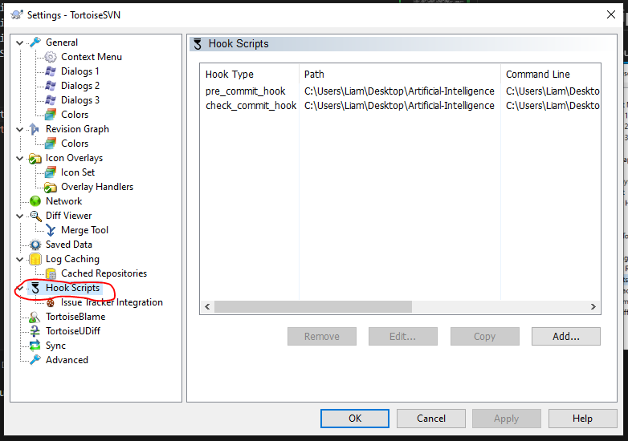
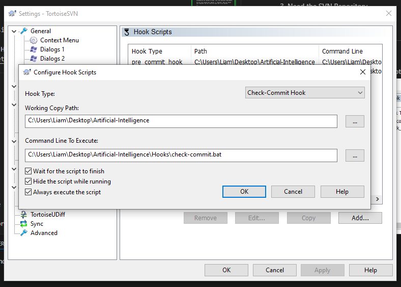
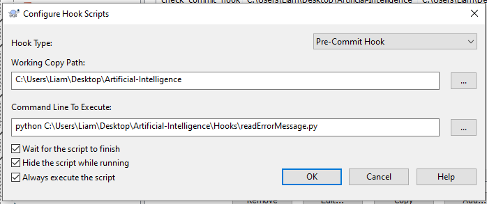
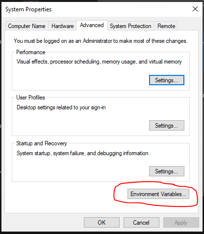
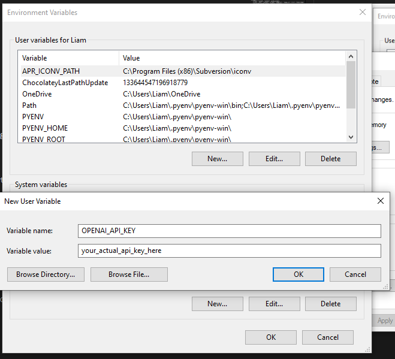
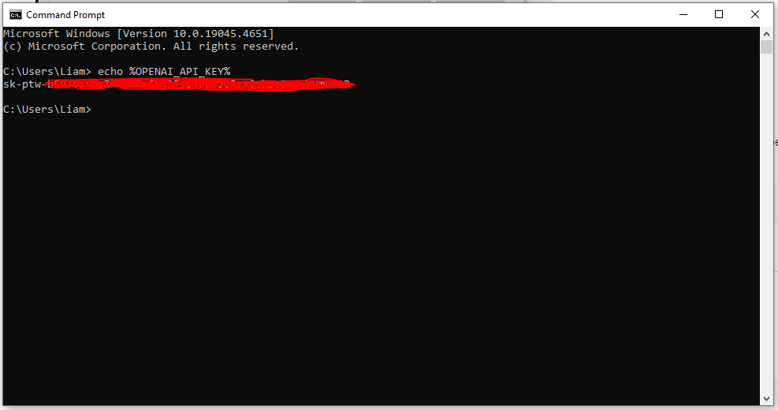

# Table Of Contents
- [Table Of Contents](#table-of-contents)
- [Open Web UI](#open-web-ui)
- [Ollama Installation](#ollama-installation)
  - [Pull Ollama Models](#pull-ollama-models)
- [Image Detection With Openai gpt-4o Model](#image-detection-with-openai-gpt-4o-model)
  - [Overview](#overview)
  - [Source Code](#source-code)
  - [Functions](#functions)
  - [Main Script](#main-script)
  - [System Prompt](#system-prompt)
  - [API Request Payload](#api-request-payload)
  - [Response](#response)
  - [Environment Variable](#environment-variable)
  - [Image File Path](#image-file-path)
- [Using SVN Hook Pre-Commit and Check Commit With Openai GPT-4o Model](#using-svn-hook-pre-commit-and-check-commit-with-openai-gpt-4o-model)
  - [Objective](#objective)
  - [Repository Folder](#repository-folder)
  - [SVN Hook Used](#svn-hook-used)
    - [Check Commit](#check-commit)
    - [Pre-Commit Hook](#pre-commit-hook)
  - [Add the Hook Script in SVN Repository](#add-the-hook-script-in-svn-repository)
    - [Prerequisite](#prerequisite)
  - [Setup the Check-Commit Hook Script](#setup-the-check-commit-hook-script)
    - [Example Check Commit Setup](#example-check-commit-setup)
  - [Setup the Pre-Commit Hook Script](#setup-the-pre-commit-hook-script)
    - [Example Pre Commit Setup](#example-pre-commit-setup)
  - [Commit a file to SVN with AI (DEMO)](#commit-a-file-to-svn-with-ai-demo)
- [Setup Environment Variable](#setup-environment-variable)
  - [In WINDOWS](#in-windows)
  - [In LINUX](#in-linux)
- [Using GPT4o mini to tag and caption images](#using-gpt4o-mini-to-tag-and-caption-images)
  - [Setup](#setup)
    - [Testing with a few examples](#testing-with-a-few-examples)
  - [Looking up existing keywords](#looking-up-existing-keywords)
    - [Testing with example keywords](#testing-with-example-keywords)
  - [Generate captions](#generate-captions)
  - [Describing images with GPT-4o mini](#describing-images-with-gpt-4o-mini)
    - [Testing on a few examples](#testing-on-a-few-examples)
  - [Turning descriptions into captions](#turning-descriptions-into-captions)
    - [Testing on a few examples](#testing-on-a-few-examples-1)
  - [Image search](#image-search)
    - [Preparing the dataset](#preparing-the-dataset)
  - [Embedding captions and keywords](#embedding-captions-and-keywords)
    - [Search from input text](#search-from-input-text)
    - [Search from image](#search-from-image)
  - [Wrapping up](#wrapping-up)


# Open Web UI
Open WebUI is an extensible, feature-rich, and user-friendly self-hosted WebUI designed to operate entirely offline. It supports various LLM runners, including Ollama and OpenAI-compatible APIs.

See the official documentation of <a href="https://docs.openwebui.com/" target="_blank">Open Web UI</a> here.


	curl -sL https://raw.githubusercontent.com/Vichondrias1/lponder/main/AI/Open-Web-UI/openwebui.sh | sh


NOTE: To use Open Web UI make sure you have Ollama installed on your device.

# Ollama Installation

Run this curl command to Install Ollama. For more info visit Ollama Website. <a href="https://ollama.com/download/linux">Ollama</a>

	curl -fsSL https://ollama.com/install.sh | sh

## Pull Ollama Models
Run this command to pull your desired LLM. See the list of available LLM in <a href="https://ollama.com/library">Ollama</a>.

	ollama pull <model name>

	example: ollama pull llama3 

# Image Detection With Openai gpt-4o Model

## Overview

This is a Python script that utilizes OpenAI's ChatGPT model to analyze an image and determine whether it meets the required standards for approval. The script encodes the image, constructs a prompt, and sends a request to the OpenAI API to get a response from the ChatGPT model.

## Source Code

	import os
	import io
	import base64
	import requests
	import openai
	
	open_ai_key = os.environ["AI_API_KEY"]
	
	# Initialize OpenAI client
	openai.api_key = open_ai_key
	
	# Function to encode the image
	def encode_image(image_path):
		with open(image_path, "rb") as image_file:
			return base64.b64encode(image_file.read()).decode('utf-8')
	
	# Path to the image file
	image_path = "images/3.jpg"  # Replace with your image path
	
	# Getting the base64 string
	base64_image = encode_image(image_path)
	
	headers = {
		"Content-Type": "application/json",
		"Authorization": f"Bearer {open_ai_key}"
	}
	
	# Constructing the prompt
	system_prompt = f"""
	You are an AI Real Estate Marketing Agent. You Are Responsible to maintaining a good quality maketing products. Ensurin that the houses you will be marketing is of high quality
	
	You will be responsible for reviewing a large dataset of images, with the primary objective of identifying and filtering out unwanted objects or content within the images. You will analyze each image and make a determination as to whether it meets the required standards for approval.
	
	Unwanted Objects or Content:
	
	1. Garbage, Garbage bags, Litter, Debm of wasris and any other forte
	2. Obscene or offensive material
	3. Harmful or illegal activities
	4. Inappropriate or explicit content
	5. Any other visual elements that may be deemed unsuitable or inappropriate by the system administrators
	
	Approval Criteria:
	
	1. Absence of Unwanted Objects or Content: The image must not contain any unwanted objects or content, including but not limited to garbage, garbage bags, obscene or offensive material, harmful or illegal activities, inappropriate or explicit content, or branding or logos that violate copyright laws.
	2. Overall Aesthetic Appeal and Quality: The image must have a high aesthetic appeal and quality, including but not limited to good lighting, composition, and resolution.
	3. Relevance to Intended Context or Purpose: The image must be relevant to the intended context or purpose, and align with the desired tone, theme, and message.
	4. Adherence to Predetermined Guidelines and Standards: The image must adhere to predetermined guidelines and standards for image publication, including but not limited to format, size, and resolution requirements.
	
	You will only respond with 'Approve' or 'Rejected'. When you respond with 'Rejected' you will state the reason why it was rejected.
	
	"""
	
	payload = {
		"model": "gpt-4o",
		"messages": [
			{"role": "system", "content": system_prompt},
			{"role": "user", "content": [{"type": "image_url", "image_url": {"url": f"data:image/jpeg;base64,{base64_image}", "detail": "low"}}]}
	
		],
		"max_tokens": 300,
		"temperature": 0.5
	}
	
	response = requests.post("https://api.openai.com/v1/chat/completions", headers=headers, json=payload)
	
	#Display whole json object
	print("CHAT GPT response: ", response.json())

## Functions  

**encode_image(image_path)**
- Takes an image file path as input
- Opens the image file in binary read mode ("rb" )
- Encodes the image data using base64 encoding
- Returns the encoded image data as a string

## Main Script
- Initializes the OpenAI client with an API key stored in an environment variable (open_ai_key)
- Sets the image file path and encodes the image using the encode_image function
- Constructs a **system prompt** that defines the task and guidelines for the ChatGPT model
- Creates a payload for the API request, including the **system prompt**, the encoded image, and other parameters
- Sends a POST request to the OpenAI API to get a response from the ChatGPT model
- Prints the response from the API, which includes the approval decision and reason (if rejected)

## System Prompt

The **system prompt** defines the task and guidelines for the ChatGPT model. It includes:

- A brief introduction to the task
- A list of unwanted objects or content that should be filtered out
- Approval criteria, including:
  - Absence of unwanted objects or content
  - Overall aesthetic appeal and quality
  - Relevance to intended context or purpose
  - Adherence to predetermined guidelines and standards

## API Request Payload

The payload includes:

- model: The ChatGPT model to use (gpt-4o)
- messages: An array of messages, including:
  - A system message with the system prompt
  - A user message with the encoded image and other details
- max_tokens: The maximum number of tokens to generate in the response (300)
- temperature: The temperature parameter for the model (0.5)

## Response

The response from the API includes the approval decision and reason (if rejected). The script prints the entire JSON response object.

## Environment Variable

**AI_API_KEY**: The OpenAI API key, stored as an environment variable.

## Image File Path

**image_path**: The file path to the image file to be analyzed.

**Note**: 
This script assumes that you have an OpenAI API key and have replaced the AI_API_KEY environment variable with your actual API key. You should also replace the image_path variable with the actual file path to the image file you want to analyze.

# Using SVN Hook Pre-Commit and Check Commit With Openai GPT-4o Model
## Objective

The SVN hook aims to ensure the quality and integrity of code files being committed to the SVN repository by leveraging AI-based analysis. It uses OpenAI's GPT-4 model to evaluate the code and identify any issues that may arise before allowing the commit to proceed.

## Repository Folder

- Path: PonderDevelopment/Artificial Intelligence

## SVN Hook Used

### Check Commit
   
- **Purpose:** To validate that the code meets certain quality standards before it can be committed to the repository.
- **Functionality:**
	- Capture the list of files being committed.
	- Read the content of these files.
	- Send the content to the GPT-4 model for analysis.
	- Parse the response from GPT-4 to determine if there are any issues with the code.
	- Provide detailed feedback on the nature of the issues identified by the AI model.
  
### Pre-Commit Hook
- **Location:** The pre-commit hook script is placed in the hooks directory of the SVN repository.
- **Purpose:** To intercept the commit process and analyze the code files using the check commit script before allowing the commit to proceed.
- **Functionality:** 
	- Capture the list of files being committed.
	- If issues are found, prevent the commit and display the errors to the user.
	- If no issues are found, allow the commit to proceed.

## Add the Hook Script in SVN Repository
### Prerequisite
1. Need to install python on your local machine for the python script to work.
2. Install Dependencies

		pip install requests
		pip install openai
		pip install argparse
3. Need the SVN Repository.
4. Set the OPENAI_API_KEY environment variable. See the docs on how to do it. [Setup Environment Variable](#setup-environment-variable)

## Setup the Check-Commit Hook Script

1. Navigate to you svn repository.

2. Go to setting and select Hook Scripts then click Add.
   
3. Select the **Check-Commit Hook**.
4. The Working Path: Point the your repository to it.
5. Command Line To Execute: Point the **check-commit.bat** script located in PonderDevelopment/Artificial-Intelligence/Hooks

### Example Check Commit Setup


## Setup the Pre-Commit Hook Script

1. Navigate to you svn repository.

2. Go to setting and select Hook Scripts then click Add.
   
3. Select the **Pre-Commit Hook**.
4. The Working Path: Point the your repository to it.
5. Command Line To Execute: Point to the **readErrorMessage.py** script located in PonderDevelopment/Artificial-Intelligence/Hooks

		python [Path_To_readErrorMessage.py]

### Example Pre Commit Setup



## Commit a file to SVN with AI (DEMO)
This example commit shows how openai gpt-4o analyze the code commit and determine the issues for the code file provided.


# Setup Environment Variable 

## In WINDOWS

1. Type in Windows Search Bar (Edit the system environment variables).
   
	
2. Click the Environment Variable
   
	

3. Click new the add, after adding correct Variable name and Variable value click ok.

		Variable name: OPENAI_API_KEY
		Variable value: your_actual_api_key
	

4. Restart Your PC for the sync to take effect.

5. To check if the environment variable is correctly added. Open command prompt and paste this command. If the OPENAI_API_KEY is being displayed this means its correctly added.
   
		echo %OPENAI_API_KEY%
	   

## In LINUX

To use a .bashrc file to store your environment variables, you'll need to follow these steps:

**Step 1: Open your .bashrc file**

You can do this by opening a terminal and typing:

	nano ~/.bashrc

This will open the .bashrc file in the nano editor. If you prefer a different editor, you can use that instead.

**Step 2: Add your environment variable**

At the end of the file, add a line to set your AI_API_KEY environment variable. For example:

	export AI_API_KEY=your_api_key_here

Replace your_api_key_here with your actual API key.

**Step 3: Save and close the file**

Save the file by pressing Ctrl+X, then Y, then Enter. This will save the changes and close the file.

**Step 4: Reload your .bashrc file**

To apply the changes, you need to reload your .bashrc file. You can do this by typing:

	source ~/.bashrc

This will reload the file and set the environment variable.

**Step 5: Verify the environment variable**

To check that the environment variable has been set, you can type:

	echo $AI_API_KEY

This should print out your API key.

**Step 6: Update your Python script**

In your Python script, you can access the environment variable using os.environ. For example:

	import os

	open_ai_key = os.environ["AI_API_KEY"]

This will retrieve the value of the AI_API_KEY environment variable and store it in the open_ai_key variable.

That's it! You should now be able to use your .bashrc file to store your environment variables.

# Using GPT4o mini to tag and caption images
This notebook explores how to leverage the vision capabilities of the GPT-4* models (for example gpt-4o, gpt-4o-mini or gpt-4-turbo) to tag & caption images.

We can leverage the multimodal capabilities of these models to provide input images along with additional context on what they represent, and prompt the model to output tags or image descriptions. The image descriptions can then be further refined with a language model (in this notebook, we'll use gpt-4o-mini) to generate captions.

Generating text content from images can be useful for multiple use cases, especially use cases involving search.
We will illustrate a search use case in this notebook by using generated keywords and product captions to search for products - both from a text input and an image input.

As an example, we will use a dataset of Amazon furniture items, tag them with relevant keywords and generate short, descriptive captions.

## Setup

	# Install dependencies if needed
	%pip install openai
	%pip install scikit-learn

```python
from IPython.display import Image, display
import pandas as pd
from sklearn.metrics.pairwise import cosine_similarity
import numpy as np
from openai import OpenAI

	os.environ["OPENAI_API_KEY"] = "OPEN_AI_KEY_HERE"

	# Initializing OpenAI client - see https://platform.openai.com/docs/quickstart?context=python
	client = OpenAI(
		api_key=os.environ.get("OPENAI_API_KEY"),
	)
```	

```python
# Loading dataset
dataset_path =  "data/amazon_furniture_dataset.csv"
df = pd.read_csv(dataset_path)
df.head()
```	

## Tag images
In this section, we'll use GPT-4o mini to generate relevant tags for our products.

We'll use a simple zero-shot approach to extract keywords, and deduplicate those keywords using embeddings to avoid having multiple keywords that are too similar.

We will use a combination of an image and the product title to avoid extracting keywords for other items that are depicted in the image - sometimes there are multiple items used in the scene and we want to focus on just the one we want to tag.

### Extract keywords
```python
system_prompt = '''
    You are an agent specialized in tagging images of furniture items, decorative items, or furnishings with relevant keywords that could be used to search for these items on a marketplace.
    
    You will be provided with an image and the title of the item that is depicted in the image, and your goal is to extract keywords for only the item specified. 
    
    Keywords should be concise and in lower case. 
    
    Keywords can describe things like:
    - Item type e.g. 'sofa bed', 'chair', 'desk', 'plant'
    - Item material e.g. 'wood', 'metal', 'fabric'
    - Item style e.g. 'scandinavian', 'vintage', 'industrial'
    - Item color e.g. 'red', 'blue', 'white'
    
    Only deduce material, style or color keywords when it is obvious that they make the item depicted in the image stand out.

    Return keywords in the format of an array of strings, like this:
    ['desk', 'industrial', 'metal']
    
'''

def analyze_image(img_url, title):
    response = client.chat.completions.create(
    model="gpt-4o-mini",
    messages=[
        {
            "role": "system",
            "content": system_prompt
        },
        {
            "role": "user",
            "content": [
                {
                    "type": "image_url",
                    "image_url": {
                        "url": img_url,
                    }
                },
            ],
        },
        {
            "role": "user",
            "content": title
        }
    ],
        max_tokens=300,
        top_p=0.1
    )

    return response.choices[0].message.content
```
### Testing with a few examples
```python
examples = df.iloc[:5]
```

```python
for index, ex in examples.iterrows():
    url = ex['primary_image']
    img = Image(url=url)
    display(img)
    result = analyze_image(url, ex['title'])
    print(result)
    print("\n\n")
```

## Looking up existing keywords
Using embeddings to avoid duplicates (synonyms) and/or match pre-defined keywords

```python
# Feel free to change the embedding model here
def get_embedding(value, model="text-embedding-3-large"): 
    embeddings = client.embeddings.create(
      model=model,
      input=value,
      encoding_format="float"
    )
    return embeddings.data[0].embedding
```

### Testing with example keywords

```python
# Existing keywords
keywords_list = ['industrial', 'metal', 'wood', 'vintage', 'bed']
```

```python
df_keywords = pd.DataFrame(keywords_list, columns=['keyword'])
df_keywords['embedding'] = df_keywords['keyword'].apply(lambda x: get_embedding(x))
df_keywords
```

```python
def compare_keyword(keyword):
    embedded_value = get_embedding(keyword)
    df_keywords['similarity'] = df_keywords['embedding'].apply(lambda x: cosine_similarity(np.array(x).reshape(1,-1), np.array(embedded_value).reshape(1, -1)))
    most_similar = df_keywords.sort_values('similarity', ascending=False).iloc[0]
    return most_similar

def replace_keyword(keyword, threshold = 0.6):
    most_similar = compare_keyword(keyword)
    if most_similar['similarity'] > threshold:
        print(f"Replacing '{keyword}' with existing keyword: '{most_similar['keyword']}'")
        return most_similar['keyword']
    return keyword
```

```python
# Example keywords to compare to our list of existing keywords
example_keywords = ['bed frame', 'wooden', 'vintage', 'old school', 'desk', 'table', 'old', 'metal', 'metallic', 'woody']
final_keywords = []

for k in example_keywords:
    final_keywords.append(replace_keyword(k))
    
final_keywords = set(final_keywords)
print(f"Final keywords: {final_keywords}")
```

## Generate captions
In this section, we'll use GPT-4o mini to generate an image description and then use a few-shot examples approach with GPT-4-turbo to generate captions from the images.

If few-shot examples are not enough for your use case, consider fine-tuning a model to get the generated captions to match the style & tone you are targeting.

```python
# Cleaning up dataset columns
selected_columns = ['title', 'primary_image', 'style', 'material', 'color', 'url']
df = df[selected_columns].copy()
df.head()
```

## Describing images with GPT-4o mini
```python
describe_system_prompt = '''
    You are a system generating descriptions for furniture items, decorative items, or furnishings on an e-commerce website.
    Provided with an image and a title, you will describe the main item that you see in the image, giving details but staying concise.
    You can describe unambiguously what the item is and its material, color, and style if clearly identifiable.
    If there are multiple items depicted, refer to the title to understand which item you should describe.
    '''

def describe_image(img_url, title):
    response = client.chat.completions.create(
    model="gpt-4o-mini",
    temperature=0.2,
    messages=[
        {
            "role": "system",
            "content": describe_system_prompt
        },
        {
            "role": "user",
            "content": [
                {
                    "type": "image_url",
                    "image_url": {
                        "url": img_url,
                    }
                },
            ],
        },
        {
            "role": "user",
            "content": title
        }
    ],
    max_tokens=300,
    )

    return response.choices[0].message.content
```

### Testing on a few examples
```python
for index, row in examples.iterrows():
    print(f"{row['title'][:50]}{'...' if len(row['title']) > 50 else ''} - {row['url']} :\n")
    img_description = describe_image(row['primary_image'], row['title'])
    print(f"{img_description}\n--------------------------\n")
```

## Turning descriptions into captions
Using a few-shot examples approach to turn a long description into a short image caption

```python
caption_system_prompt = '''
Your goal is to generate short, descriptive captions for images of furniture items, decorative items, or furnishings based on an image description.
You will be provided with a description of an item image and you will output a caption that captures the most important information about the item.
Your generated caption should be short (1 sentence), and include the most relevant information about the item.
The most important information could be: the type of the item, the style (if mentioned), the material if especially relevant and any distinctive features.
'''

few_shot_examples = [
    {
        "description": "This is a multi-layer metal shoe rack featuring a free-standing design. It has a clean, white finish that gives it a modern and versatile look, suitable for various home decors. The rack includes several horizontal shelves dedicated to organizing shoes, providing ample space for multiple pairs. Above the shoe storage area, there are 8 double hooks arranged in two rows, offering additional functionality for hanging items such as hats, scarves, or bags. The overall structure is sleek and space-saving, making it an ideal choice for placement in living rooms, bathrooms, hallways, or entryways where efficient use of space is essential.",
        "caption": "White metal free-standing shoe rack"
    },
    {
        "description": "The image shows a set of two dining chairs in black. These chairs are upholstered in a leather-like material, giving them a sleek and sophisticated appearance. The design features straight lines with a slight curve at the top of the high backrest, which adds a touch of elegance. The chairs have a simple, vertical stitching detail on the backrest, providing a subtle decorative element. The legs are also black, creating a uniform look that would complement a contemporary dining room setting. The chairs appear to be designed for comfort and style, suitable for both casual and formal dining environments.",
        "caption": "Set of 2 modern black leather dining chairs"
    },
    {
        "description": "This is a square plant repotting mat designed for indoor gardening tasks such as transplanting and changing soil for plants. It measures 26.8 inches by 26.8 inches and is made from a waterproof material, which appears to be a durable, easy-to-clean fabric in a vibrant green color. The edges of the mat are raised with integrated corner loops, likely to keep soil and water contained during gardening activities. The mat is foldable, enhancing its portability, and can be used as a protective surface for various gardening projects, including working with succulents. It's a practical accessory for garden enthusiasts and makes for a thoughtful gift for those who enjoy indoor plant care.",
        "caption": "Waterproof square plant repotting mat"
    }
]

formatted_examples = [[{
    "role": "user",
    "content": ex['description']
},
{
    "role": "assistant", 
    "content": ex['caption']
}]
    for ex in few_shot_examples
]

formatted_examples = [i for ex in formatted_examples for i in ex]
```

```python
def caption_image(description, model="gpt-4o-mini"):
    messages = formatted_examples
    messages.insert(0, 
        {
            "role": "system",
            "content": caption_system_prompt
        })
    messages.append(
        {
            "role": "user",
            "content": description
        })
    response = client.chat.completions.create(
    model=model,
    temperature=0.2,
    messages=messages
    )

    return response.choices[0].message.content
```

### Testing on a few examples
```python
examples = df.iloc[5:8]
```
```python
for index, row in examples.iterrows():
    print(f"{row['title'][:50]}{'...' if len(row['title']) > 50 else ''} - {row['url']} :\n")
    img_description = describe_image(row['primary_image'], row['title'])
    print(f"{img_description}\n--------------------------\n")
    img_caption = caption_image(img_description)
    print(f"{img_caption}\n--------------------------\n")
```

## Image search
In this section, we will use generated keywords and captions to search items that match a given input, either text or image.

We will leverage our embeddings model to generate embeddings for the keywords and captions and compare them to either input text or the generated caption from an input image.

```python
# Df we'll use to compare keywords
df_keywords = pd.DataFrame(columns=['keyword', 'embedding'])
df['keywords'] = ''
df['img_description'] = ''
df['caption'] = ''
```
```python

# Function to replace a keyword with an existing keyword if it's too similar
def get_keyword(keyword, df_keywords, threshold = 0.6):
    embedded_value = get_embedding(keyword)
    df_keywords['similarity'] = df_keywords['embedding'].apply(lambda x: cosine_similarity(np.array(x).reshape(1,-1), np.array(embedded_value).reshape(1, -1)))
    sorted_keywords = df_keywords.copy().sort_values('similarity', ascending=False)
    if len(sorted_keywords) > 0 :
        most_similar = sorted_keywords.iloc[0]
        if most_similar['similarity'] > threshold:
            print(f"Replacing '{keyword}' with existing keyword: '{most_similar['keyword']}'")
            return most_similar['keyword']
    new_keyword = {
        'keyword': keyword,
        'embedding': embedded_value
    }
    df_keywords = pd.concat([df_keywords, pd.DataFrame([new_keyword])], ignore_index=True)
    return keyword
```

### Preparing the dataset

```python
import ast

def tag_and_caption(row):
    keywords = analyze_image(row['primary_image'], row['title'])
    try:
        keywords = ast.literal_eval(keywords)
        mapped_keywords = [get_keyword(k, df_keywords) for k in keywords]
    except Exception as e:
        print(f"Error parsing keywords: {keywords}")
        mapped_keywords = []
    img_description = describe_image(row['primary_image'], row['title'])
    caption = caption_image(img_description)
    return {
        'keywords': mapped_keywords,
        'img_description': img_description,
        'caption': caption
    }

```

```python
df.shape
```

```python
# Running on first 50 lines
for index, row in df[:50].iterrows():
    print(f"{index} - {row['title'][:50]}{'...' if len(row['title']) > 50 else ''}")
    updates = tag_and_caption(row)
    df.loc[index, updates.keys()] = updates.values()
```

```python
df.head()
```

```python
data_path = "data/items_tagged_and_captioned.csv"
```

```python
# Saving locally for later - optional: do not execute if you prefer to use the provided file
df.to_csv(data_path, index=False)
```

```python
# Optional: load data from saved file if you haven't processed the whole dataset
df = pd.read_csv(data_path)
```

## Embedding captions and keywords
We can now use the generated captions and keywords to match relevant content to an input text query or caption. To do this, we will embed a combination of keywords + captions. Note: creating the embeddings will take ~3 mins to run. Feel free to load the pre-processed dataset (see below).

```python
df_search = df.copy()
```

```python
def embed_tags_caption(x):
    if x['caption'] != '':
        try:
            keywords_string = ",".join(k for k in x['keywords']) + '\n'
            content = keywords_string + x['caption']
            embedding = get_embedding(content)
            return embedding
        except Exception as e:
            print(f"Error creating embedding for {x}: {e}")
```

```python
df_search['embedding'] = df_search.apply(lambda x: embed_tags_caption(x), axis=1)
```

```python
df_search.head()
```

```python
# Keep only the lines where we have embeddings
df_search = df_search.dropna(subset=['embedding'])
print(df_search.shape)
```

```python
data_embeddings_path = "data/items_tagged_and_captioned_embeddings.csv"
```

```python
# Saving locally for later - optional: do not execute if you prefer to use the provided file
df_search.to_csv(data_embeddings_path, index=False)
```

```python
# Optional: load data from saved file if you haven't processed the whole dataset
from ast import literal_eval
df_search = pd.read_csv(data_embeddings_path)
df_search["embedding"] = df_search.embedding.apply(literal_eval).apply(np.array)
```
### Search from input text
We can compare the input text from a user directly to the embeddings we just created.

```python
# Searching for N most similar results
def search_from_input_text(query, n = 2):
    embedded_value = get_embedding(query)
    df_search['similarity'] = df_search['embedding'].apply(lambda x: cosine_similarity(np.array(x).reshape(1,-1), np.array(embedded_value).reshape(1, -1)))
    most_similar = df_search.sort_values('similarity', ascending=False).iloc[:n]
    return most_similar
```

```python
user_inputs = ['shoe storage', 'black metal side table', 'doormat', 'step bookshelf', 'ottoman']
```

```python
for i in user_inputs:
    print(f"Input: {i}\n")
    res = search_from_input_text(i)
    for index, row in res.iterrows():
        similarity_score = row['similarity']
        if isinstance(similarity_score, np.ndarray):
            similarity_score = similarity_score[0][0]
        print(f"{row['title'][:50]}{'...' if len(row['title']) > 50 else ''} ({row['url']}) - Similarity: {similarity_score:.2f}")
        img = Image(url=row['primary_image'])
        display(img)
        print("\n\n")
```

### Search from image
If the input is an image, we can find similar images by first turning images into captions, and embedding those captions to compare them to the already created embeddings.

```python
# We'll take a mix of images: some we haven't seen and some that are already in the dataset
example_images = df.iloc[306:]['primary_image'].to_list() + df.iloc[5:10]['primary_image'].to_list()
```

```python
for i in example_images:
    img_description = describe_image(i, '')
    caption = caption_image(img_description)
    img = Image(url=i)
    print('Input: \n')
    display(img)
    res = search_from_input_text(caption, 1).iloc[0]
    similarity_score = res['similarity']
    if isinstance(similarity_score, np.ndarray):
        similarity_score = similarity_score[0][0]
    print(f"{res['title'][:50]}{'...' if len(res['title']) > 50 else ''} ({res['url']}) - Similarity: {similarity_score:.2f}")
    img_res = Image(url=res['primary_image'])
    display(img_res)
    print("\n\n")
    
```

## Wrapping up
In this notebook, we explored how to leverage the multimodal capabilities of gpt-4o-mini to tag and caption images. By providing images along with contextual information to the model, we were able to generate tags and descriptions that can be further refined to create captions. This process has practical applications in various scenarios, particularly in enhancing search functionalities.

The search use case illustrated can be directly applied to applications such as recommendation systems, but the techniques covered in this notebook can be extended beyond items search and used in multiple use cases, for example RAG applications leveraging unstructured image data.

As a next step, you could explore using a combination of rule-based filtering with keywords and embeddings search with captions to retrieve more relevant results.