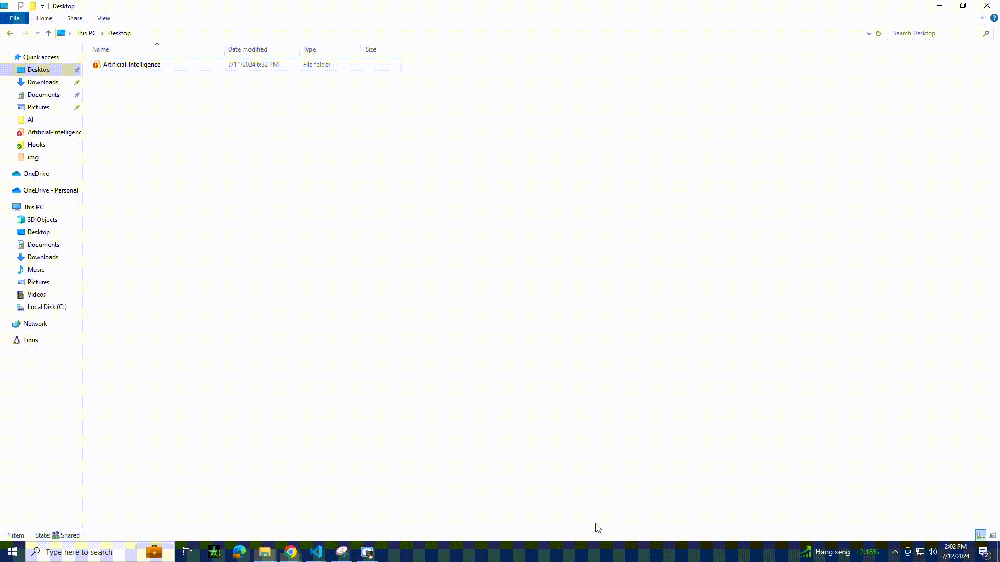

# Table Of Contents
- [Table Of Contents](#table-of-contents)
- [Open Web UI](#open-web-ui)
- [Ollama Installation](#ollama-installation)
	- [Pull Ollama Models](#pull-ollama-models)
- [Image Detection With Openai gpt-4o Model](#image-detection-with-openai-gpt-4o-model)
	- [Overview](#overview)
	- [Source Code](#source-code)
	- [Functions](#functions)
	- [Main Script](#main-script)
	- [System Prompt](#system-prompt)
	- [API Request Payload](#api-request-payload)
	- [Response](#response)
	- [Environment Variable](#environment-variable)
	- [Image File Path](#image-file-path)
- [Using SVN Hook Pre-Commit and Check Commit With Openai GPT-4o Model](#using-svn-hook-pre-commit-and-check-commit-with-openai-gpt-4o-model)
	- [Objective](#objective)
	- [Repository Folder](#repository-folder)
	- [SVN Hook Used](#svn-hook-used)
		- [Check Commit](#check-commit)
		- [Pre-Commit Hook](#pre-commit-hook)
	- [Add the Hook Script in SVN Repository](#add-the-hook-script-in-svn-repository)
		- [Prerequisite](#prerequisite)
	- [Setup the Check-Commit Hook Script](#setup-the-check-commit-hook-script)
		- [Example Check Commit Setup](#example-check-commit-setup)
	- [Setup the Pre-Commit Hook Script](#setup-the-pre-commit-hook-script)
		- [Example Pre Commit Setup](#example-pre-commit-setup)
	- [Commit a file to SVN with AI (DEMO)](#commit-a-file-to-svn-with-ai-demo)
- [Setup Environment Variable](#setup-environment-variable)

# Open Web UI
Open WebUI is an extensible, feature-rich, and user-friendly self-hosted WebUI designed to operate entirely offline. It supports various LLM runners, including Ollama and OpenAI-compatible APIs.

See the official documentation of <a href="https://docs.openwebui.com/" target="_blank">Open Web UI</a> here.

	curl -sL https://raw.githubusercontent.com/Vichondrias1/lponder/main/AI/Open-Web-UI/openwebui.sh | sh

NOTE: To use Open Web UI make sure you have Ollama installed on your device.

# Ollama Installation

Run this curl command to Install Ollama. For more info visit Ollama Website. <a href="https://ollama.com/download/linux">Ollama</a>

	curl -fsSL https://ollama.com/install.sh | sh

## Pull Ollama Models
Run this command to pull your desired LLM. See the list of available LLM in <a href="https://ollama.com/library">Ollama</a>.

	ollama pull <model name>

	example: ollama pull llama3 

# Image Detection With Openai gpt-4o Model

## Overview

This is a Python script that utilizes OpenAI's ChatGPT model to analyze an image and determine whether it meets the required standards for approval. The script encodes the image, constructs a prompt, and sends a request to the OpenAI API to get a response from the ChatGPT model.

## Source Code

	import os
	import io
	import base64
	import requests
	import openai
	
	open_ai_key = os.environ["AI_API_KEY"]
	
	# Initialize OpenAI client
	openai.api_key = open_ai_key
	
	# Function to encode the image
	def encode_image(image_path):
		with open(image_path, "rb") as image_file:
			return base64.b64encode(image_file.read()).decode('utf-8')
	
	# Path to the image file
	image_path = "images/3.jpg"  # Replace with your image path
	
	# Getting the base64 string
	base64_image = encode_image(image_path)
	
	headers = {
		"Content-Type": "application/json",
		"Authorization": f"Bearer {open_ai_key}"
	}
	
	# Constructing the prompt
	system_prompt = f"""
	You are an AI Real Estate Marketing Agent. You Are Responsible to maintaining a good quality maketing products. Ensurin that the houses you will be marketing is of high quality
	
	You will be responsible for reviewing a large dataset of images, with the primary objective of identifying and filtering out unwanted objects or content within the images. You will analyze each image and make a determination as to whether it meets the required standards for approval.
	
	Unwanted Objects or Content:
	
	1. Garbage, Garbage bags, Litter, Debm of wasris and any other forte
	2. Obscene or offensive material
	3. Harmful or illegal activities
	4. Inappropriate or explicit content
	5. Any other visual elements that may be deemed unsuitable or inappropriate by the system administrators
	
	Approval Criteria:
	
	1. Absence of Unwanted Objects or Content: The image must not contain any unwanted objects or content, including but not limited to garbage, garbage bags, obscene or offensive material, harmful or illegal activities, inappropriate or explicit content, or branding or logos that violate copyright laws.
	2. Overall Aesthetic Appeal and Quality: The image must have a high aesthetic appeal and quality, including but not limited to good lighting, composition, and resolution.
	3. Relevance to Intended Context or Purpose: The image must be relevant to the intended context or purpose, and align with the desired tone, theme, and message.
	4. Adherence to Predetermined Guidelines and Standards: The image must adhere to predetermined guidelines and standards for image publication, including but not limited to format, size, and resolution requirements.
	
	You will only respond with 'Approve' or 'Rejected'. When you respond with 'Rejected' you will state the reason why it was rejected.
	
	"""
	
	payload = {
		"model": "gpt-4o",
		"messages": [
			{"role": "system", "content": system_prompt},
			{"role": "user", "content": [{"type": "image_url", "image_url": {"url": f"data:image/jpeg;base64,{base64_image}", "detail": "low"}}]}
	
		],
		"max_tokens": 300,
		"temperature": 0.5
	}
	
	response = requests.post("https://api.openai.com/v1/chat/completions", headers=headers, json=payload)
	
	#Display whole json object
	print("CHAT GPT response: ", response.json())

## Functions  

**encode_image(image_path)**
- Takes an image file path as input
- Opens the image file in binary read mode ("rb" )
- Encodes the image data using base64 encoding
- Returns the encoded image data as a string

## Main Script
- Initializes the OpenAI client with an API key stored in an environment variable (open_ai_key)
- Sets the image file path and encodes the image using the encode_image function
- Constructs a **system prompt** that defines the task and guidelines for the ChatGPT model
- Creates a payload for the API request, including the **system prompt**, the encoded image, and other parameters
- Sends a POST request to the OpenAI API to get a response from the ChatGPT model
- Prints the response from the API, which includes the approval decision and reason (if rejected)

## System Prompt

The **system prompt** defines the task and guidelines for the ChatGPT model. It includes:

- A brief introduction to the task
- A list of unwanted objects or content that should be filtered out
- Approval criteria, including:
  - Absence of unwanted objects or content
  - Overall aesthetic appeal and quality
  - Relevance to intended context or purpose
  - Adherence to predetermined guidelines and standards

## API Request Payload

The payload includes:

- model: The ChatGPT model to use (gpt-4o)
- messages: An array of messages, including:
  - A system message with the system prompt
  - A user message with the encoded image and other details
- max_tokens: The maximum number of tokens to generate in the response (300)
- temperature: The temperature parameter for the model (0.5)

## Response

The response from the API includes the approval decision and reason (if rejected). The script prints the entire JSON response object.

## Environment Variable

**AI_API_KEY**: The OpenAI API key, stored as an environment variable.

## Image File Path

**image_path**: The file path to the image file to be analyzed.

**Note**: 
This script assumes that you have an OpenAI API key and have replaced the AI_API_KEY environment variable with your actual API key. You should also replace the image_path variable with the actual file path to the image file you want to analyze.

# Using SVN Hook Pre-Commit and Check Commit With Openai GPT-4o Model
## Objective

The SVN hook aims to ensure the quality and integrity of code files being committed to the SVN repository by leveraging AI-based analysis. It uses OpenAI's GPT-4 model to evaluate the code and identify any issues that may arise before allowing the commit to proceed.

## Repository Folder

- Path: PonderDevelopment/Artificial Intelligence

## SVN Hook Used

### Check Commit
   
- **Purpose:** To validate that the code meets certain quality standards before it can be committed to the repository.
- **Functionality:**
	- Capture the list of files being committed.
	- Read the content of these files.
	- Send the content to the GPT-4 model for analysis.
	- Parse the response from GPT-4 to determine if there are any issues with the code.
	- Provide detailed feedback on the nature of the issues identified by the AI model.
  
### Pre-Commit Hook
- **Location:** The pre-commit hook script is placed in the hooks directory of the SVN repository.
- **Purpose:** To intercept the commit process and analyze the code files using the check commit script before allowing the commit to proceed.
- **Functionality:** 
	- Capture the list of files being committed.
	- If issues are found, prevent the commit and display the errors to the user.
	- If no issues are found, allow the commit to proceed.

## Add the Hook Script in SVN Repository
### Prerequisite
1. Need to install python on your local machine for the python script to work.
2. Install Dependencies

		pip install requests
		pip install openai
		pip install argparse
3. Need the SVN Repository.

## Setup the Check-Commit Hook Script

1. Navigate to you svn repository.

2. Go to setting and select Hook Scripts then click Add.
   
3. Select the **Check-Commit Hook**.
4. The Working Path: Point the your repository to it.
5. Command Line To Execute: Point the **check-commit.bat** script located in PonderDevelopment/Artificial-Intelligence/Hooks

### Example Check Commit Setup

## Setup the Pre-Commit Hook Script

1. Navigate to you svn repository.

2. Go to setting and select Hook Scripts then click Add.
   
3. Select the **Pre-Commit Hook**.
4. The Working Path: Point the your repository to it.
5. Command Line To Execute: Point to the **readErrorMessage.py** script located in PonderDevelopment/Artificial-Intelligence/Hooks

		python [Path_To_readErrorMessage.py]

### Example Pre Commit Setup

## Commit a file to SVN with AI (DEMO)
This example commit shows how openai gpt-4o analyze the code commit and determine the issues for the code file provided.

# Setup Environment Variable

To use a .bashrc file to store your environment variables, you'll need to follow these steps:

**Step 1: Open your .bashrc file**

You can do this by opening a terminal and typing:

	nano ~/.bashrc

This will open the .bashrc file in the nano editor. If you prefer a different editor, you can use that instead.

**Step 2: Add your environment variable**

At the end of the file, add a line to set your AI_API_KEY environment variable. For example:

	export AI_API_KEY=your_api_key_here

Replace your_api_key_here with your actual API key.

**Step 3: Save and close the file**

Save the file by pressing Ctrl+X, then Y, then Enter. This will save the changes and close the file.

**Step 4: Reload your .bashrc file**

To apply the changes, you need to reload your .bashrc file. You can do this by typing:

	source ~/.bashrc

This will reload the file and set the environment variable.

**Step 5: Verify the environment variable**

To check that the environment variable has been set, you can type:

	echo $AI_API_KEY

This should print out your API key.

**Step 6: Update your Python script**

In your Python script, you can access the environment variable using os.environ. For example:

	import os

	open_ai_key = os.environ["AI_API_KEY"]

This will retrieve the value of the AI_API_KEY environment variable and store it in the open_ai_key variable.

That's it! You should now be able to use your .bashrc file to store your environment variables.

