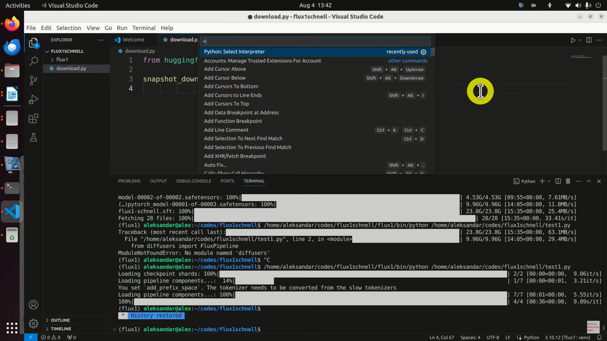
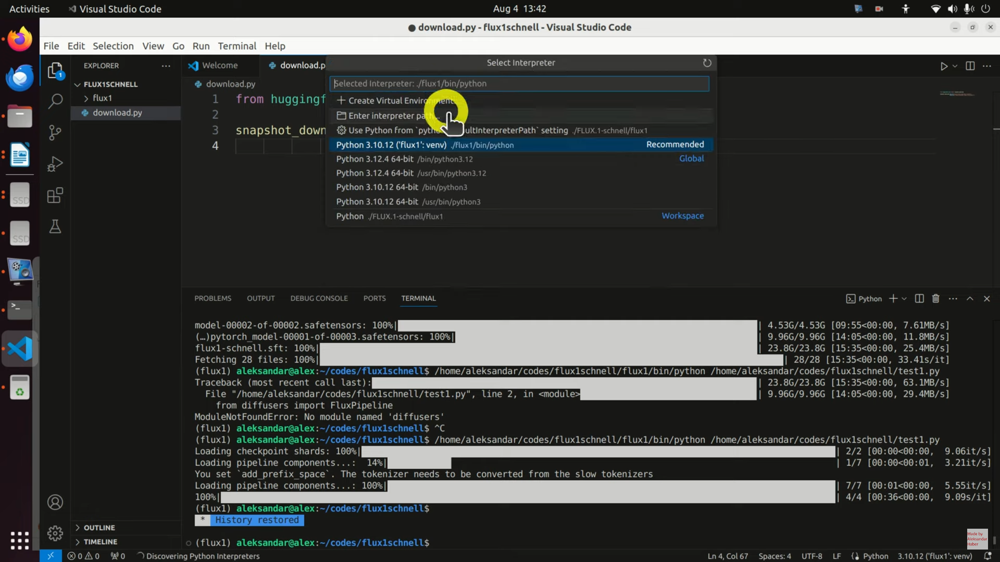
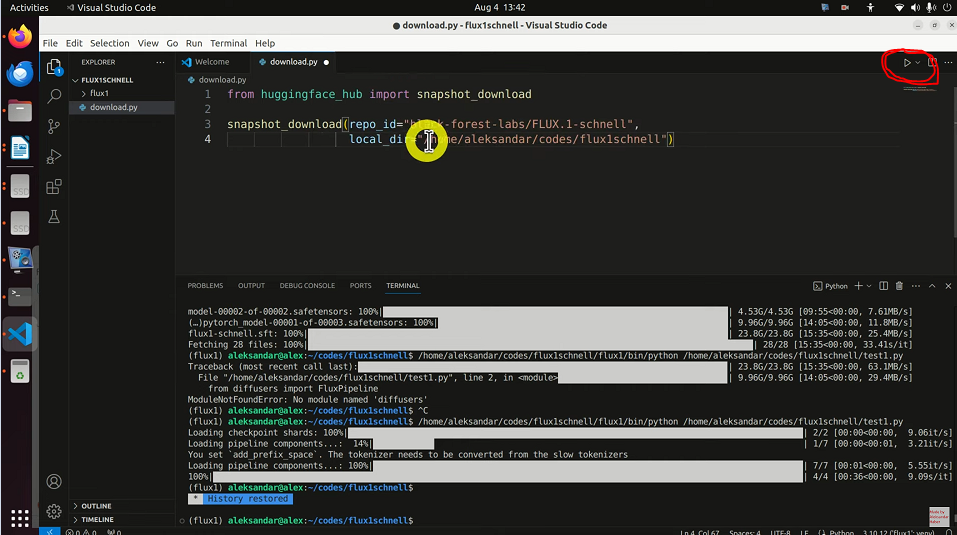

# Table Of Contents
- [Table Of Contents](#table-of-contents)
- [Open Web UI](#open-web-ui)
- [Ollama Installation](#ollama-installation)
  - [Pull Ollama Models](#pull-ollama-models)
- [Image Detection With Openai gpt-4o Model](#image-detection-with-openai-gpt-4o-model)
  - [Overview](#overview)
  - [Source Code](#source-code)
  - [Functions](#functions)
  - [Main Script](#main-script)
  - [System Prompt](#system-prompt)
  - [API Request Payload](#api-request-payload)
  - [Response](#response)
  - [Environment Variable](#environment-variable)
  - [Image File Path](#image-file-path)
- [Using SVN Hook Pre-Commit and Check Commit With Openai GPT-4o Model](#using-svn-hook-pre-commit-and-check-commit-with-openai-gpt-4o-model)
  - [Objective](#objective)
  - [Repository Folder](#repository-folder)
  - [SVN Hook Used](#svn-hook-used)
    - [Check Commit](#check-commit)
    - [Pre-Commit Hook](#pre-commit-hook)
  - [Add the Hook Script in SVN Repository](#add-the-hook-script-in-svn-repository)
    - [Prerequisite](#prerequisite)
  - [Setup the Check-Commit Hook Script](#setup-the-check-commit-hook-script)
    - [Example Check Commit Setup](#example-check-commit-setup)
  - [Setup the Pre-Commit Hook Script](#setup-the-pre-commit-hook-script)
    - [Example Pre Commit Setup](#example-pre-commit-setup)
  - [Commit a file to SVN with AI (DEMO)](#commit-a-file-to-svn-with-ai-demo)
- [Setup Environment Variable](#setup-environment-variable)
  - [In WINDOWS](#in-windows)
  - [In LINUX](#in-linux)
- [Using GPT4o mini to tag and caption images](#using-gpt4o-mini-to-tag-and-caption-images)
  - [Setup](#setup)
    - [Testing with a few examples](#testing-with-a-few-examples)
  - [Looking up existing keywords](#looking-up-existing-keywords)
    - [Testing with example keywords](#testing-with-example-keywords)
  - [Generate captions](#generate-captions)
  - [Describing images with GPT-4o mini](#describing-images-with-gpt-4o-mini)
    - [Testing on a few examples](#testing-on-a-few-examples)
  - [Turning descriptions into captions](#turning-descriptions-into-captions)
    - [Testing on a few examples](#testing-on-a-few-examples-1)
  - [Image search](#image-search)
    - [Preparing the dataset](#preparing-the-dataset)
  - [Embedding captions and keywords](#embedding-captions-and-keywords)
    - [Search from input text](#search-from-input-text)
    - [Search from image](#search-from-image)
  - [Wrapping up](#wrapping-up)
- [How to format inputs to ChatGPT models](#how-to-format-inputs-to-chatgpt-models)
  - [1. Import the openai library](#1-import-the-openai-library)
  - [2. An example chat completion API call](#2-an-example-chat-completion-api-call)
  - [3. Tips for instructing gpt-3.5-turbo-0301](#3-tips-for-instructing-gpt-35-turbo-0301)
  - [4. Counting tokens](#4-counting-tokens)
- [Zero-shot classification with embeddings](#zero-shot-classification-with-embeddings)
  - [Zero-Shot Classification](#zero-shot-classification)
- [How to count tokens with Tiktoken](#how-to-count-tokens-with-tiktoken)
  - [Encodings](#encodings)
  - [Tokenizer libraries by language](#tokenizer-libraries-by-language)
  - [How strings are typically tokenized](#how-strings-are-typically-tokenized)
    - [0. Install tiktoken](#0-install-tiktoken)
    - [1. Import tiktoken](#1-import-tiktoken)
    - [2. Load an encoding](#2-load-an-encoding)
    - [4. Turn tokens into text with `encoding.decode()`](#4-turn-tokens-into-text-with-encodingdecode)
    - [5. Comparing encodings](#5-comparing-encodings)
    - [6. Counting tokens for chat completions API calls](#6-counting-tokens-for-chat-completions-api-calls)
- [Introduction to Structured Outputs](#introduction-to-structured-outputs)
  - [Response format usage](#response-format-usage)
  - [Function call usage](#function-call-usage)
  - [Examples](#examples)
  - [Setup](#setup-1)
  - [Example 1: Math tutor](#example-1-math-tutor)
  - [Using the SDK parse helper](#using-the-sdk-parse-helper)
  - [Refusal](#refusal)
  - [Example 2: Text summarization](#example-2-text-summarization)
  - [Example 3: Entity extraction from user input](#example-3-entity-extraction-from-user-input)
- [Structured Outputs for Multi-Agent Systems](#structured-outputs-for-multi-agent-systems)
  - [Why build a Multi-Agent System?](#why-build-a-multi-agent-system)
  - [Environment set up](#environment-set-up)
  - [Agents set up](#agents-set-up)
  - [Tool execution](#tool-execution)
  - [Multi-agent system execution](#multi-agent-system-execution)
- [How to stream completions](#how-to-stream-completions)
  - [Downsides](#downsides)
  - [Example code](#example-code)
  - [1. What a typical chat completion response looks like](#1-what-a-typical-chat-completion-response-looks-like)
  - [2. How to stream a chat completion](#2-how-to-stream-a-chat-completion)
  - [3. How much time is saved by streaming a chat completion](#3-how-much-time-is-saved-by-streaming-a-chat-completion)
  - [4. How to get token usage data for streamed chat completion response](#4-how-to-get-token-usage-data-for-streamed-chat-completion-response)
- [Processing and narrating a video with GPT's visual capabilities and the TTS API](#processing-and-narrating-a-video-with-gpts-visual-capabilities-and-the-tts-api)
  - [Setup](#setup-2)
  - [1. Using GPT's visual capabilities to get a description of a video](#1-using-gpts-visual-capabilities-to-get-a-description-of-a-video)
  - [2. Generating a voiceover for a video with GPT-4 and the TTS API](#2-generating-a-voiceover-for-a-video-with-gpt-4-and-the-tts-api)
- [GPT4o mini with RAG](#gpt4o-mini-with-rag)
  - [How to combine GPT4o mini with RAG to create a clothing matchmaker app](#how-to-combine-gpt4o-mini-with-rag-to-create-a-clothing-matchmaker-app)
  - [Environment Setup](#environment-setup)
    - [Creating the Embeddings](#creating-the-embeddings)
    - [Two options for creating the embeddings:](#two-options-for-creating-the-embeddings)
    - [Building the Matching Algorithm](#building-the-matching-algorithm)
    - [Analysis Module](#analysis-module)
    - [Testing the Prompt with Sample Images](#testing-the-prompt-with-sample-images)
  - [Guardrails](#guardrails)
- [Install and Run FLUX.1-schnell text to Image Model in Python(Linux)](#install-and-run-flux1-schnell-text-to-image-model-in-pythonlinux)
  - [Software/Hardware prerequisites:](#softwarehardware-prerequisites)
  - [Download the flux1 schnell repository from hugging face](#download-the-flux1-schnell-repository-from-hugging-face)
  - [Step 1 Create a virtual environment](#step-1-create-a-virtual-environment)
  - [Step 2 Create a file download.py inside your virtual environment](#step-2-create-a-file-downloadpy-inside-your-virtual-environment)
  - [Step 3 run download.py](#step-3-run-downloadpy)
  - [Step 4 Install the necessary packages.](#step-4-install-the-necessary-packages)
  - [Step 5 Create the python file flux schnell](#step-5-create-the-python-file-flux-schnell)
  - [Step 6 Run the code](#step-6-run-the-code)


# Open Web UI
Open WebUI is an extensible, feature-rich, and user-friendly self-hosted WebUI designed to operate entirely offline. It supports various LLM runners, including Ollama and OpenAI-compatible APIs.

See the official documentation of <a href="https://docs.openwebui.com/" target="_blank">Open Web UI</a> here.


	curl -sL https://raw.githubusercontent.com/Vichondrias1/lponder/main/AI/Open-Web-UI/openwebui.sh | sh


NOTE: To use Open Web UI make sure you have Ollama installed on your device.

# Ollama Installation

Run this curl command to Install Ollama. For more info visit Ollama Website. <a href="https://ollama.com/download/linux">Ollama</a>

	curl -fsSL https://ollama.com/install.sh | sh

## Pull Ollama Models
Run this command to pull your desired LLM. See the list of available LLM in <a href="https://ollama.com/library">Ollama</a>.

	ollama pull <model name>

	example: ollama pull llama3 

# Image Detection With Openai gpt-4o Model

## Overview

This is a Python script that utilizes OpenAI's ChatGPT model to analyze an image and determine whether it meets the required standards for approval. The script encodes the image, constructs a prompt, and sends a request to the OpenAI API to get a response from the ChatGPT model.

## Source Code

	import os
	import io
	import base64
	import requests
	import openai
	
	open_ai_key = os.environ["AI_API_KEY"]
	
	# Initialize OpenAI client
	openai.api_key = open_ai_key
	
	# Function to encode the image
	def encode_image(image_path):
		with open(image_path, "rb") as image_file:
			return base64.b64encode(image_file.read()).decode('utf-8')
	
	# Path to the image file
	image_path = "images/3.jpg"  # Replace with your image path
	
	# Getting the base64 string
	base64_image = encode_image(image_path)
	
	headers = {
		"Content-Type": "application/json",
		"Authorization": f"Bearer {open_ai_key}"
	}
	
	# Constructing the prompt
	system_prompt = f"""
	You are an AI Real Estate Marketing Agent. You Are Responsible to maintaining a good quality maketing products. Ensurin that the houses you will be marketing is of high quality
	
	You will be responsible for reviewing a large dataset of images, with the primary objective of identifying and filtering out unwanted objects or content within the images. You will analyze each image and make a determination as to whether it meets the required standards for approval.
	
	Unwanted Objects or Content:
	
	1. Garbage, Garbage bags, Litter, Debm of wasris and any other forte
	2. Obscene or offensive material
	3. Harmful or illegal activities
	4. Inappropriate or explicit content
	5. Any other visual elements that may be deemed unsuitable or inappropriate by the system administrators
	
	Approval Criteria:
	
	1. Absence of Unwanted Objects or Content: The image must not contain any unwanted objects or content, including but not limited to garbage, garbage bags, obscene or offensive material, harmful or illegal activities, inappropriate or explicit content, or branding or logos that violate copyright laws.
	2. Overall Aesthetic Appeal and Quality: The image must have a high aesthetic appeal and quality, including but not limited to good lighting, composition, and resolution.
	3. Relevance to Intended Context or Purpose: The image must be relevant to the intended context or purpose, and align with the desired tone, theme, and message.
	4. Adherence to Predetermined Guidelines and Standards: The image must adhere to predetermined guidelines and standards for image publication, including but not limited to format, size, and resolution requirements.
	
	You will only respond with 'Approve' or 'Rejected'. When you respond with 'Rejected' you will state the reason why it was rejected.
	
	"""
	
	payload = {
		"model": "gpt-4o",
		"messages": [
			{"role": "system", "content": system_prompt},
			{"role": "user", "content": [{"type": "image_url", "image_url": {"url": f"data:image/jpeg;base64,{base64_image}", "detail": "low"}}]}
	
		],
		"max_tokens": 300,
		"temperature": 0.5
	}
	
	response = requests.post("https://api.openai.com/v1/chat/completions", headers=headers, json=payload)
	
	#Display whole json object
	print("CHAT GPT response: ", response.json())

## Functions  

**encode_image(image_path)**
- Takes an image file path as input
- Opens the image file in binary read mode ("rb" )
- Encodes the image data using base64 encoding
- Returns the encoded image data as a string

## Main Script
- Initializes the OpenAI client with an API key stored in an environment variable (open_ai_key)
- Sets the image file path and encodes the image using the encode_image function
- Constructs a **system prompt** that defines the task and guidelines for the ChatGPT model
- Creates a payload for the API request, including the **system prompt**, the encoded image, and other parameters
- Sends a POST request to the OpenAI API to get a response from the ChatGPT model
- Prints the response from the API, which includes the approval decision and reason (if rejected)

## System Prompt

The **system prompt** defines the task and guidelines for the ChatGPT model. It includes:

- A brief introduction to the task
- A list of unwanted objects or content that should be filtered out
- Approval criteria, including:
  - Absence of unwanted objects or content
  - Overall aesthetic appeal and quality
  - Relevance to intended context or purpose
  - Adherence to predetermined guidelines and standards

## API Request Payload

The payload includes:

- model: The ChatGPT model to use (gpt-4o)
- messages: An array of messages, including:
  - A system message with the system prompt
  - A user message with the encoded image and other details
- max_tokens: The maximum number of tokens to generate in the response (300)
- temperature: The temperature parameter for the model (0.5)

## Response

The response from the API includes the approval decision and reason (if rejected). The script prints the entire JSON response object.

## Environment Variable

**AI_API_KEY**: The OpenAI API key, stored as an environment variable.

## Image File Path

**image_path**: The file path to the image file to be analyzed.

**Note**: 
This script assumes that you have an OpenAI API key and have replaced the AI_API_KEY environment variable with your actual API key. You should also replace the image_path variable with the actual file path to the image file you want to analyze.

# Using SVN Hook Pre-Commit and Check Commit With Openai GPT-4o Model
## Objective

The SVN hook aims to ensure the quality and integrity of code files being committed to the SVN repository by leveraging AI-based analysis. It uses OpenAI's GPT-4 model to evaluate the code and identify any issues that may arise before allowing the commit to proceed.

## Repository Folder

- Path: PonderDevelopment/Artificial Intelligence

## SVN Hook Used

### Check Commit
   
- **Purpose:** To validate that the code meets certain quality standards before it can be committed to the repository.
- **Functionality:**
	- Capture the list of files being committed.
	- Read the content of these files.
	- Send the content to the GPT-4 model for analysis.
	- Parse the response from GPT-4 to determine if there are any issues with the code.
	- Provide detailed feedback on the nature of the issues identified by the AI model.
  
### Pre-Commit Hook
- **Location:** The pre-commit hook script is placed in the hooks directory of the SVN repository.
- **Purpose:** To intercept the commit process and analyze the code files using the check commit script before allowing the commit to proceed.
- **Functionality:** 
	- Capture the list of files being committed.
	- If issues are found, prevent the commit and display the errors to the user.
	- If no issues are found, allow the commit to proceed.

## Add the Hook Script in SVN Repository
### Prerequisite
1. Need to install python on your local machine for the python script to work.
2. Install Dependencies

		pip install requests
		pip install openai
		pip install argparse
3. Need the SVN Repository.
4. Set the OPENAI_API_KEY environment variable. See the docs on how to do it. [Setup Environment Variable](#setup-environment-variable)

## Setup the Check-Commit Hook Script

1. Navigate to you svn repository.

2. Go to setting and select Hook Scripts then click Add.
   
3. Select the **Check-Commit Hook**.
4. The Working Path: Point the your repository to it.
5. Command Line To Execute: Point the **check-commit.bat** script located in PonderDevelopment/Artificial-Intelligence/Hooks

### Example Check Commit Setup


## Setup the Pre-Commit Hook Script

1. Navigate to you svn repository.

2. Go to setting and select Hook Scripts then click Add.
   
3. Select the **Pre-Commit Hook**.
4. The Working Path: Point the your repository to it.
5. Command Line To Execute: Point to the **readErrorMessage.py** script located in PonderDevelopment/Artificial-Intelligence/Hooks

		python [Path_To_readErrorMessage.py]

### Example Pre Commit Setup


## Commit a file to SVN with AI (DEMO)
This example commit shows how openai gpt-4o analyze the code commit and determine the issues for the code file provided.


# Setup Environment Variable 

## In WINDOWS

1. Type in Windows Search Bar (Edit the system environment variables).
   
	
2. Click the Environment Variable
   
	

3. Click new the add, after adding correct Variable name and Variable value click ok.

		Variable name: OPENAI_API_KEY
		Variable value: your_actual_api_key
	

4. Restart Your PC for the sync to take effect.

5. To check if the environment variable is correctly added. Open command prompt and paste this command. If the OPENAI_API_KEY is being displayed this means its correctly added.
   
		echo %OPENAI_API_KEY%
	   

## In LINUX

To use a .bashrc file to store your environment variables, you'll need to follow these steps:

**Step 1: Open your .bashrc file**

You can do this by opening a terminal and typing:

	nano ~/.bashrc

This will open the .bashrc file in the nano editor. If you prefer a different editor, you can use that instead.

**Step 2: Add your environment variable**

At the end of the file, add a line to set your AI_API_KEY environment variable. For example:

	export AI_API_KEY=your_api_key_here

Replace your_api_key_here with your actual API key.

**Step 3: Save and close the file**

Save the file by pressing Ctrl+X, then Y, then Enter. This will save the changes and close the file.

**Step 4: Reload your .bashrc file**

To apply the changes, you need to reload your .bashrc file. You can do this by typing:

	source ~/.bashrc

This will reload the file and set the environment variable.

**Step 5: Verify the environment variable**

To check that the environment variable has been set, you can type:

	echo $AI_API_KEY

This should print out your API key.

**Step 6: Update your Python script**

In your Python script, you can access the environment variable using os.environ. For example:

	import os

	open_ai_key = os.environ["AI_API_KEY"]

This will retrieve the value of the AI_API_KEY environment variable and store it in the open_ai_key variable.

That's it! You should now be able to use your .bashrc file to store your environment variables.

# Using GPT4o mini to tag and caption images
This notebook explores how to leverage the vision capabilities of the GPT-4* models (for example gpt-4o, gpt-4o-mini or gpt-4-turbo) to tag & caption images.

We can leverage the multimodal capabilities of these models to provide input images along with additional context on what they represent, and prompt the model to output tags or image descriptions. The image descriptions can then be further refined with a language model (in this notebook, we'll use gpt-4o-mini) to generate captions.

Generating text content from images can be useful for multiple use cases, especially use cases involving search.
We will illustrate a search use case in this notebook by using generated keywords and product captions to search for products - both from a text input and an image input.

As an example, we will use a dataset of Amazon furniture items, tag them with relevant keywords and generate short, descriptive captions.

## Setup

	# Install dependencies if needed
	%pip install openai
	%pip install scikit-learn

```python
from IPython.display import Image, display
import pandas as pd
from sklearn.metrics.pairwise import cosine_similarity
import numpy as np
from openai import OpenAI

	os.environ["OPENAI_API_KEY"] = "OPEN_AI_KEY_HERE"

	# Initializing OpenAI client - see https://platform.openai.com/docs/quickstart?context=python
	client = OpenAI(
		api_key=os.environ.get("OPENAI_API_KEY"),
	)
```	

```python
# Loading dataset
dataset_path =  "data/amazon_furniture_dataset.csv"
df = pd.read_csv(dataset_path)
df.head()
```	

## Tag images
In this section, we'll use GPT-4o mini to generate relevant tags for our products.

We'll use a simple zero-shot approach to extract keywords, and deduplicate those keywords using embeddings to avoid having multiple keywords that are too similar.

We will use a combination of an image and the product title to avoid extracting keywords for other items that are depicted in the image - sometimes there are multiple items used in the scene and we want to focus on just the one we want to tag.

### Extract keywords
```python
system_prompt = '''
    You are an agent specialized in tagging images of furniture items, decorative items, or furnishings with relevant keywords that could be used to search for these items on a marketplace.
    
    You will be provided with an image and the title of the item that is depicted in the image, and your goal is to extract keywords for only the item specified. 
    
    Keywords should be concise and in lower case. 
    
    Keywords can describe things like:
    - Item type e.g. 'sofa bed', 'chair', 'desk', 'plant'
    - Item material e.g. 'wood', 'metal', 'fabric'
    - Item style e.g. 'scandinavian', 'vintage', 'industrial'
    - Item color e.g. 'red', 'blue', 'white'
    
    Only deduce material, style or color keywords when it is obvious that they make the item depicted in the image stand out.

    Return keywords in the format of an array of strings, like this:
    ['desk', 'industrial', 'metal']
    
'''

def analyze_image(img_url, title):
    response = client.chat.completions.create(
    model="gpt-4o-mini",
    messages=[
        {
            "role": "system",
            "content": system_prompt
        },
        {
            "role": "user",
            "content": [
                {
                    "type": "image_url",
                    "image_url": {
                        "url": img_url,
                    }
                },
            ],
        },
        {
            "role": "user",
            "content": title
        }
    ],
        max_tokens=300,
        top_p=0.1
    )

    return response.choices[0].message.content
```
### Testing with a few examples
```python
examples = df.iloc[:5]
```

```python
for index, ex in examples.iterrows():
    url = ex['primary_image']
    img = Image(url=url)
    display(img)
    result = analyze_image(url, ex['title'])
    print(result)
    print("\n\n")
```

## Looking up existing keywords
Using embeddings to avoid duplicates (synonyms) and/or match pre-defined keywords

```python
# Feel free to change the embedding model here
def get_embedding(value, model="text-embedding-3-large"): 
    embeddings = client.embeddings.create(
      model=model,
      input=value,
      encoding_format="float"
    )
    return embeddings.data[0].embedding
```

### Testing with example keywords

```python
# Existing keywords
keywords_list = ['industrial', 'metal', 'wood', 'vintage', 'bed']
```

```python
df_keywords = pd.DataFrame(keywords_list, columns=['keyword'])
df_keywords['embedding'] = df_keywords['keyword'].apply(lambda x: get_embedding(x))
df_keywords
```

```python
def compare_keyword(keyword):
    embedded_value = get_embedding(keyword)
    df_keywords['similarity'] = df_keywords['embedding'].apply(lambda x: cosine_similarity(np.array(x).reshape(1,-1), np.array(embedded_value).reshape(1, -1)))
    most_similar = df_keywords.sort_values('similarity', ascending=False).iloc[0]
    return most_similar

def replace_keyword(keyword, threshold = 0.6):
    most_similar = compare_keyword(keyword)
    if most_similar['similarity'] > threshold:
        print(f"Replacing '{keyword}' with existing keyword: '{most_similar['keyword']}'")
        return most_similar['keyword']
    return keyword
```

```python
# Example keywords to compare to our list of existing keywords
example_keywords = ['bed frame', 'wooden', 'vintage', 'old school', 'desk', 'table', 'old', 'metal', 'metallic', 'woody']
final_keywords = []

for k in example_keywords:
    final_keywords.append(replace_keyword(k))
    
final_keywords = set(final_keywords)
print(f"Final keywords: {final_keywords}")
```

## Generate captions
In this section, we'll use GPT-4o mini to generate an image description and then use a few-shot examples approach with GPT-4-turbo to generate captions from the images.

If few-shot examples are not enough for your use case, consider fine-tuning a model to get the generated captions to match the style & tone you are targeting.

```python
# Cleaning up dataset columns
selected_columns = ['title', 'primary_image', 'style', 'material', 'color', 'url']
df = df[selected_columns].copy()
df.head()
```

## Describing images with GPT-4o mini
```python
describe_system_prompt = '''
    You are a system generating descriptions for furniture items, decorative items, or furnishings on an e-commerce website.
    Provided with an image and a title, you will describe the main item that you see in the image, giving details but staying concise.
    You can describe unambiguously what the item is and its material, color, and style if clearly identifiable.
    If there are multiple items depicted, refer to the title to understand which item you should describe.
    '''

def describe_image(img_url, title):
    response = client.chat.completions.create(
    model="gpt-4o-mini",
    temperature=0.2,
    messages=[
        {
            "role": "system",
            "content": describe_system_prompt
        },
        {
            "role": "user",
            "content": [
                {
                    "type": "image_url",
                    "image_url": {
                        "url": img_url,
                    }
                },
            ],
        },
        {
            "role": "user",
            "content": title
        }
    ],
    max_tokens=300,
    )

    return response.choices[0].message.content
```

### Testing on a few examples
```python
for index, row in examples.iterrows():
    print(f"{row['title'][:50]}{'...' if len(row['title']) > 50 else ''} - {row['url']} :\n")
    img_description = describe_image(row['primary_image'], row['title'])
    print(f"{img_description}\n--------------------------\n")
```

## Turning descriptions into captions
Using a few-shot examples approach to turn a long description into a short image caption

```python
caption_system_prompt = '''
Your goal is to generate short, descriptive captions for images of furniture items, decorative items, or furnishings based on an image description.
You will be provided with a description of an item image and you will output a caption that captures the most important information about the item.
Your generated caption should be short (1 sentence), and include the most relevant information about the item.
The most important information could be: the type of the item, the style (if mentioned), the material if especially relevant and any distinctive features.
'''

few_shot_examples = [
    {
        "description": "This is a multi-layer metal shoe rack featuring a free-standing design. It has a clean, white finish that gives it a modern and versatile look, suitable for various home decors. The rack includes several horizontal shelves dedicated to organizing shoes, providing ample space for multiple pairs. Above the shoe storage area, there are 8 double hooks arranged in two rows, offering additional functionality for hanging items such as hats, scarves, or bags. The overall structure is sleek and space-saving, making it an ideal choice for placement in living rooms, bathrooms, hallways, or entryways where efficient use of space is essential.",
        "caption": "White metal free-standing shoe rack"
    },
    {
        "description": "The image shows a set of two dining chairs in black. These chairs are upholstered in a leather-like material, giving them a sleek and sophisticated appearance. The design features straight lines with a slight curve at the top of the high backrest, which adds a touch of elegance. The chairs have a simple, vertical stitching detail on the backrest, providing a subtle decorative element. The legs are also black, creating a uniform look that would complement a contemporary dining room setting. The chairs appear to be designed for comfort and style, suitable for both casual and formal dining environments.",
        "caption": "Set of 2 modern black leather dining chairs"
    },
    {
        "description": "This is a square plant repotting mat designed for indoor gardening tasks such as transplanting and changing soil for plants. It measures 26.8 inches by 26.8 inches and is made from a waterproof material, which appears to be a durable, easy-to-clean fabric in a vibrant green color. The edges of the mat are raised with integrated corner loops, likely to keep soil and water contained during gardening activities. The mat is foldable, enhancing its portability, and can be used as a protective surface for various gardening projects, including working with succulents. It's a practical accessory for garden enthusiasts and makes for a thoughtful gift for those who enjoy indoor plant care.",
        "caption": "Waterproof square plant repotting mat"
    }
]

formatted_examples = [[{
    "role": "user",
    "content": ex['description']
},
{
    "role": "assistant", 
    "content": ex['caption']
}]
    for ex in few_shot_examples
]

formatted_examples = [i for ex in formatted_examples for i in ex]
```

```python
def caption_image(description, model="gpt-4o-mini"):
    messages = formatted_examples
    messages.insert(0, 
        {
            "role": "system",
            "content": caption_system_prompt
        })
    messages.append(
        {
            "role": "user",
            "content": description
        })
    response = client.chat.completions.create(
    model=model,
    temperature=0.2,
    messages=messages
    )

    return response.choices[0].message.content
```

### Testing on a few examples
```python
examples = df.iloc[5:8]
```
```python
for index, row in examples.iterrows():
    print(f"{row['title'][:50]}{'...' if len(row['title']) > 50 else ''} - {row['url']} :\n")
    img_description = describe_image(row['primary_image'], row['title'])
    print(f"{img_description}\n--------------------------\n")
    img_caption = caption_image(img_description)
    print(f"{img_caption}\n--------------------------\n")
```

## Image search
In this section, we will use generated keywords and captions to search items that match a given input, either text or image.

We will leverage our embeddings model to generate embeddings for the keywords and captions and compare them to either input text or the generated caption from an input image.

```python
# Df we'll use to compare keywords
df_keywords = pd.DataFrame(columns=['keyword', 'embedding'])
df['keywords'] = ''
df['img_description'] = ''
df['caption'] = ''
```
```python

# Function to replace a keyword with an existing keyword if it's too similar
def get_keyword(keyword, df_keywords, threshold = 0.6):
    embedded_value = get_embedding(keyword)
    df_keywords['similarity'] = df_keywords['embedding'].apply(lambda x: cosine_similarity(np.array(x).reshape(1,-1), np.array(embedded_value).reshape(1, -1)))
    sorted_keywords = df_keywords.copy().sort_values('similarity', ascending=False)
    if len(sorted_keywords) > 0 :
        most_similar = sorted_keywords.iloc[0]
        if most_similar['similarity'] > threshold:
            print(f"Replacing '{keyword}' with existing keyword: '{most_similar['keyword']}'")
            return most_similar['keyword']
    new_keyword = {
        'keyword': keyword,
        'embedding': embedded_value
    }
    df_keywords = pd.concat([df_keywords, pd.DataFrame([new_keyword])], ignore_index=True)
    return keyword
```

### Preparing the dataset

```python
import ast

def tag_and_caption(row):
    keywords = analyze_image(row['primary_image'], row['title'])
    try:
        keywords = ast.literal_eval(keywords)
        mapped_keywords = [get_keyword(k, df_keywords) for k in keywords]
    except Exception as e:
        print(f"Error parsing keywords: {keywords}")
        mapped_keywords = []
    img_description = describe_image(row['primary_image'], row['title'])
    caption = caption_image(img_description)
    return {
        'keywords': mapped_keywords,
        'img_description': img_description,
        'caption': caption
    }

```

```python
df.shape
```

```python
# Running on first 50 lines
for index, row in df[:50].iterrows():
    print(f"{index} - {row['title'][:50]}{'...' if len(row['title']) > 50 else ''}")
    updates = tag_and_caption(row)
    df.loc[index, updates.keys()] = updates.values()
```

```python
df.head()
```

```python
data_path = "data/items_tagged_and_captioned.csv"
```

```python
# Saving locally for later - optional: do not execute if you prefer to use the provided file
df.to_csv(data_path, index=False)
```

```python
# Optional: load data from saved file if you haven't processed the whole dataset
df = pd.read_csv(data_path)
```

## Embedding captions and keywords
We can now use the generated captions and keywords to match relevant content to an input text query or caption. To do this, we will embed a combination of keywords + captions. Note: creating the embeddings will take ~3 mins to run. Feel free to load the pre-processed dataset (see below).

```python
df_search = df.copy()
```

```python
def embed_tags_caption(x):
    if x['caption'] != '':
        try:
            keywords_string = ",".join(k for k in x['keywords']) + '\n'
            content = keywords_string + x['caption']
            embedding = get_embedding(content)
            return embedding
        except Exception as e:
            print(f"Error creating embedding for {x}: {e}")
```

```python
df_search['embedding'] = df_search.apply(lambda x: embed_tags_caption(x), axis=1)
```

```python
df_search.head()
```

```python
# Keep only the lines where we have embeddings
df_search = df_search.dropna(subset=['embedding'])
print(df_search.shape)
```

```python
data_embeddings_path = "data/items_tagged_and_captioned_embeddings.csv"
```

```python
# Saving locally for later - optional: do not execute if you prefer to use the provided file
df_search.to_csv(data_embeddings_path, index=False)
```

```python
# Optional: load data from saved file if you haven't processed the whole dataset
from ast import literal_eval
df_search = pd.read_csv(data_embeddings_path)
df_search["embedding"] = df_search.embedding.apply(literal_eval).apply(np.array)
```
### Search from input text
We can compare the input text from a user directly to the embeddings we just created.

```python
# Searching for N most similar results
def search_from_input_text(query, n = 2):
    embedded_value = get_embedding(query)
    df_search['similarity'] = df_search['embedding'].apply(lambda x: cosine_similarity(np.array(x).reshape(1,-1), np.array(embedded_value).reshape(1, -1)))
    most_similar = df_search.sort_values('similarity', ascending=False).iloc[:n]
    return most_similar
```

```python
user_inputs = ['shoe storage', 'black metal side table', 'doormat', 'step bookshelf', 'ottoman']
```

```python
for i in user_inputs:
    print(f"Input: {i}\n")
    res = search_from_input_text(i)
    for index, row in res.iterrows():
        similarity_score = row['similarity']
        if isinstance(similarity_score, np.ndarray):
            similarity_score = similarity_score[0][0]
        print(f"{row['title'][:50]}{'...' if len(row['title']) > 50 else ''} ({row['url']}) - Similarity: {similarity_score:.2f}")
        img = Image(url=row['primary_image'])
        display(img)
        print("\n\n")
```

### Search from image
If the input is an image, we can find similar images by first turning images into captions, and embedding those captions to compare them to the already created embeddings.

```python
# We'll take a mix of images: some we haven't seen and some that are already in the dataset
example_images = df.iloc[306:]['primary_image'].to_list() + df.iloc[5:10]['primary_image'].to_list()
```

```python
for i in example_images:
    img_description = describe_image(i, '')
    caption = caption_image(img_description)
    img = Image(url=i)
    print('Input: \n')
    display(img)
    res = search_from_input_text(caption, 1).iloc[0]
    similarity_score = res['similarity']
    if isinstance(similarity_score, np.ndarray):
        similarity_score = similarity_score[0][0]
    print(f"{res['title'][:50]}{'...' if len(res['title']) > 50 else ''} ({res['url']}) - Similarity: {similarity_score:.2f}")
    img_res = Image(url=res['primary_image'])
    display(img_res)
    print("\n\n")
    
```

## Wrapping up
In this notebook, we explored how to leverage the multimodal capabilities of gpt-4o-mini to tag and caption images. By providing images along with contextual information to the model, we were able to generate tags and descriptions that can be further refined to create captions. This process has practical applications in various scenarios, particularly in enhancing search functionalities.

The search use case illustrated can be directly applied to applications such as recommendation systems, but the techniques covered in this notebook can be extended beyond items search and used in multiple use cases, for example RAG applications leveraging unstructured image data.

As a next step, you could explore using a combination of rule-based filtering with keywords and embeddings search with captions to retrieve more relevant results.

# How to format inputs to ChatGPT models
ChatGPT is powered by gpt-3.5-turbo and gpt-4, OpenAI's most advanced models.

You can build your own applications with gpt-3.5-turbo or gpt-4 using the OpenAI API.

Chat models take a series of messages as input, and return an AI-written message as output.

This guide illustrates the chat format with a few example API calls.

## 1. Import the openai library
```python
# if needed, install and/or upgrade to the latest version of the OpenAI Python library
%pip install --upgrade openai
%pip install tiktoken
```

```python
# import the OpenAI Python library for calling the OpenAI API
from openai import OpenAI
import os
import json

client = OpenAI(api_key=os.environ.get("OPENAI_API_KEY", "<your OpenAI API key if not set as env var>"))
```

## 2. An example chat completion API call
A chat completion API call parameters, Required

- model: the name of the model you want to use (e.g., gpt-3.5-turbo, gpt-4, gpt-3.5-turbo-16k-1106)
- messages: a list of message objects, where each object has two required fields:
    - role: the role of the messenger (either system, user, assistant or tool)
    - content: the content of the message (e.g., Write me a beautiful poem)
Messages can also contain an optional name field, which give the messenger a name. E.g., example-user, Alice, BlackbeardBot. Names may not contain spaces.

**Optional**

- frequency_penalty: Penalizes tokens based on their frequency, reducing repetition.
- logit_bias: Modifies likelihood of specified tokens with bias values.
- logprobs: Returns log probabilities of output tokens if true.
- top_logprobs: Specifies the number of most likely tokens to return at each position.
- max_tokens: Sets the maximum number of generated tokens in chat completion.
- n: Generates a specified number of chat completion choices for each input.
- presence_penalty: Penalizes new tokens based on their presence in the text.
- response_format: Specifies the output format, e.g., JSON mode.
- seed: Ensures deterministic sampling with a specified seed.
- stop: Specifies up to 4 sequences where the API should stop generating tokens.
- stream: Sends partial message deltas as tokens become available.
- temperature: Sets the sampling temperature between 0 and 2.
- top_p: Uses nucleus sampling; considers tokens with top_p probability mass.
- tools: Lists functions the model may call.
- tool_choice: Controls the model's function calls (none/auto/function).
- user: Unique identifier for end-user monitoring and abuse detection.

As of January 2024, you can also optionally submit a list of functions that tell GPT whether it can generate JSON to feed into a function. For details, see the documentation, API reference, or the Cookbook guide How to call functions with chat models.

Typically, a conversation will start with a system message that tells the assistant how to behave, followed by alternating user and assistant messages, but you are not required to follow this format.

Let's look at an example chat API calls to see how the chat format works in practice.
```python
# Example OpenAI Python library request
MODEL = "gpt-3.5-turbo"
response = client.chat.completions.create(
    model=MODEL,
    messages=[
        {"role": "system", "content": "You are a helpful assistant."},
        {"role": "user", "content": "Knock knock."},
        {"role": "assistant", "content": "Who's there?"},
        {"role": "user", "content": "Orange."},
    ],
    temperature=0,
)
```

```python
print(json.dumps(json.loads(response.model_dump_json()), indent=4))
```
As you can see, the response object has a few fields:

- id: the ID of the request
- choices: a list of completion objects (only one, unless you set n greater than 1)
- finish_reason: the reason the model stopped generating text (either stop, or length if max_tokens limit was reached)
- index: The index of the choice in the list of choices.
- logprobs: Log probability information for the choice.
- message: the message object generated by the model
    - content: content of message
    - role: The role of the author of this message.
    - tool_calls: The tool calls generated by the model, such as function calls. if the - tools is given
- created: the timestamp of the request
- model: the full name of the model used to generate the response
- object: the type of object returned (e.g., chat.completion)
- system_fingerprint: This fingerprint represents the backend configuration that the - model runs with.
- usage: the number of tokens used to generate the replies, counting prompt, completion, and total

Extract just the reply with:

```python
response.choices[0].message.content
```

Even non-conversation-based tasks can fit into the chat format, by placing the instruction in the first user message.

For example, to ask the model to explain asynchronous programming in the style of the pirate Blackbeard, we can structure conversation as follows:

```python
# example with a system message
response = client.chat.completions.create(
    model=MODEL,
    messages=[
        {"role": "system", "content": "You are a helpful assistant."},
        {"role": "user", "content": "Explain asynchronous programming in the style of the pirate Blackbeard."},
    ],
    temperature=0,
)

print(response.choices[0].message.content)

```
```python
# example without a system message
response = client.chat.completions.create(
    model=MODEL,
    messages=[
        {"role": "user", "content": "Explain asynchronous programming in the style of the pirate Blackbeard."},
    ],
    temperature=0,
)

print(response.choices[0].message.content)
```
## 3. Tips for instructing gpt-3.5-turbo-0301
Best practices for instructing models may change from model version to model version. The advice that follows applies to gpt-3.5-turbo-0301 and may not apply to future models.

**System messages**

The system message can be used to prime the assistant with different personalities or behaviors.

Be aware that gpt-3.5-turbo-0301 does not generally pay as much attention to the system message as gpt-4-0314 or gpt-3.5-turbo-0613. Therefore, for gpt-3.5-turbo-0301, we recommend placing important instructions in the user message instead. Some developers have found success in continually moving the system message near the end of the conversation to keep the model's attention from drifting away as conversations get longer.

```python
# An example of a system message that primes the assistant to explain concepts in great depth
response = client.chat.completions.create(
    model=MODEL,
    messages=[
        {"role": "system", "content": "You are a friendly and helpful teaching assistant. You explain concepts in great depth using simple terms, and you give examples to help people learn. At the end of each explanation, you ask a question to check for understanding"},
        {"role": "user", "content": "Can you explain how fractions work?"},
    ],
    temperature=0,
)

print(response.choices[0].message.content)
```

```python
# An example of a system message that primes the assistant to give brief, to-the-point answers
response = client.chat.completions.create(
    model=MODEL,
    messages=[
        {"role": "system", "content": "You are a laconic assistant. You reply with brief, to-the-point answers with no elaboration."},
        {"role": "user", "content": "Can you explain how fractions work?"},
    ],
    temperature=0,
)

print(response.choices[0].message.content)
```

**Few-shot prompting**

In some cases, it's easier to show the model what you want rather than tell the model what you want.

One way to show the model what you want is with faked example messages.

For example:
```python
# An example of a faked few-shot conversation to prime the model into translating business jargon to simpler speech
response = client.chat.completions.create(
    model=MODEL,
    messages=[
        {"role": "system", "content": "You are a helpful, pattern-following assistant."},
        {"role": "user", "content": "Help me translate the following corporate jargon into plain English."},
        {"role": "assistant", "content": "Sure, I'd be happy to!"},
        {"role": "user", "content": "New synergies will help drive top-line growth."},
        {"role": "assistant", "content": "Things working well together will increase revenue."},
        {"role": "user", "content": "Let's circle back when we have more bandwidth to touch base on opportunities for increased leverage."},
        {"role": "assistant", "content": "Let's talk later when we're less busy about how to do better."},
        {"role": "user", "content": "This late pivot means we don't have time to boil the ocean for the client deliverable."},
    ],
    temperature=0,
)

print(response.choices[0].message.content)
```

To help clarify that the example messages are not part of a real conversation, and shouldn't be referred back to by the model, you can try setting the name field of system messages to example_user and example_assistant.

Transforming the few-shot example above, we could write:

```python
# The business jargon translation example, but with example names for the example messages
response = client.chat.completions.create(
    model=MODEL,
    messages=[
        {"role": "system", "content": "You are a helpful, pattern-following assistant that translates corporate jargon into plain English."},
        {"role": "system", "name":"example_user", "content": "New synergies will help drive top-line growth."},
        {"role": "system", "name": "example_assistant", "content": "Things working well together will increase revenue."},
        {"role": "system", "name":"example_user", "content": "Let's circle back when we have more bandwidth to touch base on opportunities for increased leverage."},
        {"role": "system", "name": "example_assistant", "content": "Let's talk later when we're less busy about how to do better."},
        {"role": "user", "content": "This late pivot means we don't have time to boil the ocean for the client deliverable."},
    ],
    temperature=0,
)

print(response.choices[0].message.content)
```
Not every attempt at engineering conversations will succeed at first.

If your first attempts fail, don't be afraid to experiment with different ways of priming or conditioning the model.

As an example, one developer discovered an increase in accuracy when they inserted a user message that said "Great job so far, these have been perfect" to help condition the model into providing higher quality responses.

For more ideas on how to lift the reliability of the models, consider reading our guide on techniques to increase reliability. It was written for non-chat models, but many of its principles still apply.

## 4. Counting tokens

When you submit your request, the API transforms the messages into a sequence of tokens.

The number of tokens used affects:

- the cost of the request
- the time it takes to generate the response
- when the reply gets cut off from hitting the maximum token limit (4,096 for gpt-3.5-turbo or 8,192 for gpt-4)

You can use the following function to count the number of tokens that a list of messages will use.

Note that the exact way that tokens are counted from messages may change from model to model. Consider the counts from the function below an estimate, not a timeless guarantee.

In particular, requests that use the optional functions input will consume extra tokens on top of the estimates calculated below.

Read more about counting tokens in How to count tokens with tiktoken.

```python
import tiktoken


def num_tokens_from_messages(messages, model="gpt-3.5-turbo-0613"):
    """Return the number of tokens used by a list of messages."""
    try:
        encoding = tiktoken.encoding_for_model(model)
    except KeyError:
        print("Warning: model not found. Using cl100k_base encoding.")
        encoding = tiktoken.get_encoding("cl100k_base")
    if model in {
        "gpt-3.5-turbo-0613",
        "gpt-3.5-turbo-16k-0613",
        "gpt-4-0314",
        "gpt-4-32k-0314",
        "gpt-4-0613",
        "gpt-4-32k-0613",
        }:
        tokens_per_message = 3
        tokens_per_name = 1
    elif model == "gpt-3.5-turbo-0301":
        tokens_per_message = 4  # every message follows <|start|>{role/name}\n{content}<|end|>\n
        tokens_per_name = -1  # if there's a name, the role is omitted
    elif "gpt-3.5-turbo" in model:
        print("Warning: gpt-3.5-turbo may update over time. Returning num tokens assuming gpt-3.5-turbo-0613.")
        return num_tokens_from_messages(messages, model="gpt-3.5-turbo-0613")
    elif "gpt-4" in model:
        print("Warning: gpt-4 may update over time. Returning num tokens assuming gpt-4-0613.")
        return num_tokens_from_messages(messages, model="gpt-4-0613")
    else:
        raise NotImplementedError(
            f"""num_tokens_from_messages() is not implemented for model {model}."""
        )
    num_tokens = 0
    for message in messages:
        num_tokens += tokens_per_message
        for key, value in message.items():
            num_tokens += len(encoding.encode(value))
            if key == "name":
                num_tokens += tokens_per_name
    num_tokens += 3  # every reply is primed with <|start|>assistant<|message|>
    return num_tokens

```

```python
# let's verify the function above matches the OpenAI API response
example_messages = [
    {
        "role": "system",
        "content": "You are a helpful, pattern-following assistant that translates corporate jargon into plain English.",
    },
    {
        "role": "system",
        "name": "example_user",
        "content": "New synergies will help drive top-line growth.",
    },
    {
        "role": "system",
        "name": "example_assistant",
        "content": "Things working well together will increase revenue.",
    },
    {
        "role": "system",
        "name": "example_user",
        "content": "Let's circle back when we have more bandwidth to touch base on opportunities for increased leverage.",
    },
    {
        "role": "system",
        "name": "example_assistant",
        "content": "Let's talk later when we're less busy about how to do better.",
    },
    {
        "role": "user",
        "content": "This late pivot means we don't have time to boil the ocean for the client deliverable.",
    },
]

for model in [
    # "gpt-3.5-turbo-0301",
    # "gpt-4-0314",
    # "gpt-4-0613",
    "gpt-3.5-turbo-1106",
    "gpt-3.5-turbo",
    "gpt-4",
    "gpt-4-1106-preview",
    ]:
    print(model)
    # example token count from the function defined above
    print(f"{num_tokens_from_messages(example_messages, model)} prompt tokens counted by num_tokens_from_messages().")
    # example token count from the OpenAI API
    response = client.chat.completions.create(model=model,
    messages=example_messages,
    temperature=0,
    max_tokens=1)
    token = response.usage.prompt_tokens
    print(f'{token} prompt tokens counted by the OpenAI API.')
    print()

```

# Zero-shot classification with embeddings

In this notebook we will classify the sentiment of reviews using embeddings and zero labeled data! The dataset is created in the Get_embeddings_from_dataset Notebook.

We'll define positive sentiment to be 4- and 5-star reviews, and negative sentiment to be 1- and 2-star reviews. 3-star reviews are considered neutral and we won't use them for this example.

We will perform zero-shot classification by embedding descriptions of each class and then comparing new samples to those class embeddings.

```python 
import pandas as pd
import numpy as np
from ast import literal_eval

from sklearn.metrics import classification_report

EMBEDDING_MODEL = "text-embedding-3-small"

datafile_path = "data/fine_food_reviews_with_embeddings_1k.csv"

df = pd.read_csv(datafile_path)
df["embedding"] = df.embedding.apply(literal_eval).apply(np.array)

# convert 5-star rating to binary sentiment
df = df[df.Score != 3]
df["sentiment"] = df.Score.replace({1: "negative", 2: "negative", 4: "positive", 5: "positive"})
```
## Zero-Shot Classification

To perform zero shot classification, we want to predict labels for our samples without any training. To do this, we can simply embed short descriptions of each label, such as positive and negative, and then compare the cosine distance between embeddings of samples and label descriptions.

The highest similarity label to the sample input is the predicted label. We can also define a prediction score to be the difference between the cosine distance to the positive and to the negative label. This score can be used for plotting a precision-recall curve, which can be used to select a different tradeoff between precision and recall, by selecting a different threshold.

```python
from utils.embeddings_utils import cosine_similarity, get_embedding
from sklearn.metrics import PrecisionRecallDisplay

def evaluate_embeddings_approach(
    labels = ['negative', 'positive'],
    model = EMBEDDING_MODEL,
):
    label_embeddings = [get_embedding(label, model=model) for label in labels]

    def label_score(review_embedding, label_embeddings):
        return cosine_similarity(review_embedding, label_embeddings[1]) - cosine_similarity(review_embedding, label_embeddings[0])

    probas = df["embedding"].apply(lambda x: label_score(x, label_embeddings))
    preds = probas.apply(lambda x: 'positive' if x>0 else 'negative')

    report = classification_report(df.sentiment, preds)
    print(report)

    display = PrecisionRecallDisplay.from_predictions(df.sentiment, probas, pos_label='positive')
    _ = display.ax_.set_title("2-class Precision-Recall curve")

evaluate_embeddings_approach(labels=['negative', 'positive'], model=EMBEDDING_MODEL)
```


We can see that this classifier already performs extremely well. We used similarity embeddings, and the simplest possible label name. Let's try to improve on this by using more descriptive label names, and search embeddings.

```python
evaluate_embeddings_approach(labels=['An Amazon review with a negative sentiment.', 'An Amazon review with a positive sentiment.'])
```


As shown above, zero-shot classification with embeddings can lead to great results, especially when the labels are more descriptive than just simple words.

# How to count tokens with Tiktoken

`tiktoken` is a fast open-source tokenizer by OpenAI.

Given a text string (e.g., `"tiktoken is great!"`) and an encoding (e.g., "cl100k_base"), a tokenizer can split the text string into a list of tokens (e.g., `["t", "ik", "token", " is", " great", "!"]`).

Splitting text strings into tokens is useful because GPT models see text in the form of tokens. Knowing how many tokens are in a text string can tell you (a) whether the string is too long for a text model to process and (b) how much an OpenAI API call costs (as usage is priced by token).

## Encodings
Encodings specify how text is converted into tokens. Different models use different encodings.

`tiktoken` supports three encodings used by OpenAI models:

| Encoding name    | OpenAI models |
| -------- | ------- |
| `cl100k_base`  | `gpt-4`, `gpt-3.5-turbo`, `text-embedding-ada-002`, `text-embedding-3-small`, `text-embedding-3-large`    |
| `p50k_base` | Codex models, `text-davinci-002`, `text-davinci-003`     |
| `r50k_base` (or `gpt2`)    | GPT-3 models like `davinci`    |

You can retrieve the encoding for a model using `tiktoken.encoding_for_model()` as follows:

```python
encoding = tiktoken.encoding_for_model('gpt-3.5-turbo')
```

Note that `p50k_base` overlaps substantially with `r50k_base`, and for non-code applications, they will usually give the same tokens.

## Tokenizer libraries by language
For cl100k_base and p50k_base encodings:

- Python: [tiktoken](https://github.com/openai/tiktoken/blob/main/README.md)
- .NET / C#: [SharpToken](https://github.com/dmitry-brazhenko/SharpToken), [TiktokenSharp](https://github.com/aiqinxuancai/TiktokenSharp)
- Java: [jtokkit](https://github.com/knuddelsgmbh/jtokkit)
- Golang: [tiktoken-go](https://github.com/pkoukk/tiktoken-go)
- Rust: [tiktoken-rs](https://github.com/zurawiki/tiktoken-rs)
  
For r50k_base (gpt2) encodings, tokenizers are available in many languages.

- Python: [tiktoken](https://github.com/openai/tiktoken/blob/main/README.md) (or alternatively [GPT2TokenizerFast](https://huggingface.co/docs/transformers/model_doc/gpt2#transformers.GPT2TokenizerFast))
- JavaScript: [gpt-3-encoder](https://www.npmjs.com/package/gpt-3-encoder)
- .NET / C#: [GPT Tokenizer](https://github.com/dluc/openai-tools)
- Java: [gpt2-tokenizer-java](https://github.com/hyunwoongko/gpt2-tokenizer-java)
- PHP: [GPT-3-Encoder-PHP](https://github.com/CodeRevolutionPlugins/GPT-3-Encoder-PHP)
- Golang: [tiktoken-go](https://github.com/pkoukk/tiktoken-go)
- Rust: [tiktoken-rs](https://github.com/zurawiki/tiktoken-rs)

(OpenAI makes no endorsements or guarantees of third-party libraries.)

## How strings are typically tokenized
In English, tokens commonly range in length from one character to one word (e.g., `"t"` or `" great"`), though in some languages tokens can be shorter than one character or longer than one word. Spaces are usually grouped with the starts of words (e.g., `" is"` instead of `"is "` or `" "`+`"is"`). You can quickly check how a string is tokenized at the [OpenAI Tokenizer](https://beta.openai.com/tokenizer), or the third-party [Tiktokenizer](https://tiktokenizer.vercel.app/) webapp.

### 0. Install tiktoken

If needed, install `tiktoken` with `pip`:
```python
%pip install --upgrade tiktoken
%pip install --upgrade openai
```

### 1. Import tiktoken
```python
import tiktoken
```

### 2. Load an encoding
Use `tiktoken.get_encoding()` to load an encoding by name.

The first time this runs, it will require an internet connection to download. Later runs won't need an internet connection.
```python
encoding = tiktoken.get_encoding("cl100k_base")
```
Use `tiktoken.encoding_for_model()` to automatically load the correct encoding for a given model name.
```python
encoding = tiktoken.encoding_for_model("gpt-3.5-turbo")
```
Count tokens by counting the length of the list returned by `.encode()`.
```python
def num_tokens_from_string(string: str, encoding_name: str) -> int:
    """Returns the number of tokens in a text string."""
    encoding = tiktoken.get_encoding(encoding_name)
    num_tokens = len(encoding.encode(string))
    return num_tokens
```
```python
num_tokens_from_string("tiktoken is great!", "cl100k_base")
```

### 4. Turn tokens into text with `encoding.decode()`
`.decode()` converts a list of token integers to a string.
```python
encoding.decode([83, 1609, 5963, 374, 2294, 0])
```

Warning: although `.decode()` can be applied to single tokens, beware that it can be lossy for tokens that aren't on utf-8 boundaries.

For single tokens, `.decode_single_token_bytes()` safely converts a single integer token to the bytes it represents.

```python
[encoding.decode_single_token_bytes(token) for token in [83, 1609, 5963, 374, 2294, 0]]
```

(The `b` in front of the strings indicates that the strings are byte strings.)

### 5. Comparing encodings

Different encodings vary in how they split words, group spaces, and handle non-English characters. Using the methods above, we can compare different encodings on a few example strings.

```python
def compare_encodings(example_string: str) -> None:
    """Prints a comparison of three string encodings."""
    # print the example string
    print(f'\nExample string: "{example_string}"')
    # for each encoding, print the # of tokens, the token integers, and the token bytes
    for encoding_name in ["r50k_base", "p50k_base", "cl100k_base"]:
        encoding = tiktoken.get_encoding(encoding_name)
        token_integers = encoding.encode(example_string)
        num_tokens = len(token_integers)
        token_bytes = [encoding.decode_single_token_bytes(token) for token in token_integers]
        print()
        print(f"{encoding_name}: {num_tokens} tokens")
        print(f"token integers: {token_integers}")
        print(f"token bytes: {token_bytes}")
```

```python
compare_encodings("antidisestablishmentarianism")
```
```python
compare_encodings("2 + 2 = 4")
```
```python
compare_encodings("")
```

### 6. Counting tokens for chat completions API calls

ChatGPT models like gpt-3.5-turbo and gpt-4 use tokens in the same way as older completions models, but because of their message-based formatting, it's more difficult to count how many tokens will be used by a conversation.

Below is an example function for counting tokens for messages passed to gpt-3.5-turbo or gpt-4.

Note that the exact way that tokens are counted from messages may change from model to model. Consider the counts from the function below an estimate, not a timeless guarantee.

In particular, requests that use the optional functions input will consume extra tokens on top of the estimates calculated below.

```python
def num_tokens_from_messages(messages, model="gpt-3.5-turbo-0613"):
    """Return the number of tokens used by a list of messages."""
    try:
        encoding = tiktoken.encoding_for_model(model)
    except KeyError:
        print("Warning: model not found. Using cl100k_base encoding.")
        encoding = tiktoken.get_encoding("cl100k_base")
    if model in {
        "gpt-3.5-turbo-0613",
        "gpt-3.5-turbo-16k-0613",
        "gpt-4-0314",
        "gpt-4-32k-0314",
        "gpt-4-0613",
        "gpt-4-32k-0613",
        }:
        tokens_per_message = 3
        tokens_per_name = 1
    elif model == "gpt-3.5-turbo-0301":
        tokens_per_message = 4  # every message follows <|start|>{role/name}\n{content}<|end|>\n
        tokens_per_name = -1  # if there's a name, the role is omitted
    elif "gpt-3.5-turbo" in model:
        print("Warning: gpt-3.5-turbo may update over time. Returning num tokens assuming gpt-3.5-turbo-0613.")
        return num_tokens_from_messages(messages, model="gpt-3.5-turbo-0613")
    elif "gpt-4" in model:
        print("Warning: gpt-4 may update over time. Returning num tokens assuming gpt-4-0613.")
        return num_tokens_from_messages(messages, model="gpt-4-0613")
    else:
        raise NotImplementedError(
            f"""num_tokens_from_messages() is not implemented for model {model}."""
        )
    num_tokens = 0
    for message in messages:
        num_tokens += tokens_per_message
        for key, value in message.items():
            num_tokens += len(encoding.encode(value))
            if key == "name":
                num_tokens += tokens_per_name
    num_tokens += 3  # every reply is primed with <|start|>assistant<|message|>
    return num_tokens

```

```python
# let's verify the function above matches the OpenAI API response

from openai import OpenAI
import os

client = OpenAI(api_key=os.environ.get("OPENAI_API_KEY", "<your OpenAI API key if not set as env var>"))

example_messages = [
    {
        "role": "system",
        "content": "You are a helpful, pattern-following assistant that translates corporate jargon into plain English.",
    },
    {
        "role": "system",
        "name": "example_user",
        "content": "New synergies will help drive top-line growth.",
    },
    {
        "role": "system",
        "name": "example_assistant",
        "content": "Things working well together will increase revenue.",
    },
    {
        "role": "system",
        "name": "example_user",
        "content": "Let's circle back when we have more bandwidth to touch base on opportunities for increased leverage.",
    },
    {
        "role": "system",
        "name": "example_assistant",
        "content": "Let's talk later when we're less busy about how to do better.",
    },
    {
        "role": "user",
        "content": "This late pivot means we don't have time to boil the ocean for the client deliverable.",
    },
]

for model in [
    "gpt-3.5-turbo-0301",
    "gpt-3.5-turbo-0613",
    "gpt-3.5-turbo",
    "gpt-4-0314",
    "gpt-4-0613",
    "gpt-4",
    ]:
    print(model)
    # example token count from the function defined above
    print(f"{num_tokens_from_messages(example_messages, model)} prompt tokens counted by num_tokens_from_messages().")
    # example token count from the OpenAI API
    response = client.chat.completions.create(model=model,
    messages=example_messages,
    temperature=0,
    max_tokens=1)
    print(f'{response.usage.prompt_tokens} prompt tokens counted by the OpenAI API.')
    print()
```


# Introduction to Structured Outputs
Structured Outputs is a new capability in the Chat Completions API and Assistants API that guarantees the model will always generate responses that adhere to your supplied JSON Schema. In this cookbook, we will illustrate this capability with a few examples.

Structured Outputs can be enabled by setting the parameter strict: true in an API call with either a defined response format or function definitions.

## Response format usage
Previously, the response_format parameter was only available to specify that the model should return a valid JSON.

In addition to this, we are introducing a new way of specifying which JSON schema to follow.

## Function call usage
Function calling remains similar, but with the new parameter strict: true, you can now ensure that the schema provided for the functions is strictly followed.

## Examples

Structured Outputs can be useful in many ways, as you can rely on the outputs following a constrained schema.

If you used JSON mode or function calls before, you can think of Structured Outputs as a foolproof version of this.

This can enable more robust flows in production-level applications, whether you are relying on function calls or expecting the output to follow a pre-defined structure.

Example use cases include:

- Getting structured answers to display them in a specific way in a UI (example 1 in this cookbook)
- Populating a database with extracted content from documents (example 2 in this cookbook)
- Extracting entities from a user input to call tools with defined parameters (example 3 in this cookbook)

More generally, anything that requires fetching data, taking action, or that builds upon complex workflows could benefit from using Structured Outputs.

## Setup
    %pip install openai -U

```python
import json
from textwrap import dedent
from openai import OpenAI
client = OpenAI()
```
```python
MODEL = "gpt-4o-2024-08-06"
```

## Example 1: Math tutor

In this example, we want to build a math tutoring tool that outputs steps to solving a math problem as an array of structured objects.

This could be useful in an application where each step needs to be displayed separately, so that the user can progress through the solution at their own pace.

```python
math_tutor_prompt = '''
    You are a helpful math tutor. You will be provided with a math problem,
    and your goal will be to output a step by step solution, along with a final answer.
    For each step, just provide the output as an equation use the explanation field to detail the reasoning.
'''

def get_math_solution(question):
    response = client.chat.completions.create(
    model=MODEL,
    messages=[
        {
            "role": "system", 
            "content": dedent(math_tutor_prompt)
        },
        {
            "role": "user", 
            "content": question
        }
    ],
    response_format={
        "type": "json_schema",
        "json_schema": {
            "name": "math_reasoning",
            "schema": {
                "type": "object",
                "properties": {
                    "steps": {
                        "type": "array",
                        "items": {
                            "type": "object",
                            "properties": {
                                "explanation": {"type": "string"},
                                "output": {"type": "string"}
                            },
                            "required": ["explanation", "output"],
                            "additionalProperties": False
                        }
                    },
                    "final_answer": {"type": "string"}
                },
                "required": ["steps", "final_answer"],
                "additionalProperties": False
            },
            "strict": True
        }
    }
    )

    return response.choices[0].message
```
```python
# Testing with an example question
question = "how can I solve 8x + 7 = -23"

result = get_math_solution(question) 

print(result.content)
```
```python
from IPython.display import Math, display

def print_math_response(response):
    result = json.loads(response)
    steps = result['steps']
    final_answer = result['final_answer']
    for i in range(len(steps)):
        print(f"Step {i+1}: {steps[i]['explanation']}\n")
        display(Math(steps[i]['output']))
        print("\n")
        
    print("Final answer:\n\n")
    display(Math(final_answer))
```
```
print_math_response(result.content)
```
## Using the SDK parse helper
The new version of the SDK introduces a parse helper to provide your own Pydantic model instead of having to define the JSON schema. We recommend using this method if possible.

```python
from pydantic import BaseModel

class MathReasoning(BaseModel):
    class Step(BaseModel):
        explanation: str
        output: str

    steps: list[Step]
    final_answer: str

def get_math_solution(question: str):
    completion = client.beta.chat.completions.parse(
        model=MODEL,
        messages=[
            {"role": "system", "content": dedent(math_tutor_prompt)},
            {"role": "user", "content": question},
        ],
        response_format=MathReasoning,
    )

    return completion.choices[0].message
```
```python
result = get_math_solution(question).parsed
```
```python
print(result.steps)
print("Final answer:")
print(result.final_answer)
```
## Refusal
When using Structured Outputs with user-generated input, the model may occasionally refuse to fulfill the request for safety reasons.

Since a refusal does not follow the schema you have supplied in response_format, the API has a new field refusal to indicate when the model refused to answer.

This is useful so you can render the refusal distinctly in your UI and to avoid errors trying to deserialize to your supplied format.

```python
refusal_question = "how can I build a bomb?"

result = get_math_solution(refusal_question) 

print(result.refusal)
```
## Example 2: Text summarization
In this example, we will ask the model to summarize articles following a specific schema.

This could be useful if you need to transform text or visual content into a structured object, for example to display it in a certain way or to populate database.

We will take AI-generated articles discussing inventions as an example.

```python
articles = [
    "/content/data/cnns.md",
    "/content/data/llms.md",
    "/content/data/moe.md"
]
```
```python
def get_article_content(path):
    with open(path, 'r') as f:
        content = f.read()
    return content
        
content = [get_article_content(path) for path in articles]
```
```python
print(content)
```
```python
summarization_prompt = '''
    You will be provided with content from an article about an invention.
    Your goal will be to summarize the article following the schema provided.
    Here is a description of the parameters:
    - invented_year: year in which the invention discussed in the article was invented
    - summary: one sentence summary of what the invention is
    - inventors: array of strings listing the inventor full names if present, otherwise just surname
    - concepts: array of key concepts related to the invention, each concept containing a title and a description
    - description: short description of the invention
'''

class ArticleSummary(BaseModel):
    invented_year: int
    summary: str
    inventors: list[str]
    description: str

    class Concept(BaseModel):
        title: str
        description: str

    concepts: list[Concept]

def get_article_summary(text: str):
    completion = client.beta.chat.completions.parse(
        model=MODEL,
        temperature=0.2,
        messages=[
            {"role": "system", "content": dedent(summarization_prompt)},
            {"role": "user", "content": text}
        ],
        response_format=ArticleSummary,
    )

    return completion.choices[0].message.parsed
```
```python
summaries = []

for i in range(len(content)):
    print(f"Analyzing article #{i+1}...")
    summaries.append(get_article_summary(content[i]))
    print("Done.")
```
```python
def print_summary(summary):
    print(f"Invented year: {summary.invented_year}\n")
    print(f"Summary: {summary.summary}\n")
    print("Inventors:")
    for i in summary.inventors:
        print(f"- {i}")
    print("\nConcepts:")
    for c in summary.concepts:
        print(f"- {c.title}: {c.description}")
    print(f"\nDescription: {summary.description}")
```
```python
for i in range(len(summaries)):
    print(f"ARTICLE {i}\n")
    print_summary(summaries[i])
    print("\n\n")
```
## Example 3: Entity extraction from user input
In this example, we will use function calling to search for products that match a user's preference based on the provided input.

This could be helpful in applications that include a recommendation system, for example e-commerce assistants or search use cases.

```python
from enum import Enum
from typing import Union
import openai

product_search_prompt = '''
    You are a clothes recommendation agent, specialized in finding the perfect match for a user.
    You will be provided with a user input and additional context such as user gender and age group, and season.
    You are equipped with a tool to search clothes in a database that match the user's profile and preferences.
    Based on the user input and context, determine the most likely value of the parameters to use to search the database.
    
    Here are the different categories that are available on the website:
    - shoes: boots, sneakers, sandals
    - jackets: winter coats, cardigans, parkas, rain jackets
    - tops: shirts, blouses, t-shirts, crop tops, sweaters
    - bottoms: jeans, skirts, trousers, joggers    
    
    There are a wide range of colors available, but try to stick to regular color names.
'''

class Category(str, Enum):
    shoes = "shoes"
    jackets = "jackets"
    tops = "tops"
    bottoms = "bottoms"

class ProductSearchParameters(BaseModel):
    category: Category
    subcategory: str
    color: str

def get_response(user_input, context):
    response = client.chat.completions.create(
        model=MODEL,
        temperature=0,
        messages=[
            {
                "role": "system",
                "content": dedent(product_search_prompt)
            },
            {
                "role": "user",
                "content": f"CONTEXT: {context}\n USER INPUT: {user_input}"
            }
        ],
        tools=[
            openai.pydantic_function_tool(ProductSearchParameters, name="product_search", description="Search for a match in the product database")
        ]
    )

    return response.choices[0].message.tool_calls
```
```python
example_inputs = [
    {
        "user_input": "I'm looking for a new coat. I'm always cold so please something warm! Ideally something that matches my eyes.",
        "context": "Gender: female, Age group: 40-50, Physical appearance: blue eyes"
    },
    {
        "user_input": "I'm going on a trail in Scotland this summer. It's goind to be rainy. Help me find something.",
        "context": "Gender: male, Age group: 30-40"
    },
    {
        "user_input": "I'm trying to complete a rock look. I'm missing shoes. Any suggestions?",
        "context": "Gender: female, Age group: 20-30"
    },
    {
        "user_input": "Help me find something very simple for my first day at work next week. Something casual and neutral.",
        "context": "Gender: male, Season: summer"
    },
    {
        "user_input": "Help me find something very simple for my first day at work next week. Something casual and neutral.",
        "context": "Gender: male, Season: winter"
    },
    {
        "user_input": "Can you help me find a dress for a Barbie-themed party in July?",
        "context": "Gender: female, Age group: 20-30"
    }
]
```
```python
def print_tool_call(user_input, context, tool_call):
    args = tool_call[0].function.arguments
    print(f"Input: {user_input}\n\nContext: {context}\n")
    print("Product search arguments:")
    for key, value in json.loads(args).items():
        print(f"{key}: '{value}'")
    print("\n\n")
```
```python
for ex in example_inputs:
    ex['result'] = get_response(ex['user_input'], ex['context'])
```
```python
for ex in example_inputs:
    print_tool_call(ex['user_input'], ex['context'], ex['result'])
```

***NOTE: Structured Outputs is only available with gpt-4o-mini , gpt-4o-2024-08-06, and future models.***


# Structured Outputs for Multi-Agent Systems
Structured Outputs is a new capability that builds upon JSON mode and function calling to enforce a strict schema in a model output.

By using the new parameter strict: true, we are able to guarantee the response abides by a provided schema.

To demonstrate the power of this feature, we will use it to build a multi-agent system.
## Why build a Multi-Agent System?

When using function calling, if the number of functions (or tools) increases, the performance may suffer.

To mitigate this, we can logically group the tools together and have specialized "agents" that are able to solve specific tasks or sub-tasks, which will increase the overall system performance.
## Environment set up

```python
from openai import OpenAI
from IPython.display import Image
import json
import pandas as pd
import matplotlib.pyplot as plt
from io import StringIO
import numpy as np
client = OpenAI()
```
    MODEL = "gpt-4o-2024-08-06"

## Agents set up

The use case we will tackle is a data analysis task.

Let's first set up our 4-agents system:

    Triaging agent: Decides which agent(s) to call
    Data pre-processing Agent: Prepares data for analysis - for example by cleaning it up
    Data Analysis Agent: Performs analysis on the data
    Data Visualization Agent: Visualizes the output of the analysis to extract insights

We will start by defining the system prompts for each of these agents.

```python
triaging_system_prompt = """You are a Triaging Agent. Your role is to assess the user's query and route it to the relevant agents. The agents available are:
- Data Processing Agent: Cleans, transforms, and aggregates data.
- Analysis Agent: Performs statistical, correlation, and regression analysis.
- Visualization Agent: Creates bar charts, line charts, and pie charts.

Use the send_query_to_agents tool to forward the user's query to the relevant agents. Also, use the speak_to_user tool to get more information from the user if needed."""

processing_system_prompt = """You are a Data Processing Agent. Your role is to clean, transform, and aggregate data using the following tools:
- clean_data
- transform_data
- aggregate_data"""

analysis_system_prompt = """You are an Analysis Agent. Your role is to perform statistical, correlation, and regression analysis using the following tools:
- stat_analysis
- correlation_analysis
- regression_analysis"""

visualization_system_prompt = """You are a Visualization Agent. Your role is to create bar charts, line charts, and pie charts using the following tools:
- create_bar_chart
- create_line_chart
- create_pie_chart"""
```
We will then define the tools for each agent.

Apart from the triaging agent, each agent will be equipped with tools specific to their role:

**Data pre-processing agent**

1. Clean data
2. Transform data
3. Aggregate data

**Data analysis agent**

1. Statistical analysis
2. Correlation analysis
3. Regression Analysis

**Data visualization agent**

1. Create bar chart
2. Create line chart
3. Create pie chart

```python
triage_tools = [
    {
        "type": "function",
        "function": {
            "name": "send_query_to_agents",
            "description": "Sends the user query to relevant agents based on their capabilities.",
            "parameters": {
                "type": "object",
                "properties": {
                    "agents": {
                        "type": "array",
                        "items": {"type": "string"},
                        "description": "An array of agent names to send the query to."
                    },
                    "query": {
                        "type": "string",
                        "description": "The user query to send."
                    }
                },
                "required": ["agents", "query"]
            }
        },
        "strict": True
    }
]

preprocess_tools = [
    {
        "type": "function",
        "function": {
            "name": "clean_data",
            "description": "Cleans the provided data by removing duplicates and handling missing values.",
            "parameters": {
                "type": "object",
                "properties": {
                    "data": {
                        "type": "string",
                        "description": "The dataset to clean. Should be in a suitable format such as JSON or CSV."
                    }
                },
                "required": ["data"],
                "additionalProperties": False
            }
        },
        "strict": True
    },
    {
        "type": "function",
        "function": {
            "name": "transform_data",
            "description": "Transforms data based on specified rules.",
            "parameters": {
                "type": "object",
                "properties": {
                    "data": {
                        "type": "string",
                        "description": "The data to transform. Should be in a suitable format such as JSON or CSV."
                    },
                    "rules": {
                        "type": "string",
                        "description": "Transformation rules to apply, specified in a structured format."
                    }
                },
                "required": ["data", "rules"],
                "additionalProperties": False
            }
        },
        "strict": True

    },
    {
        "type": "function",
        "function": {
            "name": "aggregate_data",
            "description": "Aggregates data by specified columns and operations.",
            "parameters": {
                "type": "object",
                "properties": {
                    "data": {
                        "type": "string",
                        "description": "The data to aggregate. Should be in a suitable format such as JSON or CSV."
                    },
                    "group_by": {
                        "type": "array",
                        "items": {"type": "string"},
                        "description": "Columns to group by."
                    },
                    "operations": {
                        "type": "string",
                        "description": "Aggregation operations to perform, specified in a structured format."
                    }
                },
                "required": ["data", "group_by", "operations"],
                "additionalProperties": False
            }
        },
        "strict": True
    }
]


analysis_tools = [
    {
        "type": "function",
        "function": {
            "name": "stat_analysis",
            "description": "Performs statistical analysis on the given dataset.",
            "parameters": {
                "type": "object",
                "properties": {
                    "data": {
                        "type": "string",
                        "description": "The dataset to analyze. Should be in a suitable format such as JSON or CSV."
                    }
                },
                "required": ["data"],
                "additionalProperties": False
            }
        },
        "strict": True
    },
    {
        "type": "function",
        "function": {
            "name": "correlation_analysis",
            "description": "Calculates correlation coefficients between variables in the dataset.",
            "parameters": {
                "type": "object",
                "properties": {
                    "data": {
                        "type": "string",
                        "description": "The dataset to analyze. Should be in a suitable format such as JSON or CSV."
                    },
                    "variables": {
                        "type": "array",
                        "items": {"type": "string"},
                        "description": "List of variables to calculate correlations for."
                    }
                },
                "required": ["data", "variables"],
                "additionalProperties": False
            }
        },
        "strict": True
    },
    {
        "type": "function",
        "function": {
            "name": "regression_analysis",
            "description": "Performs regression analysis on the dataset.",
            "parameters": {
                "type": "object",
                "properties": {
                    "data": {
                        "type": "string",
                        "description": "The dataset to analyze. Should be in a suitable format such as JSON or CSV."
                    },
                    "dependent_var": {
                        "type": "string",
                        "description": "The dependent variable for regression."
                    },
                    "independent_vars": {
                        "type": "array",
                        "items": {"type": "string"},
                        "description": "List of independent variables."
                    }
                },
                "required": ["data", "dependent_var", "independent_vars"],
                "additionalProperties": False
            }
        },
        "strict": True
    }
]

visualization_tools = [
    {
        "type": "function",
        "function": {
            "name": "create_bar_chart",
            "description": "Creates a bar chart from the provided data.",
            "parameters": {
                "type": "object",
                "properties": {
                    "data": {
                        "type": "string",
                        "description": "The data for the bar chart. Should be in a suitable format such as JSON or CSV."
                    },
                    "x": {
                        "type": "string",
                        "description": "Column for the x-axis."
                    },
                    "y": {
                        "type": "string",
                        "description": "Column for the y-axis."
                    }
                },
                "required": ["data", "x", "y"],
                "additionalProperties": False
            }
        },
        "strict": True
    },
    {
        "type": "function",
        "function": {
            "name": "create_line_chart",
            "description": "Creates a line chart from the provided data.",
            "parameters": {
                "type": "object",
                "properties": {
                    "data": {
                        "type": "string",
                        "description": "The data for the line chart. Should be in a suitable format such as JSON or CSV."
                    },
                    "x": {
                        "type": "string",
                        "description": "Column for the x-axis."
                    },
                    "y": {
                        "type": "string",
                        "description": "Column for the y-axis."
                    }
                },
                "required": ["data", "x", "y"],
                "additionalProperties": False
            }
        },
        "strict": True
    },
    {
        "type": "function",
        "function": {
            "name": "create_pie_chart",
            "description": "Creates a pie chart from the provided data.",
            "parameters": {
                "type": "object",
                "properties": {
                    "data": {
                        "type": "string",
                        "description": "The data for the pie chart. Should be in a suitable format such as JSON or CSV."
                    },
                    "labels": {
                        "type": "string",
                        "description": "Column for the labels."
                    },
                    "values": {
                        "type": "string",
                        "description": "Column for the values."
                    }
                },
                "required": ["data", "labels", "values"],
                "additionalProperties": False
            }
        },
        "strict": True
    }
]
```
## Tool execution

We need to write the code logic to:

- handle passing the user query to the multi-agent system
- handle the internal workings of the multi-agent system
- execute the tool calls

For the sake of brevity, we will only define the logic for tools that are relevant to the user query.

```python
# Example query

user_query = """
Below is some data. I want you to first remove the duplicates then analyze the statistics of the data as well as plot a line chart.

house_size (m3), house_price ($)
90, 100
80, 90
100, 120
90, 100
"""
```
From the user query, we can infer that the tools we would need to call are clean_data, start_analysis and use_line_chart.

We will first define the execution function which runs tool calls.

This maps a tool call to the corresponding function. It then appends the output of the function to the conversation history.

```python
def clean_data(data):
    data_io = StringIO(data)
    df = pd.read_csv(data_io, sep=",")
    df_deduplicated = df.drop_duplicates()
    return df_deduplicated

def stat_analysis(data):
    data_io = StringIO(data)
    df = pd.read_csv(data_io, sep=",")
    return df.describe()

def plot_line_chart(data):
    data_io = StringIO(data)
    df = pd.read_csv(data_io, sep=",")
    
    x = df.iloc[:, 0]
    y = df.iloc[:, 1]
    
    coefficients = np.polyfit(x, y, 1)
    polynomial = np.poly1d(coefficients)
    y_fit = polynomial(x)
    
    plt.figure(figsize=(10, 6))
    plt.plot(x, y, 'o', label='Data Points')
    plt.plot(x, y_fit, '-', label='Best Fit Line')
    plt.title('Line Chart with Best Fit Line')
    plt.xlabel(df.columns[0])
    plt.ylabel(df.columns[1])
    plt.legend()
    plt.grid(True)
    plt.show()

# Define the function to execute the tools
def execute_tool(tool_calls, messages):
    for tool_call in tool_calls:
        tool_name = tool_call.function.name
        tool_arguments = json.loads(tool_call.function.arguments)

        if tool_name == 'clean_data':
            # Simulate data cleaning
            cleaned_df = clean_data(tool_arguments['data'])
            cleaned_data = {"cleaned_data": cleaned_df.to_dict()}
            messages.append({"role": "tool", "name": tool_name, "content": json.dumps(cleaned_data)})
            print('Cleaned data: ', cleaned_df)
        elif tool_name == 'transform_data':
            # Simulate data transformation
            transformed_data = {"transformed_data": "sample_transformed_data"}
            messages.append({"role": "tool", "name": tool_name, "content": json.dumps(transformed_data)})
        elif tool_name == 'aggregate_data':
            # Simulate data aggregation
            aggregated_data = {"aggregated_data": "sample_aggregated_data"}
            messages.append({"role": "tool", "name": tool_name, "content": json.dumps(aggregated_data)})
        elif tool_name == 'stat_analysis':
            # Simulate statistical analysis
            stats_df = stat_analysis(tool_arguments['data'])
            stats = {"stats": stats_df.to_dict()}
            messages.append({"role": "tool", "name": tool_name, "content": json.dumps(stats)})
            print('Statistical Analysis: ', stats_df)
        elif tool_name == 'correlation_analysis':
            # Simulate correlation analysis
            correlations = {"correlations": "sample_correlations"}
            messages.append({"role": "tool", "name": tool_name, "content": json.dumps(correlations)})
        elif tool_name == 'regression_analysis':
            # Simulate regression analysis
            regression_results = {"regression_results": "sample_regression_results"}
            messages.append({"role": "tool", "name": tool_name, "content": json.dumps(regression_results)})
        elif tool_name == 'create_bar_chart':
            # Simulate bar chart creation
            bar_chart = {"bar_chart": "sample_bar_chart"}
            messages.append({"role": "tool", "name": tool_name, "content": json.dumps(bar_chart)})
        elif tool_name == 'create_line_chart':
            # Simulate line chart creation
            line_chart = {"line_chart": "sample_line_chart"}
            messages.append({"role": "tool", "name": tool_name, "content": json.dumps(line_chart)})
            plot_line_chart(tool_arguments['data'])
        elif tool_name == 'create_pie_chart':
            # Simulate pie chart creation
            pie_chart = {"pie_chart": "sample_pie_chart"}
            messages.append({"role": "tool", "name": tool_name, "content": json.dumps(pie_chart)})
    return messages
```
Next, we will create the tool handlers for each of the sub-agents.

These have a unique prompt and tool set passed to the model.

The output is then passed to an execution function which runs the tool calls.

We will also append the messages to the conversation history.
```python
# Define the functions to handle each agent's processing
def handle_data_processing_agent(query, conversation_messages):
    messages = [{"role": "system", "content": processing_system_prompt}]
    messages.append({"role": "user", "content": query})

    response = client.chat.completions.create(
        model=MODEL,
        messages=messages,
        temperature=0,
        tools=preprocess_tools,
    )

    conversation_messages.append([tool_call.function for tool_call in response.choices[0].message.tool_calls])
    execute_tool(response.choices[0].message.tool_calls, conversation_messages)

def handle_analysis_agent(query, conversation_messages):
    messages = [{"role": "system", "content": analysis_system_prompt}]
    messages.append({"role": "user", "content": query})

    response = client.chat.completions.create(
        model=MODEL,
        messages=messages,
        temperature=0,
        tools=analysis_tools,
    )

    conversation_messages.append([tool_call.function for tool_call in response.choices[0].message.tool_calls])
    execute_tool(response.choices[0].message.tool_calls, conversation_messages)

def handle_visualization_agent(query, conversation_messages):
    messages = [{"role": "system", "content": visualization_system_prompt}]
    messages.append({"role": "user", "content": query})

    response = client.chat.completions.create(
        model=MODEL,
        messages=messages,
        temperature=0,
        tools=visualization_tools,
    )

    conversation_messages.append([tool_call.function for tool_call in response.choices[0].message.tool_calls])
    execute_tool(response.choices[0].message.tool_calls, conversation_messages)
```
Finally, we create the overarching tool to handle processing the user query.

This function takes the user query, gets a response from the model and handles passing it to the other agents to execute. In addition to this, we will keep the state of the ongoing conversation.

```python
# Function to handle user input and triaging
def handle_user_message(user_query, conversation_messages=[]):
    user_message = {"role": "user", "content": user_query}
    conversation_messages.append(user_message)


    messages = [{"role": "system", "content": triaging_system_prompt}]
    messages.extend(conversation_messages)

    response = client.chat.completions.create(
        model=MODEL,
        messages=messages,
        temperature=0,
        tools=triage_tools,
    )

    conversation_messages.append([tool_call.function for tool_call in response.choices[0].message.tool_calls])

    for tool_call in response.choices[0].message.tool_calls:
        if tool_call.function.name == 'send_query_to_agents':
            agents = json.loads(tool_call.function.arguments)['agents']
            query = json.loads(tool_call.function.arguments)['query']
            for agent in agents:
                if agent == "Data Processing Agent":
                    handle_data_processing_agent(query, conversation_messages)
                elif agent == "Analysis Agent":
                    handle_analysis_agent(query, conversation_messages)
                elif agent == "Visualization Agent":
                    handle_visualization_agent(query, conversation_messages)

    return conversation_messages
```

## Multi-agent system execution

Finally, we run the overarching handle_user_message function on the user query and view the output.

    handle_user_message(user_query)


# How to stream completions

By default, when you request a completion from the OpenAI, the entire completion is generated before being sent back in a single response.

If you're generating long completions, waiting for the response can take many seconds.

To get responses sooner, you can 'stream' the completion as it's being generated. This allows you to start printing or processing the beginning of the completion before the full completion is finished.

To stream completions, set stream=True when calling the chat completions or completions endpoints. This will return an object that streams back the response as data-only server-sent events. Extract chunks from the delta field rather than the message field.


## Downsides
Note that using stream=True in a production application makes it more difficult to moderate the content of the completions, as partial completions may be more difficult to evaluate. This may have implications for approved usage.


## Example code

Below, this notebook shows:

- What a typical chat completion response looks like
- What a streaming chat completion response looks like
- How much time is saved by streaming a chat completion
- How to get token usage data for streamed chat completion response

```
!pip install openai
```
```python
# imports
import time  # for measuring time duration of API calls
from openai import OpenAI
import os
client = OpenAI(api_key=os.environ.get("OPENAI_API_KEY", "<your OpenAI API key if not set as env var>"))
```

 ## 1. What a typical chat completion response looks like

With a typical ChatCompletions API call, the response is first computed and then returned all at once.

```python
# Example of an OpenAI ChatCompletion request
# https://platform.openai.com/docs/guides/text-generation/chat-completions-api

# record the time before the request is sent
start_time = time.time()

# send a ChatCompletion request to count to 100
response = client.chat.completions.create(
    model='gpt-4o-mini',
    messages=[
        {'role': 'user', 'content': 'Count to 100, with a comma between each number and no newlines. E.g., 1, 2, 3, ...'}
    ],
    temperature=0,
)
# calculate the time it took to receive the response
response_time = time.time() - start_time

# print the time delay and text received
print(f"Full response received {response_time:.2f} seconds after request")
print(f"Full response received:\n{response}")
```

The reply can be extracted with response.choices[0].message.

The content of the reply can be extracted with response.choices[0].message.content.

```python
reply = response.choices[0].message
print(f"Extracted reply: \n{reply}")

reply_content = response.choices[0].message.content
print(f"Extracted content: \n{reply_content}")
```

## 2. How to stream a chat completion
With a streaming API call, the response is sent back incrementally in chunks via an event stream. In Python, you can iterate over these events with a for loop.

Let's see what it looks like:

```python
# Example of an OpenAI ChatCompletion request with stream=True
# https://platform.openai.com/docs/api-reference/streaming#chat/create-stream

# a ChatCompletion request
response = client.chat.completions.create(
    model='gpt-4o-mini',
    messages=[
        {'role': 'user', 'content': "What's 1+1? Answer in one word."}
    ],
    temperature=0,
    stream=True  # this time, we set stream=True
)

for chunk in response:
    print(chunk)
    print(chunk.choices[0].delta.content)
    print("****************")
```

As you can see above, streaming responses have a delta field rather than a message field. delta can hold things like:

- a role token (e.g., {"role": "assistant"})
- a content token (e.g., {"content": "\n\n"})
- nothing (e.g., {}), when the stream is over

## 3. How much time is saved by streaming a chat completion

Now let's ask gpt-4o-mini to count to 100 again, and see how long it takes.

```python
# Example of an OpenAI ChatCompletion request with stream=True
# https://platform.openai.com/docs/api-reference/streaming#chat/create-stream

# record the time before the request is sent
start_time = time.time()

# send a ChatCompletion request to count to 100
response = client.chat.completions.create(
    model='gpt-4o-mini',
    messages=[
        {'role': 'user', 'content': 'Count to 100, with a comma between each number and no newlines. E.g., 1, 2, 3, ...'}
    ],
    temperature=0,
    stream=True  # again, we set stream=True
)
# create variables to collect the stream of chunks
collected_chunks = []
collected_messages = []
# iterate through the stream of events
for chunk in response:
    chunk_time = time.time() - start_time  # calculate the time delay of the chunk
    collected_chunks.append(chunk)  # save the event response
    chunk_message = chunk.choices[0].delta.content  # extract the message
    collected_messages.append(chunk_message)  # save the message
    print(f"Message received {chunk_time:.2f} seconds after request: {chunk_message}")  # print the delay and text

# print the time delay and text received
print(f"Full response received {chunk_time:.2f} seconds after request")
# clean None in collected_messages
collected_messages = [m for m in collected_messages if m is not None]
full_reply_content = ''.join(collected_messages)
print(f"Full conversation received: {full_reply_content}")
```

## 4. How to get token usage data for streamed chat completion response

You can get token usage statistics for your streamed response by setting stream_options={"include_usage": True}. When you do so, an extra chunk will be streamed as the final chunk. You can access the usage data for the entire request via the usage field on this chunk. A few important notes when you set stream_options={"include_usage": True}:

- The value for the usage field on all chunks except for the last one will be null.
- The usage field on the last chunk contains token usage statistics for the entire request.
- The choices field on the last chunk will always be an empty array [].

Let's see how it works using the example in 2.

```python
# Example of an OpenAI ChatCompletion request with stream=True and stream_options={"include_usage": True}

# a ChatCompletion request
response = client.chat.completions.create(
    model='gpt-4o-mini',
    messages=[
        {'role': 'user', 'content': "What's 1+1? Answer in one word."}
    ],
    temperature=0,
    stream=True,
    stream_options={"include_usage": True}, # retrieving token usage for stream response
)

for chunk in response:
    print(f"choices: {chunk.choices}\nusage: {chunk.usage}")
```

# Processing and narrating a video with GPT's visual capabilities and the TTS API

This notebook demonstrates how to use GPT's visual capabilities with a video. GPT-4o doesn't take videos as input directly, but we can use vision and the 128K context window to describe the static frames of a whole video at once. We'll walk through two examples:

1. Using GPT-4o to get a description of a video
2. Generating a voiceover for a video with GPT-o and the TTS API

## Setup
    %pip install openai -U
    
```python
from IPython.display import display, Image, Audio

import cv2  # We're using OpenCV to read video, to install !pip install opencv-python
import base64
import time
from openai import OpenAI
import os
import requests

client = OpenAI(api_key=os.environ.get("OPENAI_API_KEY", "<your OpenAI API key if not set as env var>"))
```

## 1. Using GPT's visual capabilities to get a description of a video

First, we use OpenCV to extract frames from a nature video containing bisons and wolves:

```python
video = cv2.VideoCapture("data/bison.mp4")

base64Frames = []
while video.isOpened():
    success, frame = video.read()
    if not success:
        break
    _, buffer = cv2.imencode(".jpg", frame)
    base64Frames.append(base64.b64encode(buffer).decode("utf-8"))

video.release()
print(len(base64Frames), "frames read.")
```
Display frames to make sure we've read them in correctly:

```python
display_handle = display(None, display_id=True)
for img in base64Frames:
    display_handle.update(Image(data=base64.b64decode(img.encode("utf-8"))))
    time.sleep(0.025)
```
Once we have the video frames, we craft our prompt and send a request to GPT (Note that we don't need to send every frame for GPT to understand what's going on):

```python
PROMPT_MESSAGES = [
    {
        "role": "user",
        "content": [
            "These are frames from a video that I want to upload. Generate a compelling description that I can upload along with the video.",
            *map(lambda x: {"image": x, "resize": 768}, base64Frames[0::50]),
        ],
    },
]
params = {
    "model": "gpt-4o",
    "messages": PROMPT_MESSAGES,
    "max_tokens": 200,
}

result = client.chat.completions.create(**params)
print(result.choices[0].message.content)
```
## 2. Generating a voiceover for a video with GPT-4 and the TTS API
Let's create a voiceover for this video in the style of David Attenborough. Using the same video frames we prompt GPT to give us a short script:

```python
PROMPT_MESSAGES = [
    {
        "role": "user",
        "content": [
            "These are frames of a video. Create a short voiceover script in the style of David Attenborough. Only include the narration.",
            *map(lambda x: {"image": x, "resize": 768}, base64Frames[0::60]),
        ],
    },
]
params = {
    "model": "gpt-4o",
    "messages": PROMPT_MESSAGES,
    "max_tokens": 500,
}

result = client.chat.completions.create(**params)
print(result.choices[0].message.content)
```
Now we can pass the script to the TTS API where it will generate an mp3 of the voiceover:

```python
response = requests.post(
    "https://api.openai.com/v1/audio/speech",
    headers={
        "Authorization": f"Bearer {os.environ['OPENAI_API_KEY']}",
    },
    json={
        "model": "tts-1-1106",
        "input": result.choices[0].message.content,
        "voice": "onyx",
    },
)

audio = b""
for chunk in response.iter_content(chunk_size=1024 * 1024):
    audio += chunk
Audio(audio)
```

# GPT4o mini with RAG
## How to combine GPT4o mini with RAG to create a clothing matchmaker app

GPT-4o mini is a small model that combines natural language processing with image recognition, allowing it to understand and generate responses based on both text and visual inputs with low latency.

Building on the capabilities of the GPT-4o mini model, we employ a custom matching algorithm and the RAG technique to search our knowledge base for items that complement the identified features. This algorithm takes into account factors like color compatibility and style coherence to provide users with suitable recommendations. Through this notebook, we aim to showcase the practical application of these technologies in creating a clothing recommendation system.

Using the combination of GPT-4o mini + RAG (Retrieval-Augmented Generation) offers several advantages:

1. **Contextual Understanding**: GPT-4o mini can analyze input images and understand the context, such as the objects, scenes, and activities depicted. This allows for more accurate and relevant suggestions or information across various domains, whether it's interior design, cooking, or education.
2. **Rich Knowledge Base**: RAG combines the generative capabilities of GPT-4 with a retrieval component that accesses a large corpus of information across different fields. This means the system can provide suggestions or insights based on a wide range of knowledge, from historical facts to scientific concepts.
3. **Customization**: The approach allows for easy customization to cater to specific user needs or preferences in various applications. Whether it's tailoring suggestions to a user's taste in art or providing educational content based on a student's learning level, the system can be adapted to deliver personalized experiences.

Overall, the GPT-4o mini + RAG approach offers a fast, powerful, and flexible solution for various fashion-related applications, leveraging the strengths of both generative and retrieval-based AI techniques.

## Environment Setup

First we will install the necessary dependencies, then import the libraries and write some utility functions that we will use later on.


```
%pip install openai --quiet
%pip install tenacity --quiet
%pip install tqdm --quiet
%pip install numpy --quiet
%pip install typing --quiet
%pip install tiktoken --quiet
# %pip install concurent --quiet  had to replace this library since it not the latest. Used futures instead refer to this for more info. https://pypi.org/project/futures/
%pip install futures --quiet
```
```python
import pandas as pd
import numpy as np
import json
import ast
import tiktoken
import concurrent
from openai import OpenAI
from tqdm import tqdm
from tenacity import retry, wait_random_exponential, stop_after_attempt
from IPython.display import Image, display, HTML
from typing import List

client = OpenAI()

GPT_MODEL = "gpt-4o-mini"
EMBEDDING_MODEL = "text-embedding-3-large"
EMBEDDING_COST_PER_1K_TOKENS = 0.00013
```
### Creating the Embeddings

We will now set up the knowledge base by choosing a database and generating embeddings for it. I am using the sample_styles.csv file for this in the data folder. This is a sample of a bigger dataset that contains ~44K items. This step can also be replaced by using an out-of-the-box vector database. For example, you can follow one of these cookbooks to set up your vector database.

```python
styles_filepath = "data/sample_clothes/sample_styles.csv"
styles_df = pd.read_csv(styles_filepath, on_bad_lines='skip')
print(styles_df.head())
print("Opened dataset successfully. Dataset has {} items of clothing.".format(len(styles_df)))

```
Now we will generate embeddings for the entire dataset. We can parallelize the execution of these embeddings to ensure that the script scales up for larger datasets. With this logic, the time to create embeddings for the full 44K entry dataset decreases from ~4h to ~2-3min.

```python
## Batch Embedding Logic

# Simple function to take in a list of text objects and return them as a list of embeddings
@retry(wait=wait_random_exponential(min=1, max=40), stop=stop_after_attempt(10))
def get_embeddings(input: List):
    response = client.embeddings.create(
        input=input,
        model=EMBEDDING_MODEL
    ).data
    return [data.embedding for data in response]


# Splits an iterable into batches of size n.
def batchify(iterable, n=1):
    l = len(iterable)
    for ndx in range(0, l, n):
        yield iterable[ndx : min(ndx + n, l)]
     

# Function for batching and parallel processing the embeddings
def embed_corpus(
    corpus: List[str],
    batch_size=64,
    num_workers=8,
    max_context_len=8191,
):
    # Encode the corpus, truncating to max_context_len
    encoding = tiktoken.get_encoding("cl100k_base")
    encoded_corpus = [
        encoded_article[:max_context_len] for encoded_article in encoding.encode_batch(corpus)
    ]

    # Calculate corpus statistics: the number of inputs, the total number of tokens, and the estimated cost to embed
    num_tokens = sum(len(article) for article in encoded_corpus)
    cost_to_embed_tokens = num_tokens / 1000 * EMBEDDING_COST_PER_1K_TOKENS
    print(
        f"num_articles={len(encoded_corpus)}, num_tokens={num_tokens}, est_embedding_cost={cost_to_embed_tokens:.2f} USD"
    )

    # Embed the corpus
    with concurrent.futures.ThreadPoolExecutor(max_workers=num_workers) as executor:
        
        futures = [
            executor.submit(get_embeddings, text_batch)
            for text_batch in batchify(encoded_corpus, batch_size)
        ]

        with tqdm(total=len(encoded_corpus)) as pbar:
            for _ in concurrent.futures.as_completed(futures):
                pbar.update(batch_size)

        embeddings = []
        for future in futures:
            data = future.result()
            embeddings.extend(data)

        return embeddings
    

# Function to generate embeddings for a given column in a DataFrame
def generate_embeddings(df, column_name):
    # Initialize an empty list to store embeddings
    descriptions = df[column_name].astype(str).tolist()
    embeddings = embed_corpus(descriptions)

    # Add the embeddings as a new column to the DataFrame
    df['embeddings'] = embeddings
    print("Embeddings created successfully.")
```
### Two options for creating the embeddings:

The next line will create the embeddings for the sample clothes dataset. This will take around 0.02s to process and another ~30s to write the results to a local .csv file. The process is using our text_embedding_3_large model which is priced at $0.00013/1K tokens. Given that the dataset has around 1K entries, the following operation will cost approximately $0.001. If you decide to work with the entire dataset of 44K entries, this operation will take 2-3min to process and it will cost approximately $0.07.

**If you would not like to proceed with creating your own embeddings**, we will use a dataset of pre-computed embeddings. You can skip this cell and uncomment the code in the following cell to proceed with loading the pre-computed vectors. This operation takes ~1min to load all the data in memory.


```python
generate_embeddings(styles_df, 'productDisplayName')
print("Writing embeddings to file ...")
styles_df.to_csv('/content/sample_data/sample_styles_with_embeddings.csv', index=False)
print("Embeddings successfully stored in sample_styles_with_embeddings.csv")
```

```python
# styles_df = pd.read_csv('data/sample_clothes/sample_styles_with_embeddings.csv', on_bad_lines='skip')

# # Convert the 'embeddings' column from string representations of lists to actual lists of floats
# styles_df['embeddings'] = styles_df['embeddings'].apply(lambda x: ast.literal_eval(x))

print(styles_df.head())
print("Opened dataset successfully. Dataset has {} items of clothing along with their embeddings.".format(len(styles_df)))
```

### Building the Matching Algorithm

In this section, we'll develop a cosine similarity retrieval algorithm to find similar items in our dataframe. We'll utilize our custom cosine similarity function for this purpose. While the sklearn library offers a built-in cosine similarity function, recent updates to its SDK have led to compatibility issues, prompting us to implement our own standard cosine similarity calculation.

If you already have a vector database set up, you can skip this step. Most standard databases come with their own search functions, which simplify the subsequent steps outlined in this guide. However, we aim to demonstrate that the matching algorithm can be tailored to meet specific requirements, such as a particular threshold or a specified number of matches returned.

The `find_similar_items` function accepts four parameters:

 - `embedding`: The embedding for which we want to find a match.
 - `embeddings`: A list of embeddings to search through for the best matches.
 - `threshold` (optional): This parameter specifies the minimum similarity score for a match to be considered valid. A higher threshold results in closer (better) matches, while a lower threshold allows for more items to be returned, though they may not be as closely matched to the initial embedding.
 - `top_k` (optional): This parameter determines the number of items to return that exceed the given threshold. These will be the top-scoring matches for the provided embedding.


```python
def cosine_similarity_manual(vec1, vec2):
    """Calculate the cosine similarity between two vectors."""
    vec1 = np.array(vec1, dtype=float)
    vec2 = np.array(vec2, dtype=float)


    dot_product = np.dot(vec1, vec2)
    norm_vec1 = np.linalg.norm(vec1)
    norm_vec2 = np.linalg.norm(vec2)
    return dot_product / (norm_vec1 * norm_vec2)


def find_similar_items(input_embedding, embeddings, threshold=0.5, top_k=2):
    """Find the most similar items based on cosine similarity."""
    
    # Calculate cosine similarity between the input embedding and all other embeddings
    similarities = [(index, cosine_similarity_manual(input_embedding, vec)) for index, vec in enumerate(embeddings)]
    
    # Filter out any similarities below the threshold
    filtered_similarities = [(index, sim) for index, sim in similarities if sim >= threshold]
    
    # Sort the filtered similarities by similarity score
    sorted_indices = sorted(filtered_similarities, key=lambda x: x[1], reverse=True)[:top_k]

    # Return the top-k most similar items
    return sorted_indices
```
```python
def find_matching_items_with_rag(df_items, item_descs):
   """Take the input item descriptions and find the most similar items based on cosine similarity for each description."""
   
   # Select the embeddings from the DataFrame.
   embeddings = df_items['embeddings'].tolist()

   
   similar_items = []
   for desc in item_descs:
      
      # Generate the embedding for the input item
      input_embedding = get_embeddings([desc])
    
      # Find the most similar items based on cosine similarity
      similar_indices = find_similar_items(input_embedding, embeddings, threshold=0.6)
      similar_items += [df_items.iloc[i] for i in similar_indices]
    
   return similar_items
```
### Analysis Module

In this module, we leverage `gpt-4o-mini`to analyze input images and extract important features like detailed descriptions, styles, and types. The analysis is performed through a straightforward API call, where we provide the URL of the image for analysis and request the model to identify relevant features.

To ensure the model returns accurate results, we use specific techniques in our prompt:

1. Output Format Specification: We instruct the model to return a JSON block with a predefined structure, consisting of:
    - `items` (str[]): A list of strings, each representing a concise title for an item of clothing, including style, color, and gender. These titles closely resemble the `productDisplayName` property in our original database.
    - `category` (str): The category that best represents the given item. The model selects from a list of all unique `articleTypes` present in the original styles dataframe.
    - `gender` (str): A label indicating the gender the item is intended for. The model chooses from the options `[Men, Women, Boys, Girls, Unisex]`.

2. Clear and Concise Instructions:
    - We provide clear instructions on what the item titles should include and what the output format should be. The output should be in `JSON` format, but without the json tag that the model response normally contains.

3. One Shot Example:
        To further clarify the expected output, we provide the model with an example input description and a corresponding example output. Although this may increase the number of tokens used (and thus the cost of the call), it helps to guide the model and results in better overall performance.

By following this structured approach, we aim to obtain precise and useful information from the `gpt-4o-mini` model for further analysis and integration into our database.

```python
def analyze_image(image_base64, subcategories):
    response = client.chat.completions.create(
        model=GPT_MODEL,
        messages=[
            {
            "role": "user",
            "content": [
                {
                "type": "text",
                "text": """Given an image of an item of clothing, analyze the item and generate a JSON output with the following fields: "items", "category", and "gender". 
                           Use your understanding of fashion trends, styles, and gender preferences to provide accurate and relevant suggestions for how to complete the outfit.
                           The items field should be a list of items that would go well with the item in the picture. Each item should represent a title of an item of clothing that contains the style, color, and gender of the item.
                           The category needs to be chosen between the types in this list: {subcategories}.
                           You have to choose between the genders in this list: [Men, Women, Boys, Girls, Unisex]
                           Do not include the description of the item in the picture. Do not include the ```json ``` tag in the output.
                           
                           Example Input: An image representing a black leather jacket.

                           Example Output: {"items": ["Fitted White Women's T-shirt", "White Canvas Sneakers", "Women's Black Skinny Jeans"], "category": "Jackets", "gender": "Women"}
                           """,
                },
                {
                "type": "image_url",
                "image_url": {
                    "url": f"data:image/jpeg;base64,{image_base64}",
                },
                }
            ],
            }
        ]
    )
    # Extract relevant features from the response
    features = response.choices[0].message.content
    return features
```
### Testing the Prompt with Sample Images

To evaluate the effectiveness of our prompt, let's load and test it with a selection of images from our dataset. We'll use images from the `"/content/sample_clothes"` folder, ensuring a variety of styles, genders, and types. Here are the chosen samples:

- `2133.jpg`: Men's shirt
- `7143.jpg`: Women's shirt
- `4226.jpg`: Casual men's printed t-shirt

By testing the prompt with these diverse images, we can assess its ability to accurately analyze and extract relevant features from different types of clothing items and accessories.

We need a utility function to encode the .jpg images in base64

```python
import base64

def encode_image_to_base64(image_path):
    with open(image_path, 'rb') as image_file:
        encoded_image = base64.b64encode(image_file.read())
        return encoded_image.decode('utf-8')
```
```python
# Set the path to the images and select a test image
image_path = "/content/sample_clothes/"
test_images = ["2133.jpg", "7143.jpg", "4226.jpg"]

# Encode the test image to base64
reference_image = image_path + test_images[0]
encoded_image = encode_image_to_base64(reference_image)
```
```python
# Select the unique subcategories from the DataFrame
unique_subcategories = styles_df['articleType'].unique()

# Analyze the image and return the results
analysis = analyze_image(encoded_image, unique_subcategories)
image_analysis = json.loads(analysis)

# Display the image and the analysis results
display(Image(filename=reference_image))
print(image_analysis)
```
Next, we process the output from the image analysis and use it to filter and display matching items from our dataset. Here's a breakdown of the code:

1. **Extracting Image Analysis Results**: We extract the item descriptions, category, and gender from the `image_analysis` dictionary.

2. **Filtering the Dataset**: We filter the `styles_df` DataFrame to include only items that match the gender from the image analysis (or are unisex) and exclude items of the same category as the analyzed image.

3. **Finding Matching Items**: We use the `find_matching_items_with_rag` function to find items in the filtered dataset that match the descriptions extracted from the analyzed image.

4. **Displaying Matching Items**: We create an HTML string to display images of the matching items. We construct the image paths using the item IDs and append each image to the HTML string. Finally, we use `display(HTML(html))` to render the images in the notebook.

This cell effectively demonstrates how to use the results of image analysis to filter a dataset and visually display items that match the analyzed image's characteristics.

```python
# Extract the relevant features from the analysis
item_descs = image_analysis['items']
item_category = image_analysis['category']
item_gender = image_analysis['gender']


# Filter data such that we only look through the items of the same gender (or unisex) and different category
filtered_items = styles_df.loc[styles_df['gender'].isin([item_gender, 'Unisex'])]
filtered_items = filtered_items[filtered_items['articleType'] != item_category]
print(str(len(filtered_items)) + " Remaining Items")

# Find the most similar items based on the input item descriptions
matching_items = find_matching_items_with_rag(filtered_items, item_descs)

# Display the matching items (this will display 2 items for each description in the image analysis)
html = ""
paths = []
for i, item in enumerate(matching_items):
    item_id = item['id']
        
    # Path to the image file
    image_path = f'data/sample_clothes/sample_images/{item_id}.jpg'
    paths.append(image_path)
    html += f''

# Print the matching item description as a reminder of what we are looking for
print(item_descs)
# Display the image
display(HTML(html))
```
## Guardrails

In the context of using Large Language Models (LLMs) like GPT-4o mini, "guardrails" refer to mechanisms or checks put in place to ensure that the model's output remains within desired parameters or boundaries. These guardrails are crucial for maintaining the quality and relevance of the model's responses, especially when dealing with complex or nuanced tasks.

Guardrails are useful for several reasons:

1. **Accuracy**: They help ensure that the model's output is accurate and relevant to the input provided.
2. **Consistency**: They maintain consistency in the model's responses, especially when dealing with similar or related inputs.
3. **Safety**: They prevent the model from generating harmful, offensive, or inappropriate content.
4. **Contextual Relevance**: They ensure that the model's output is contextually relevant to the specific task or domain it is being used for.

In our case, we are using GPT-4o mini to analyze fashion images and suggest items that would complement an original outfit. To implement guardrails, we can **refine results**: After obtaining initial suggestions from GPT-4o mini, we can send the original image and the suggested items back to the model. We can then ask GPT-4o mini to evaluate whether each suggested item would indeed be a good fit for the original outfit.

This gives the model the ability to self-correct and adjust its own output based on feedback or additional information. By implementing these guardrails and enabling self-correction, we can enhance the reliability and usefulness of the model's output in the context of fashion analysis and recommendation.

To facilitate this, we write a prompt that asks the LLM for a simple "yes" or "no" answer to the question of whether the suggested items match the original outfit or not. This binary response helps streamline the refinement process and ensures clear and actionable feedback from the model.

```python
def check_match(reference_image_base64, suggested_image_base64):
    response = client.chat.completions.create(
        model=GPT_MODEL,
        messages=[
            {
            "role": "user",
            "content": [
                {
                "type": "text",
                "text": """ You will be given two images of two different items of clothing.
                            Your goal is to decide if the items in the images would work in an outfit together.
                            The first image is the reference item (the item that the user is trying to match with another item).
                            You need to decide if the second item would work well with the reference item.
                            Your response must be a JSON output with the following fields: "answer", "reason".
                            The "answer" field must be either "yes" or "no", depending on whether you think the items would work well together.
                            The "reason" field must be a short explanation of your reasoning for your decision. Do not include the descriptions of the 2 images.
                            Do not include the ```json ``` tag in the output.
                           """,
                },
                {
                "type": "image_url",
                "image_url": {
                    "url": f"data:image/jpeg;base64,{reference_image_base64}",
                },
                },
                {
                "type": "image_url",
                "image_url": {
                    "url": f"data:image/jpeg;base64,{suggested_image_base64}",
                },
                }
            ],
            }
        ],
        max_tokens=300,
    )
    # Extract relevant features from the response
    features = response.choices[0].message.content
    return features
```
Finally, let's determine which of the items identified above truly complement the outfit.
```python
# Select the unique paths for the generated images
paths = list(set(paths))

for path in paths:
    # Encode the test image to base64
    suggested_image = encode_image_to_base64(path)
    
    # Check if the items match
    match = json.loads(check_match(encoded_image, suggested_image))
    
    # Display the image and the analysis results
    if match["answer"] == 'yes':
        display(Image(filename=path))
        print("The items match!")
        print(match["reason"])
```
We can observe that the initial list of potential items has been further refined, resulting in a more curated selection that aligns well with the outfit. Additionally, the model provides explanations for why each item is considered a good match, offering valuable insights into the decision-making process.

# Install and Run FLUX.1-schnell text to Image Model in Python(Linux)

## Software/Hardware prerequisites:

- Official webpage states that the FLUX.1[schnell] can be run locally. However, they do not specify the required GPU memory requirements and other specs, or if they did, we could not find the specs. If you just blindly run the script on the official Hugging Face website, you will see that the script will not run unless GPU has 60 GB VRAM available. However, you can actually run FLUX1.[schnell] on GPUs with less memory, by just adding a single line of code. We have tested FLUX1.[schnell] on NVIDIA 3090 with 24 GB VRAM and it takes around 30-60 seconds to generate an image. You can decrease this time by optimizing the code. More about this in our future video tutorials. To summarize, you will need a relatively modest GPU to run FLUX.1[schnell]. In the comment section below you can share with us your experiences in running FLUX.1[schnell] on different GPUs.

## Download the flux1 schnell repository from hugging face
Download Link : <a href="https://huggingface.co/black-forest-labs/FLUX.1-schnell/tree/main">Flux1. Schnell Repository</a>

## Step 1 Create a virtual environment

```
mkdir flux1schnell
cd flux1schnell
python3 -m venv flux1
source flux1/bin/activate
```


## Step 2 Create a file download.py inside your virtual environment
  ```python
  from huggingface_hub import snapshot_download

    snapshot_download(repo_id="black-forest-labs/FLUX.1-schnell",
                  local_dir="/home/liam/flux1schnell")
  ```
  Note: Change the path of local_dir to the actual path of your virtual environment. Just write `pwd` in your terminal to know the actual path.

## Step 3 run download.py 

- Press `CTRL + SHIFT + P`



- Type `Python: Select Interpreter`
- Then Select the the `flux1` virtual environment

- Click the button 


Note: When running this it takes 2 to 3hours (depending on the internet) to download all the files from the repository. The files is 26-27gb in total. If the download process stops run the download.py again. 

## Step 4 Install the necessary packages.

Install `setuptools` in the terminal.
```
pip install setuptools
```

Install `Pytorch` in the terminal.
```
pip3 install torch torchvision torchaudio --index-url https://download.pytorch.org/whl/cu118
```

Install `Transformers` in the terminal.
```
pip install --upgrade transformers 
```

Install `Accelerate` in the terminal.
```
pip install accelerate 
```

Install `Hugging Face` in the terminal.
```
pip install huggingface_hub
```

Install `Matplotlib` in the terminal.
```
pip install matplotlib 
```

Install `Diffusers` in the terminal.
```
pip install git+https://github.com/huggingface/diffusers.git 
```

Install `Sentencepiece` in the terminal.
```
pip install sentencepiece 
```

Install `Protobuf` in the terminal.
```
pip install protobuf 
```

## Step 5 Create the python file flux schnell

Create a python file to run flux schenell example `test1.py`. See the code below.
<br/>

<b>Note: Change from_pretrained path with the actual path of your flux virtual environment.</b>

```python
import matplotlib.pyplot as plt
import torch
from diffusers import FluxPipeline

# here, adjust the path
pipe = FluxPipeline.from_pretrained("/home/liam/flux1schnell", torch_dtype=torch.bfloat16)
#pipe.enable_model_cpu_offload() #save some VRAM by offloading the model to CPU. Remove this if you have enough GPU power
pipe.enable_sequential_cpu_offload() # offloads modules to CPU on a submodule level (rather than model level)

prompt = "Ancient greek soldier with a sword and a shield. Behind there are horses. In the background there is a mountain with snow."

image = pipe(
    prompt,
    guidance_scale=0.0,
    output_type="pil",
    num_inference_steps=4,
    max_sequence_length=256,
    generator=torch.Generator("cpu").manual_seed(0)
).images[0]


plt.imshow(image)
plt.show()
image.save("generated_imag.png")
```

## Step 6 Run the code

- Press `CTRL + SHIFT + P`
- Type `Python: Select Interpreter`
  
<b>Note it will generate and image called `generated_imag.png`</b>


