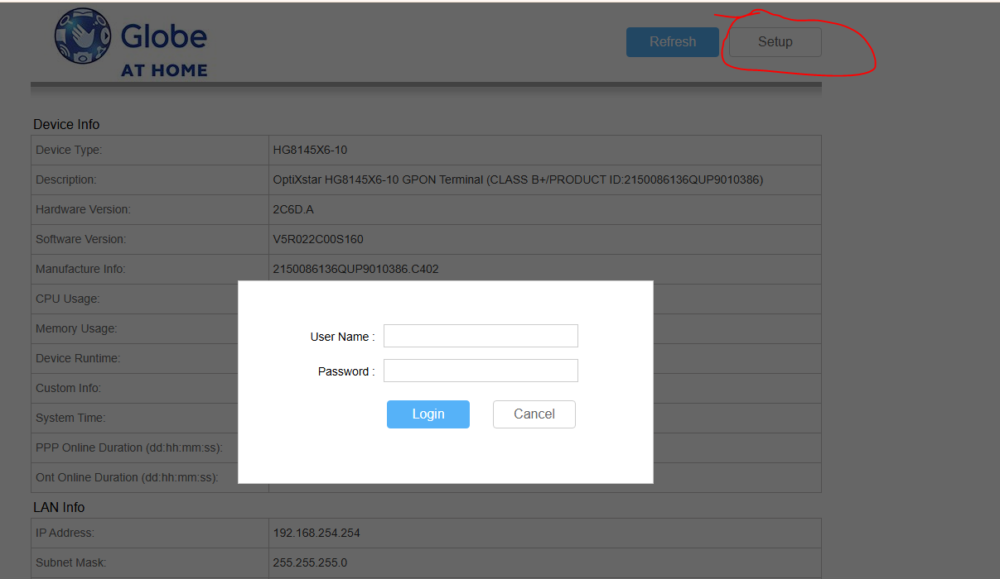
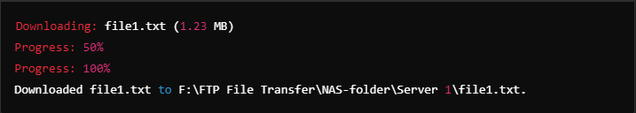

# Table Of Contents 
- [Table Of Contents](#table-of-contents)
- [Copy file from server to NAS using rsync](#copy-file-from-server-to-nas-using-rsync)
- [Fail2ban](#fail2ban)
  - [Install and Setup Fail2ban](#install-and-setup-fail2ban)
  - [Basic Configuration](#basic-configuration)
  - [Enable and Configure SSH jail in jail.local](#enable-and-configure-ssh-jail-in-jaillocal)
  - [Restart Fail2ban](#restart-fail2ban)
  - [Check the ban IPs](#check-the-ban-ips)
  - [Set Time Durations](#set-time-durations)
- [Scrape ELS Website For PDF's and HTML Files](#scrape-els-website-for-pdfs-and-html-files)
- [Setup Static Ip Address in Raspberry Pi](#setup-static-ip-address-in-raspberry-pi)
- [Transfer Database from FTP Server(Linux)](#transfer-database-from-ftp-serverlinux)
  - [1. Things to Install](#1-things-to-install)
    - [Required Tools](#required-tools)
  - [2. How to Set Up](#2-how-to-set-up)
    - [Step 1: Prepare the Script and Configuration File](#step-1-prepare-the-script-and-configuration-file)
    - [Step 2: Verify Configuration File](#step-2-verify-configuration-file)
    - [Step 3: Create the Log File](#step-3-create-the-log-file)
  - [3. How to Run the Shell Script](#3-how-to-run-the-shell-script)
    - [Run the Script](#run-the-script)
  - [4. How It Works](#4-how-it-works)
  - [Code](#code)
- [FTP File Download Script](#ftp-file-download-script)
  - [Requirements](#requirements)
  - [Installation](#installation)
  - [Configuration](#configuration)
    - [Configuration File (`config.json`)](#configuration-file-configjson)
  - [Explanation](#explanation)
  - [Local Directory](#local-directory)
  - [USAGE](#usage)
  - [Expected Output](#expected-output)
  - [Check the Downloaded Files](#check-the-downloaded-files)

# Copy file from server to NAS using rsync
See the official documentation of <a href="https://linux.die.net/man/1/rsync" target="_blank">Rsync</a> here.

**Step 1: Connect your server and NAS to tailscale to establish a connect.**

(In this example I use my Deca PC as the Source path and the pi-Lab as the destination path)


**Step 2: Create a folder on your destination path.**
You need to create a folder on your NAS to point it on the Destination Path and run this commands .

    #Connect to your NAS
    ssh [NAS Username]@[Nas Tailscale IP]

    # Create the directory /home/admin/rsync with superuser privileges.
    sudo mkdir /home/admin/rsync

    # Change the ownership of the /home/admin/rsync directory to user 'admin' and group 'admin'.
    sudo chown admin:admin /home/admin/rsync

    # Add write permissions for the user 'admin' to the /home/admin/rsync directory.
    sudo chmod u+w /home/admin/rsync


**Step 3: Run this command.**


     sudo rsync -av [Source Path] [Destination Username]@[Tailscale Ip]:[Destination Path]

     Example: sudo rsync -av /mnt/c/Users/paqui/Downloads/Rsync-Sample-Data admin@100.70.95.78:/home/admin/Rsync-Folder


# Fail2ban
Fail2Ban is a security tool used to protect servers from brute force attacks and other malicious activities by monitoring log files for suspicious patterns. When it detects repeated failed login attempts or other signs of attacks, it bans the offending IP addresses by updating firewall rules. Common uses include securing SSH, protecting web applications, blocking spam and abuse, and mitigating denial-of-service attacks. It works by monitoring logs, applying filters to identify threats, and executing actions like IP bans to enhance server security.

## Install and Setup Fail2ban

**1. Update the server first.**

    sudo apt update
    sudo apt upgrade

**2. Install Fail2ban**

    sudo apt install fail2ban

## Basic Configuration

Instead of modifying the main configuration file directly, create a local configuration file:

    sudo cp /etc/fail2ban/jail.conf /etc/fail2ban/jail.local

Open the local configuration file for editing:

    sudo nano /etc/fail2ban/jail.local

## Enable and Configure SSH jail in jail.local

Open (jail.local) and find the [sshd] section and set the values to configure the sshd jails:
    
    [sshd]
    enabled = true
    port = ssh
    backend = systemd
    maxretry = 3
    findtime = 300
    bantime = 3600
    ignoreip = 127.0.0.1

- enabled = true: This enables the jail, meaning it will actively monitor and ban IPs based on the specified rules.
- port = ssh: This specifies that the jail will monitor the SSH port. By default, this is port 22, but it can be customized if your SSH service runs on a different port.
- backend = systemd: This tells Fail2Ban to use systemd's journal for log monitoring, which is useful if your system uses systemd (common in modern Linux distributions).
- maxretry = 3: This sets the maximum number of failed login attempts allowed before an IP is banned. In this case, after 3 failed attempts, the IP will be banned.
- findtime = 300: This sets the time window (in seconds) in which the failed login attempts must occur to trigger a ban. Here, if 3 failed attempts occur within 300 seconds (5 minutes), the ban will be triggered.
- bantime = 3600: This sets the duration (in seconds) for which the offending IP will be banned. Here, the ban will last for 3600 seconds (1 hour).
- ignoreip = 127.0.0.1: This specifies IP addresses that should never be banned. In this case, it ensures that the local IP address (127.0.0.1) is never banned, which is useful to avoid locking yourself out.

## Restart Fail2ban
To apply the changes you need to restart fail2ban.

    #Restart fail2ban
    sudo systemctl restart fail2ban

    #Check status
    sudo systemctl status fail2ban


## Check the ban IPs
This command will show the list of banned IP Addresses.

    sudo fail2ban-client status sshd
    
## Set Time Durations

Fail2Ban supports specifying time durations in various units, including minutes, hours, and even days. You can use the following suffixes to specify the time units:

- m for minutes
- h for hours
- d for days

Example

    [sshd]
    enabled = true
    port = ssh
    backend = systemd
    maxretry = 3
    findtime = 5m  # 5 minutes
    bantime = 1h  # 1 hour
    ignoreip = 127.0.0.1

- findtime = 5m sets the time window to 5 minutes.
- bantime = 1h sets the ban duration to 1 hour.


# Scrape ELS Website For PDF's and HTML Files

        import os
        import requests
        from bs4 import BeautifulSoup
        import markdownify
        from datetime import datetime
        import json
        from pdfminer.high_level import extract_text

        # Function to extract text from a PDF file using pdfminer
        def extract_text_from_pdf(pdf_path):
            return extract_text(pdf_path)

        # Send an HTTP request to the web page and get the HTML response
        url = "https://equitylifestyle.gcs-web.com/news?af7c0978_year%5Bvalue%5D=_none"  # Replace with the actual URL
        response = requests.get(url)
        html = response.content

        # Parse the HTML content using BeautifulSoup
        soup = BeautifulSoup(html, 'html.parser')

        # Find all table rows (tr) in the HTML content
        table_rows = soup.select('table.tabcon tbody tr')

        # Display the total number of rows being scraped
        print(f"Total rows being scraped: {len(table_rows)}")

        # Loop through each row and extract the links
        links = []
        for row in table_rows:
            # Find the 'td' element containing the link
            link_element = row.find('td', {'id': 'news-title'})
            date_element = row.find('td', {'id': 'news-date'})
            
            if link_element and link_element.a and date_element:
                # Extract the link text (title)
                title_text = link_element.text.strip()
                
                # Extract the date text
                date_text = date_element.text.strip()
                
                # Extract the link URL and type
                link_url = link_element.a['href']
                link_type = link_element.a.get('type', '')

                # Construct the full URL
                full_link = requests.compat.urljoin(url, link_url)
                links.append((title_text, full_link, link_type, date_text))

        # Create directories for PDF and markdown files if they don't exist
        pdf_folder = "pdf"
        md_folder = "markdown"
        if not os.path.exists(pdf_folder):
            os.makedirs(pdf_folder)
        if not os.path.exists(md_folder):
            os.makedirs(md_folder)

        # Initialize counters for downloads
        pdf_count = 0
        md_count = 0
        file_counter = 1  # Counter to ensure unique filenames

        # List to hold JSON data
        json_data = []

        # Download each link
        for title, link, link_type, date in links:
            response = requests.get(link)
            # Generate a valid filename from the title
            valid_title = "".join(c if c.isalnum() or c in " .-_" else " " for c in title)
            
            # Generate the current timestamp
            timestamp = datetime.now().strftime("%Y%m%d_%H%M%S")
            
            # Append the counter to the filename to ensure uniqueness
            file_id = f"{file_counter:03d}"  # Zero-padded counter
            file_counter += 1
            
            file_path = ""
            content = ""
            
            if link_type in ['application/pdf', 'application/octet-stream']:
                # Save the PDF file with the timestamp and counter
                file_path = os.path.join(pdf_folder, f"{valid_title}_{timestamp}_{file_id}.pdf")
                with open(file_path, 'wb') as file:
                    file.write(response.content)
                pdf_count += 1
                print(f"Downloaded PDF: {title}")
                
                # Extract text from the PDF file
                content = extract_text_from_pdf(file_path)
                
            else:
                # Parse the HTML content of the page
                page_soup = BeautifulSoup(response.content, 'html.parser')
                body_content = page_soup.find('div', {'id': 'content-area', 'class': 'container'})
                
                if body_content:
                    # Convert the body content to markdown
                    markdown_content = markdownify.markdownify(str(body_content), heading_style="ATX")
                    
                    # Save the markdown file with the timestamp and counter
                    file_path = os.path.join(md_folder, f"{valid_title}_{timestamp}_{file_id}.md")
                    with open(file_path, 'w', encoding='utf-8') as file:
                        file.write(markdown_content)
                    md_count += 1
                    print(f"Downloaded and converted to Markdown: {title}")
                    
                    # Use the markdown content as the file content
                    content = markdown_content
            
            # Add to JSON data list
            json_data.append({
                "title": title,
                "content": content,
                "date": date
            })

        # Save JSON data to a file
        json_file_path = "downloaded_data.json"
        with open(json_file_path, 'w', encoding='utf-8') as json_file:
            json.dump(json_data, json_file, ensure_ascii=False, indent=4)

        # Display the download counts
        total_count = pdf_count + md_count
        print(f"Total PDFs downloaded: {pdf_count}")
        print(f"Total Markdown files downloaded: {md_count}")
        print(f"Total files downloaded: {total_count}")
        print(f"JSON data saved to {json_file_path}")


Here’s a line-by-line explanation:

1. Import necessary libraries: These libraries are used for various tasks such as web scraping, PDF text extraction, markdown conversion, handling dates, and JSON operations.

        pip install request 
        pip install beautifulsoup4
        pip install markdownify
        pip install pdfminer
        pip install pdfminer.six

2. Define a function to extract text from a PDF file using pdfminer. This function takes a PDF file path as input and returns the extracted text.
3. Send an HTTP GET request to the specified URL and get the HTML content of the page.
4. Parse the HTML content using BeautifulSoup to create a BeautifulSoup object (soup) which allows us to navigate and search the HTML structure.
5. Find all table rows (tr) within the table in the parsed HTML. This is done using the select method with a CSS selector.
6. Print the total number of rows that are being scraped to provide feedback on how many rows were found.
7. Loop through each row in the table to extract the relevant links:
    - Find the 'td' element containing the link (news-title) and the date (news-date).
    - Check if the link and date elements exist and if so, extract their text content and the link URL.
    - Construct the full URL of the link using requests.compat.urljoin to handle relative URLs.
    - Append the extracted data (title, full link, link type, date) to the links list.
8. Create directories for PDF and markdown files if they do not already exist using os.makedirs.
9. Initialize counters for tracking the number of PDF and markdown files downloaded and a counter to ensure unique filenames.
10. Create a list to hold JSON data for all the downloaded files.
11. Loop through each link to download the content:
    - Send an HTTP GET request to the link URL.
    - Generate a valid filename from the title by removing or replacing invalid characters.
    - Generate a timestamp for the current date and time.
    - Create a unique file ID using the counter.
    - Initialize variables for the file path and content.
    - Check the link type to determine if it's a PDF or HTML content:
        - For PDF files:
            - Save the PDF file with the generated filename.
            - Extract text from the PDF using the extract_text_from_pdf function.
            - Increment the PDF counter and print a message.
        - For HTML content:
            - Parse the HTML content using BeautifulSoup.
            - Find the main content area in the parsed HTML.
            - Convert the content to markdown using markdownify.
            - Save the markdown file with the generated filename.
            - Increment the markdown counter and print a message.
            - Use the markdown content as the file content.
    - Append the extracted data (title, content, date) to the JSON data list.
12. Save the JSON data to a file (downloaded_data.json) using json.dump.
13. Print the download counts for PDFs, markdown files, and the total number of files. Also, print the path to the saved JSON file.

This code automates the process of scraping a news page, downloading PDF or HTML content, converting HTML to markdown, extracting text from PDFs, and saving all this information in a structured JSON format.


# Setup Static Ip Address in Raspberry Pi

1. Open Terminal.
2. Edit the dhcpcd.conf File: Use a text editor (like nano) to edit the configuration file:
    ```
    sudo nano /etc/dhcpcd.conf
    ```

3. <b>Add Static IP Configuration</b>: Scroll down to the end of the file and add the following lines, modifying them according to your network settings:

    - For Wifi Connection
        ```
            interface eth0
            static ip_address=192.168.1.100/24    # Your desired static IP
            static routers=192.168.1.1             # Your router's IP
            static domain_name_servers=192.168.1.1 8.8.8.8  # Router's DNS and Google's DNS
        ```

    - For WLAN Connection
        ```
            interface wlan0
            static ip_address=192.168.1.100/24    # Your desired static IP
            static routers=192.168.1.1             # Your router's IP
            static domain_name_servers=192.168.1.1 8.8.8.8  # Router's DNS and Google's DNS
        ```
4. <b>Save and Exit</b>: Press `CTRL + X`, then `Y`, and hit `Enter` to save the changes.

5. Reboot the Raspberry Pi: Apply the changes by rebooting:
    ```
    sudo reboot
    ```
6. Add new Static Ip on your internet provider admin page

   - Open http://192.168.254.254/public/public_info_page.asp, scroll down to 
User Device Information and find the IP address there you can find the MAC Address beside it.
    

    - Click Setup and provide your `Username` and `Password`.
    

   - Go to DHCP Static IP Configuration and click New
        

   - Provide the static ip that you set in the `/etc/dhcpcd.conf`
    

# Transfer Database from FTP Server(Linux)

## 1. Things to Install
To run this script, ensure you have the following tools and dependencies installed:

### Required Tools
1. Bash Shell: Comes pre-installed on most Linux distributions.
2. `lftp`: A sophisticated command-line FTP/HTTP client.
    ```
    sudo apt-get install lftp
    ```
3. `jq`: A lightweight and flexible JSON processor.
    ```
    sudo apt-get install jq
    ```
## 2. How to Set Up
### Step 1: Prepare the Script and Configuration File
1. Copy the script:
- Save the `transfer_and_delete_files.sh` script to a desired directory, e.g., `/home/liam/scripts/`.
- Ensure the script is executable:
    ```
    chmod +x /home/liam/scripts/transfer_and_delete_files.sh
    ```
2. Prepare the JSON configuration file:
- Save the `config.json` file in the same directory as the script, or modify the script to point to its location:
    ```
    CONFIG_FILE="/path/to/config.json"
    ```
### Step 2: Verify Configuration File
Update the config.json file with your specific FTP servers and file details:

- FTP_HOST: The Tailscale IP address.
- FTP_PORT: Typically 21 for standard FTP connections.
- FTP_USER and FTP_PASS: Credentials for the FTP server.
- SERVER_DIR: Directory path on the FTP server where the file is located.
- DATABASEFILENAME: Name of the file to transfer.
- COPY_DESTINATION_DIR: Local directory where the file should be stored.

Example:
```
{
  "configurations": [
    {
      "FTP_HOST": "ftp.example.com",
      "FTP_PORT": 21,
      "FTP_USER": "username",
      "FTP_PASS": "password",
      "SERVER_DIR": "/remote/path",
      "DATABASEFILENAME": "example_file.zip",
      "COPY_DESTINATION_DIR": "/local/path"
    }
  ]
}
```

### Step 3: Create the Log File
The script writes logs to `/home/liam/transfer_and_delete_files.log`. Ensure the directory exists or modify the `LOG_FILE` variable in the script.

## 3. How to Run the Shell Script
### Run the Script
1. Open a terminal and navigate to the script's directory:
    ```
    cd /home/liam/scripts/
    ```
2. Execute the script:
    ```
    ./transfer_and_delete_files.sh
    ```

## 4. How It Works
1. Script Execution:
   - The script reads each configuration from config.json.
   - For each configuration:
     -  Connects to the FTP server using lftp.
     -  Checks if the specified file exists in the SERVER_DIR.
     -  If found:
        - Downloads the file to the COPY_DESTINATION_DIR.
        - Deletes the file from the FTP server after a successful transfer.
   - Logs all activities and errors to /home/liam/transfer_and_delete_files.log.
2. Logs:
    - The script records each operation and its status in a log file for easy tracking and debugging.

## Code
1. transfer_and_delete_files.sh
```
#!/bin/bash

# JSON Configuration File
CONFIG_FILE="config.json"

# Log file
LOG_FILE="/home/liam/transfer_and_delete_files.log"

# Log and handle errors
log_error() {
  local message="$1"
  echo "$(date): ERROR - $message" | tee -a $LOG_FILE
}

log_info() {
  local message="$1"
  echo "$(date): INFO - $message" | tee -a $LOG_FILE
}

# Function to check FTP connection
check_connection() {
  lftp -d -u $FTP_USER,$FTP_PASS ftp://$FTP_HOST:$FTP_PORT << EOF
  bye
EOF
  if [ $? -ne 0 ]; then
    log_error "Failed to establish connection to FTP server $FTP_HOST on port $FTP_PORT."
    return 1
  else
    log_info "Successfully connected to FTP server $FTP_HOST."
    return 0
  fi
}

# Loop through each configuration in the JSON file
jq -c '.configurations[]' "$CONFIG_FILE" | while read -r config; do
  # Extract configuration values using jq
  FTP_HOST=$(echo "$config" | jq -r '.FTP_HOST')
  FTP_PORT=$(echo "$config" | jq -r '.FTP_PORT')
  FTP_USER=$(echo "$config" | jq -r '.FTP_USER')
  FTP_PASS=$(echo "$config" | jq -r '.FTP_PASS')
  SERVER_DIR=$(echo "$config" | jq -r '.SERVER_DIR')
  DATABASEFILENAME=$(echo "$config" | jq -r '.DATABASEFILENAME')
  COPY_DESTINATION_DIR=$(echo "$config" | jq -r '.COPY_DESTINATION_DIR')

  # Log configuration details
  log_info "Processing configuration for $FTP_HOST:"
  # log_info "FTP_HOST: $FTP_HOST"
  # log_info "FTP_PORT: $FTP_PORT"
  # log_info "FTP_USER: $FTP_USER"
  # log_info "SERVER_DIR: $SERVER_DIR"
  # log_info "DATABASEFILENAME: $DATABASEFILENAME"
  # log_info "COPY_DESTINATION_DIR: $COPY_DESTINATION_DIR"

  # Verify connection to the FTP server
  check_connection
  if [ $? -ne 0 ]; then
    log_error "Skipping processing for $FTP_HOST due to connection failure."
    continue
  fi

  # Check if the file exists on the FTP server
  log_info "Checking if file '$DATABASEFILENAME' exists in $SERVER_DIR on $FTP_HOST..."
  FILE_EXISTS=$(lftp -d -u $FTP_USER,$FTP_PASS ftp://$FTP_HOST:$FTP_PORT << EOF
  set ssl:verify-certificate no
  cd $SERVER_DIR
  cls -1 | grep -F "$DATABASEFILENAME"
  bye
EOF
  )

  if [ -n "$FILE_EXISTS" ]; then
    log_info "File '$DATABASEFILENAME' exists. Starting transfer to $COPY_DESTINATION_DIR..."

    # Transfer the file to the destination directory
    lftp -d -u $FTP_USER,$FTP_PASS ftp://$FTP_HOST:$FTP_PORT << EOF | tee -a $LOG_FILE
    set ssl:verify-certificate no
    cd $SERVER_DIR
    get "$DATABASEFILENAME" -o "$COPY_DESTINATION_DIR/$DATABASEFILENAME"
    bye
EOF

    # Check if the transfer was successful
    if [ $? -eq 0 ]; then
      log_info "Transfer of '$DATABASEFILENAME' successful."

      # Delete the file from the FTP server
      log_info "Deleting '$DATABASEFILENAME' from $SERVER_DIR on $FTP_HOST..."
      lftp -d -u $FTP_USER,$FTP_PASS ftp://$FTP_HOST:$FTP_PORT << EOF | tee -a $LOG_FILE
      set ssl:verify-certificate no
      cd $SERVER_DIR
      rm "$DATABASEFILENAME"
      bye
EOF

      if [ $? -eq 0 ]; then
        log_info "File '$DATABASEFILENAME' deleted successfully from $SERVER_DIR."
      else
        log_error "Failed to delete '$DATABASEFILENAME' from $SERVER_DIR."
      fi
    else
      log_error "Transfer of '$DATABASEFILENAME' failed."
    fi
  else
    log_info "File '$DATABASEFILENAME' does not exist in $SERVER_DIR."
  fi
done

```

2. config.json
```
{
    "configurations": [
      {
        "FTP_HOST": "Tailscale_IP_Address",
        "FTP_PORT": 21,
        "FTP_USER": "server1",
        "FTP_PASS": "server1pass",
        "SERVER_DIR": "/DatabaseBackup1",
        "DATABASEFILENAME": "10_28_2024_Cambio_Database.zip",
        "COPY_DESTINATION_DIR": "/home/liam/Desktop/NAS_Folder"
      },
      {
        "FTP_HOST": "Tailscale_IP_Address",
        "FTP_PORT": 21,
        "FTP_USER": "server2",
        "FTP_PASS": "server2pass",
        "SERVER_DIR": "/DatabaseBackup2",
        "DATABASEFILENAME": "7_7_2024_Cambio_Database.zip",
        "COPY_DESTINATION_DIR": "/home/liam/Desktop/NAS_Folder"
      },
      {
        "FTP_HOST": "Tailscale_IP_Address",
        "FTP_PORT": 21,
        "FTP_USER": "server2",
        "FTP_PASS": "server2pass",
        "SERVER_DIR": "/DatabaseBackup2",
        "DATABASEFILENAME": "7_7_2024_Cambio_Database.zip",
        "COPY_DESTINATION_DIR": "/home/liam/Desktop/NAS_Folder"
      }
    ]
  }
```

# FTP File Download Script

This script connects to FTP servers, processes specific folders, and downloads files to a local directory. It uses `ftplib` for FTP communication, `os` for local directory handling, and `json` for reading configuration files.

## Requirements

- Python 3.x (tested with Python 3.8)
- Libraries:
  - `ftplib` (Standard Python library for FTP connections)
  - `os` (Standard Python library for file and directory operations)
  - `json` (Standard Python library for parsing JSON data)

These libraries are part of Python's standard library, so no external dependencies are required.

## Installation

1. **Clone the repository** or download the script.
2. Ensure you have **Python 3.x** installed.
3. Since the libraries are part of Python's standard library, no additional installation steps are necessary.

## Configuration

### Configuration File (`config.json`)

The script requires a `config.json` file to configure the FTP servers and directories from which files should be downloaded. Below is an example of the configuration format:

```json
{
  "servers": [
    {
      "ftp_host": "ftp.example.com",
      "ftp_port": 21,
      "ftp_username": "your_username",
      "ftp_password": "your_password",
      "folders_to_download": [
        {
          "remote_folder": "/remote/folder/path",
          "folder_mask": "*.txt"
        }
      ]
    }
  ]
}
```
## Explanation
- `ftp_host:` The host address of the FTP server.
- `ftp_port:` The port to connect to (default FTP port is 21).
- `ftp_username:` The FTP username.
- `folders_to_download:` A list of folders to be processed, each containing:
    - `remote_folder:` The remote folder to access.
    - `folder_mask:` The mask to filter files (e.g., *.zip).


## Local Directory

The script will download files to a local directory. The default download directory is:

- F:\FTP File Transfer\NAS-folder
  - This path can be changed by modifying the DOWNLOAD_DIR variable in the script

## USAGE
1. Modify the config.json file with the correct FTP server details.
2. Run the script with Python:
   ```python
   python FileTransfer.py
   ```
The script will connect to the FTP servers, navigate to the specified folders, and download the files matching the given `folder_mask.`

## Expected Output

The script will:
- Read the FTP server configuration from `config.json.`
- Connect to each FTP server listed in the configuration.
- Access the specified folders and download files that match the given filter (e.g., `*.zip`).
- Display progress for each file being downloaded, like so:


## Check the Downloaded Files

After the script finishes running, check the specified download directory for the downloaded files, which will be saved in folders named `Server <index>` based on the order of the servers in the `config.json` file.

``` Python
import ftplib
import os
import json

# Base directory for downloads
DOWNLOAD_DIR = r"F:\FTP File Transfer\NAS-folder"
os.makedirs(DOWNLOAD_DIR, exist_ok=True)


def connect_to_ftp(server_config):
    """Establish an FTP connection."""
    try:
        ftp = ftplib.FTP(timeout=30)
        ftp.connect(server_config['ftp_host'], server_config['ftp_port'])
        ftp.login(server_config['ftp_username'], server_config['ftp_password'])
        print(f"Connected to {server_config['ftp_host']}.")
        return ftp
    except ftplib.all_errors as e:
        print(f"FTP connection error: {e}")
        return None


def download_file(ftp, filename, local_folder):
    """Download a single file from the FTP server."""
    local_filepath = os.path.join(local_folder, filename)
    try:
         # Get the file size for progress reporting
        file_size = ftp.size(filename)
        print(f"Downloading: {filename} ({file_size / (1024 * 1024):.2f} MB)")

        downloaded_size = 0

        def progress_callback(data):
            # Callback to write data to the file and show progress
            nonlocal downloaded_size
            with open(local_filepath, 'ab') as f:
                f.write(data)
            downloaded_size += len(data)
            print(f"\rProgress: {downloaded_size / file_size:.2%}", end="")

         # Download the file in binary mode
        ftp.retrbinary(f"RETR {filename}", progress_callback)
        print(f"\nDownloaded {filename} to {local_filepath}.")
    except ftplib.all_errors as e:
        print(f"Error downloading file {filename}: {e}")


def process_folder(ftp, folder, server_index):
    """Process a specific folder on the FTP server."""

    remote_folder = folder['remote_folder']
    local_folder = os.path.join(DOWNLOAD_DIR, f"Server {server_index}", remote_folder)
    os.makedirs(local_folder, exist_ok=True)

    try:
        # Navigate to the specified remote folder
        ftp.cwd(remote_folder)
        print(f"Accessing folder: {remote_folder}")

         # Get a list of matching files based on the folder mask
        files = [
            name for name, _ in ftp.mlsd()
            if folder.get('folder_mask', '').lower() in name.lower()
        ]

        if not files:
            print(f"No matching files in {remote_folder}")
            return

        # Download the first matching file
        download_file(ftp, files[0], local_folder)
    except ftplib.error_perm as e:
        print(f"Permission error accessing {remote_folder}: {e}")
    except Exception as e:
        print(f"Error processing folder {remote_folder}: {e}")


def process_server(server_config, server_index):
    """Process a specific server."""
    print(f"Processing Server {server_index}: {server_config['ftp_host']}")

    # Connect to the FTP server
    ftp = connect_to_ftp(server_config)
    if not ftp:
        return

    try:
         # Process the first folder in the server configuration
        folder = server_config['folders_to_download'][0]  # Only one folder per server
        process_folder(ftp, folder, server_index)

        # Print the separator after each server's folder has been processed
        print("\n=======================================================")
    finally:
        # Ensure the FTP connection is closed
        ftp.quit()


def main():
    """Main script logic."""

    # Load server configuration from a JSON file
    with open("config.json", 'r') as f:
        config = json.load(f)

    # Process each server in the configuration
    for index, server_config in enumerate(config['servers'], start=1):
        process_server(server_config, index)

    print("All server processing completed.")


if __name__ == "__main__":
    main()

```
    
```
config.json
{
    "servers": [
        {
            "ftp_host": "Tailscale_IP",
            "ftp_port": 21,
            "ftp_username": "user1",
            "ftp_password": "Developer14!",
            "folders_to_download": [
                {
                    "remote_folder": "Database/Cambio",
                    "folder_mask": "11_21_2024_Cambio_database.zip"
                }
            ]
        },
        {
            "ftp_host": "Tailscale_IP",
            "ftp_port": 21,
            "ftp_username": "CambioServer",
            "ftp_password": "bravo99",
            "folders_to_download": [
                {
                    "remote_folder": "Database/Inspire",
                    "folder_mask": "08_03_2024_Inspire_Database.zip"
                }
            ]
        },
        {
            "ftp_host": "Tailscale_IP",
            "ftp_port": 21,
            "ftp_username": "server3",
            "ftp_password": "server3pass",
            "folders_to_download": [
                {
                    "remote_folder": "Database/Lakeshore",
                    "folder_mask": "7_7_2024_Lakeshore_Database.zip"
                }
            ]
        }
    ]
}
```