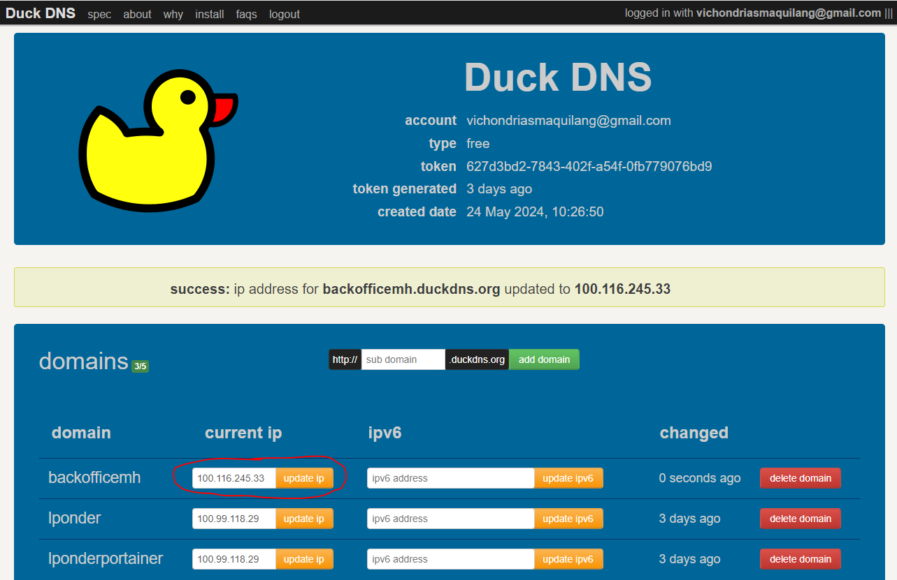

# Welcome to Nginx Proxy Manager!
Nginx Proxy Manager is a user-friendly interface for managing Nginx proxies with a web-based dashboard. It simplifies the process of setting up reverse proxies, managing SSL certificates, and configuring various web server settings without the need for extensive command-line knowledge. To set up Nginx Proxy Manager, you typically start by deploying it using Docker, following the provided installation instructions. Once installed, you can access the web interface to add and configure proxy hosts, set up SSL certificates via Let's Encrypt, and manage access controls. The platform supports advanced configurations like custom Nginx configurations, redirections, and stream proxy hosts, making it a powerful tool for both beginners and experienced users.

  

Default Ports:

  

1.  **Uptime Kuma : Port 3001**
2.  **Pi-Hole : Port 84**
3.  **Dashy : Port 4000**
4.  **Stirling PDF : Port 8081**
5.  **Nginx : Port 81**
6.  **Portainer : Port 9000**
7.  **Nginx Proxy Manager : Port 82**

  

# Create Nginx Proxy Manager

See the official documentation of <a  href="https://nginxproxymanager.com/guide/"  target="_blank">Nginx Proxy Manager</a> here.

  

 1. Run this curl command to create Nginx Proxy Manager on your host machine.

>    curl -sL https://raw.githubusercontent.com/Vichondrias1/lponder/main/Nginx-Proxy-Manager/nginxProxyManager.sh | sh

 2. Access it on http://[tailscale host machine ip]:82/

 
> Default Admin User

> Email: admin@example.com

> Password: changeme

# Create Domain Name in DuckDNS

 1. Create account on https://www.duckdns.org/
 2. Create the your own sub domain name and paste your tailscale IP address in the current IP
 

# Setup Reverse Proxy and TSL Certificate
This video shows how to reverse proxy your created duckdns domain name to your localhost applications and genenate a TLS or SSL certicate. <a href="../img/Duck-DNS.mp4">(Download Video Here.)</a>

<video controls src="../img/Duck-DNS.mp4" title="Title"></video>