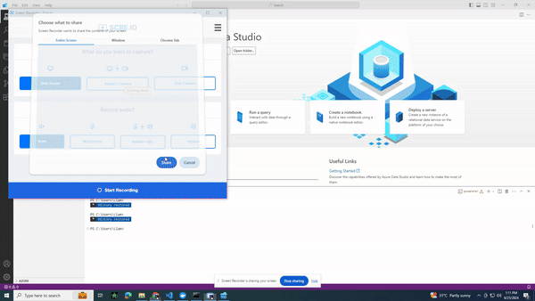

# Install SQL EDGE using Docker
See the official documentation of <a href="https://learn.microsoft.com/en-us/azure/azure-sql-edge/disconnected-deployment" target="_blank">SQL Edge on Docker</a> here.

**Run this command to download and run the docker compose file**

    curl -sL https://raw.githubusercontent.com/Vichondrias1/lponder/main/Sql-Edge/sqlEdge.sh | sh 

# Docker Container Name
Note that **azuresqledge** is the docker container name (you can check the docker-compose.yml)

# Connect to Azure SQL Edge

The following steps use the Azure SQL Edge command-line tool, sqlcmd, inside the container to connect to SQL Edge.

1. Use the docker exec -it command to start an interactive bash shell inside your running container. In the following example, azuresqledge is the name specified by the --name parameter when you created the container.

        sudo docker exec -it azuresqledge "bash"

2. Once inside the container, connect locally with sqlcmd. sqlcmd isn't in the path by default, so you have to specify the full path.

        /opt/mssql-tools/bin/sqlcmd -S localhost -U SA -P 'YourStrong!Passw0rd'

3. If successful, you should get to a sqlcmd command prompt: 1>.

# Create a new database

The following steps create a new database named legacy.

1. From the sqlcmd command prompt, paste the following Transact-SQL command to create a test database:

        CREATE DATABASE Legacy;
        GO

2. On the next line, write a query to return the name of all of the databases on your server:

        SELECT name from sys.databases;
        GO

# Restore Database

**Step 1: Ensure You Have the Backup File**

Make sure you have your legacy.bak or any database .bak file ready.

**Step 2: Copy the Backup File to the Docker Container**

    docker cp C:/Users/Liam/Downloads/legacy.bak azuresqledge:/var/opt/mssql/data/legacy.bak

**Step 3: Connect to the SQL Edge Instance:**

    docker exec -it azuresqledge /opt/mssql-tools/bin/sqlcmd -S localhost -U sa -P 'YourStrong!Passw0rd'

**Step 4: Find Logical File Names:** 

Run the following command to get the logical file names:

    RESTORE FILELISTONLY
    FROM DISK = '/var/opt/mssql/data/legacy.bak';
    GO

This command returns a list of the logical file names in the backup. Take note of the logical names, which you will use in the restore command.

**Step 5: Restore the Database:**

Use the logical file names you found in the previous step in the following restore command. For example, let's assume the logical file names are Legacy and legacy_Log.

    RESTORE DATABASE legacy
    FROM DISK = '/var/opt/mssql/data/legacy.bak'
    WITH MOVE 'Legacy' TO '/var/opt/mssql/data/Legacy_Primary.mdf',
    MOVE 'Legacy_log' TO '/var/opt/mssql/data/Legacy_Primary.ldf';
    GO

# Connect To Azure Data Studio
Make sure that the Azure Data Studio is already installed. Click here to install <a href="https://learn.microsoft.com/en-us/azure-data-studio/download-azure-data-studio?view=sql-server-ver16&tabs=win-install%2Cwin-user-install%2Credhat-install%2Cwindows-uninstall%2Credhat-uninstall" target="_blank">Azure Data Studio</a>.

Server: localhost

User: sa

Password: YourStrong!Passw0rd

# Create Master Key And Certificate. (Run this on Azure Data Studio)

    USE master;
    GO

	CREATE MASTER KEY ENCRYPTION BY PASSWORD = 'YourStrong!Passw0rd';
	GO

	CREATE CERTIFICATE TDETestCert WITH SUBJECT = 'TDE Test DEK Certificate';
	GO

This script is designed to be run in Azure Data Studio, targeting a SQL Server database. Here’s a straightforward explanation of what each part does:

|Command|Usage|
|--|--|
|CREATE MASTER KEY ENCRYPTION BY PASSWORD = 'YourStrong!Passw0rd' | Creates a master key in the database. This master key is encrypted by the specified password ('YourStrong!Passw0rd'). The    master key is a symmetric key used to secure other keys in the database.|
|CREATE CERTIFICATE TDETestCert WITH SUBJECT = 'TDE Test DEK Certificate'| Creates a certificate named TDETestCert in the master database with the subject 'TDE Test DEK Certificate'. This certificate will be used later for encryption purposes, such as Transparent Data Encryption (TDE).|

# Apply Encryption to your database. (Run this on Azure Data Studio)

	USE <Your Database Name>;
	GO

	CREATE DATABASE ENCRYPTION KEY
	WITH ALGORITHM = AES_256
	ENCRYPTION BY SERVER CERTIFICATE TDETestCert;
	GO

	ALTER DATABASE <Your Database Name>
	SET ENCRYPTION ON;
	GO

This script is intended to apply Transparent Data Encryption (TDE) to a specific database using Azure Data Studio. Here’s a straightforward explanation of what each part does.

|Command|Usage|
|--|--|
|CREATE DATABASE ENCRYPTION KEY | Creates a database encryption key for <Your Database Name>.|
|WITH ALGORITHM = AES_256 | Specifies that the encryption algorithm to use is AES_256, which is a strong encryption standard.|
|ENCRYPTION BY SERVER CERTIFICATE TDETestCert | Specifies that the encryption key should be encrypted by the certificate TDETestCert that was created in the previous steps.|
|ALTER DATABASE <Your Database Name> SET ENCRYPTION ON | Turns on encryption for the <Your Database Name>. This command enables Transparent Data Encryption (TDE) for the database, encrypting the data at rest.|

# Back Up your SERVICE/MASTER KEY and CERTIFICATE (Run this on Azure Data Studio)
	
	USE master
	GO

	BACKUP SERVICE MASTER KEY TO FILE = N'\var\opt\mssql\data\keys\Service_Master_Key.key'
	ENCRYPTION BY PASSWORD = N'YourStrong!Passw0rd1';
 
	BACKUP MASTER KEY TO FILE = N'\var\opt\mssql\data\keys\Master_Key.key'
	ENCRYPTION BY PASSWORD = N'YourStrong!Passw0rd2';
 
	BACKUP CERTIFICATE TDETestCert 
	TO FILE = N'\var\opt\mssql\data\keys\TDETestCert.cert'
	WITH PRIVATE KEY (
    	FILE = N'\var\opt\mssql\data\keys\TDETestCert.key'
    	, ENCRYPTION BY PASSWORD = N'YourStrong!Passw0rd3'
    	);

This script backs up the service master key, the master key, and the certificate used for Transparent Data Encryption (TDE). Here's a straightforward explanation of what each part does

|Command|Usage|
|--|--|
|BACKUP SERVICE MASTER KEY| Backs up the service master key to a file.|
|TO FILE = N'\var\opt\mssql\data\keys\Service_Master_Key.key' | Specifies the file path where the service master key will be saved.|
|ENCRYPTION BY PASSWORD = N'YourStrong!Passw0rd1'| Specifies the password to encrypt the service master key backup file.|

|Command|Usage|
|--|--|
|BACKUP MASTER KEY | Backs up the database master key to a file.|
|TO FILE = N'\var\opt\mssql\data\keys\Master_Key.key'|Specifies the file path where the master key will be saved.|
|ENCRYPTION BY PASSWORD = N'YourStrong!Passw0rd2'|Specifies the password to encrypt the master key backup file.|

|Command|Usage|
|--|--|
|BACKUP CERTIFICATE TDETestCert|Backs up the certificate TDETestCert to a file.|
|TO FILE = N'\var\opt\mssql\data\keys\TDETestCert.cert'|Specifies the file path where the certificate will be saved.|
|WITH PRIVATE KEY (FILE = N'\var\opt\mssql\data\keys\TDETestCert.key', ENCRYPTION BY PASSWORD = N'YourStrong!Passw0rd3'|Specifies the file path where the private key will be saved and the password to encrypt the private key backup file.|

**To Copy the Keys From your Docker Container to Your Device RUN (Run this on your terminal)**

	sudo docker cp <containername>:path/to/your/keys path/to/your/destination
	
	ex: docker cp azuresqledge:/var/opt/mssql/data/keys home/liam/documents/ 

# Restore Database with TDE to Another Server/Computer

Verify first if you already have a master key.

	USE master;
	GO

	-- Check if you have already a master key on the master database.
	-- ##MS_DatabaseMasterKey##
		SELECT * FROM sys.symmetric_keys;

If you dont have a master key you can create one using the command below:

	USE master;
	GO

	CREATE MASTER KEY ENCRYPTION
	BY PASSWORD = 'masterK37';
	GO
	

In the master database, restore certificate using backup file and private key

	USE master;
	GO

	CREATE CERTIFICATE TDECert
	FROM FILE = '<path>/TDETestCert.cert'
	WITH PRIVATE KEY (FILE = N'<path>/TDETestCert.key',
	DECRYPTION BY PASSWORD = 'YourStrong!Passw0rd3'); 
	GO

|Command|Usage|
|--|--|
|CREATE CERTIFICATE TDECert|Restores a certificate named TDECert|
|FROM FILE = '<path>/TDETestCert.cert'|Specifies the file path where the certificate backup file is located.|
|WITH PRIVATE KEY (FILE = N'<path>/TDETestCert.key', DECRYPTION BY PASSWORD = 'YourStrong!Passw0rd3')|Specifies the file path where the private key backup file is located and the password to decrypt the private key. (The password must match the one used during the backup process to avoid errors.) |