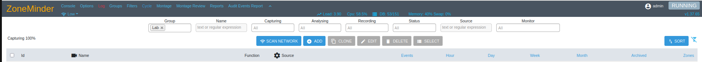
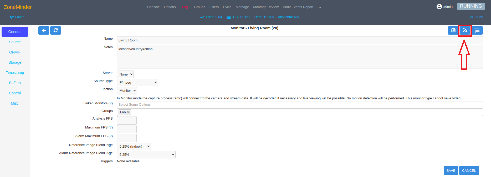
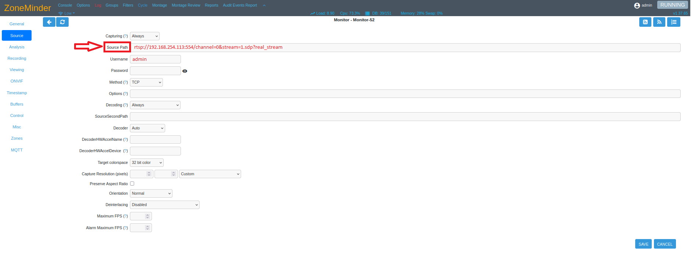
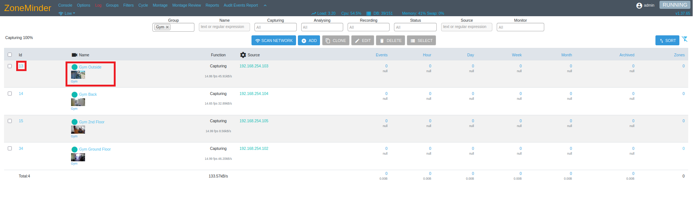
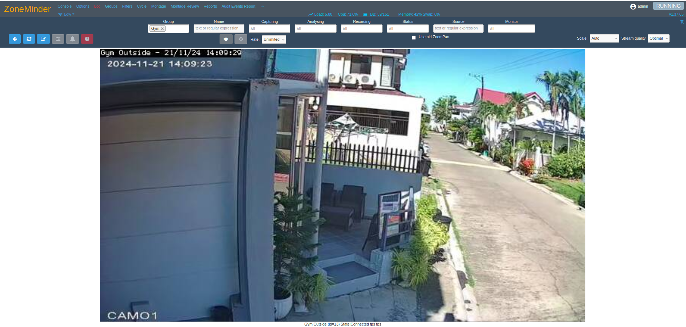
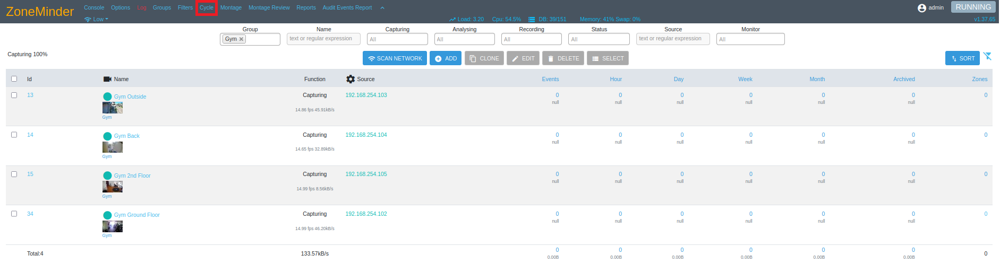
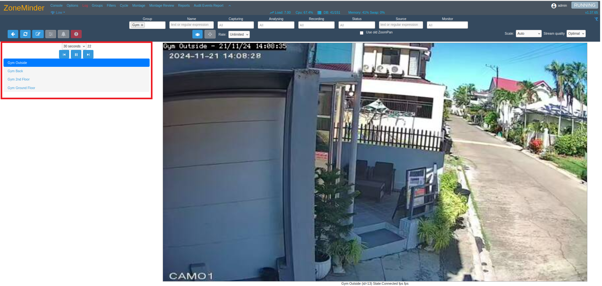
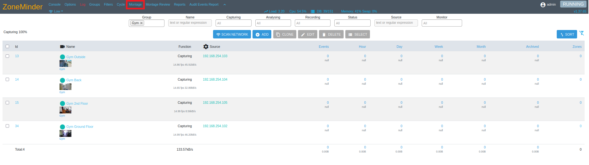
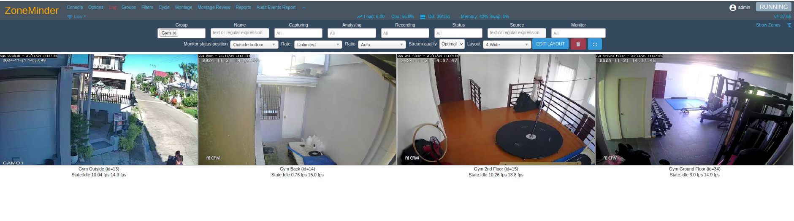
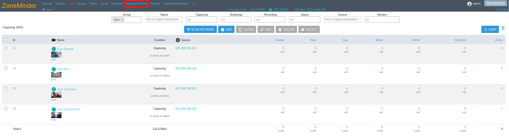

# ZoneMinder Installation Guide for Ubuntu

This guide provides detailed steps for installing ZoneMinder, an open-source video surveillance software, on an Ubuntu system.

## Prerequisites

- A server running Ubuntu (20.04 or later recommended)
- Access to a terminal with `sudo` privileges

---

## Installation Steps

### Step 1: Update the System

Start by updating the package list and upgrading all existing packages:

```bash
sudo apt-get update && sudo apt upgrade -y
```

### Step 2: Update repositories (Optional)

**`ZoneMinder`** is part of the current standard Ubuntu repository, but sometimes the official repository can lag behind. To find out check our releases page for the latest release.

Alternatively, the ZoneMinder project team maintains a PPA, which is updated immediately following a new release of ZoneMinder. To use this repository instead of the official Ubuntu repository, enter the following commands:

```bash
sudo apt install -y software-properties-common
sudo add-apt-repository ppa:iconnor/zoneminder-master
sudo apt update
```

### Step 3: Install Zoneminder

```bash
sudo apt install -y zoneminder
```

### Step 4: Configure Apache correctly:

```bash
sudo a2enmod rewrite
sudo a2enconf zoneminder
sudo systemctl restart apache2
```

### Step 5: Enable and start zoneminder

```bash
sudo systemctl enable zoneminder
sudo systemctl start zoneminder
```

### To Confirm Zoneminder is Installed and Running 

```bash 
sudo systemctl status zoneminder
```

### Step 6: Open Zoneminder

Open up a browser and go to <span style="color: #e74c3c;">http://hostname_or_ip/zm</span>
 to open the ZoneMinder Console. 

# ZoneMinder User Guide

The intent of this section is to provide a simplified introduction to some of the basic configuration tasks that most ZoneMinder servers will require. This will include setting your Timezone, enabling Authentication, adding a Monitor (camera), adding a Zone and changing the web display Theme. Detailed explanations about each particular item can be found in their respective sections of the ZoneMinder documentation.

Having followed the Installation Guide for your distribution you should now be able to load the ZoneMinder web interface which can be found at <span style="color: #e74c3c;">http://hostname_or_ip/zm</span>. The image below shows an example of the ZoneMinder Console which is displayed after starting. 

The ZoneMinder **Console** is the central location from which all ZoneMinder configuration and functionality can be accessed.



## Setting Timezone

ZoneMinder allows you to specify the Timezone in the web interface. Please set up before moving forward so that your saved events, logfiles and timestamp overlays contain correct time information. The Timezone can be changed using the following steps.

- At the top of the Console display, click on the **Options** menu link.
- The **Options** window will open. 
  - Locate and click the **System** tab link.
  - Find the **TIMEZONE** parameter and use the pulldown menu to select your timezone.

  

## Enabling Authentication

We strongly recommend enabling authentication during initial setup of ZoneMinder. There are some situations where certain users don’t enable authentication, such as instances where the server is in a LAN not directly exposed to the Internet. In most cases authentication should be enabled. Follow the steps below.

Click on the **Options** link in the top bar of the web interface.

You will now be presented with a sidebar full of Option tabs. Click on the **System** tab and scroll down to the section containing authentication parameters.


**OPT_USE_AUTH:** Enable by checking the box. This enables user authentication.

**AUTH_HASH_SECRET:** Enter a random string. This makes authentication logic more secure.

Remaining items should be left as default.

Click on Save at the top of list and that’s it! The next time you refresh that page, you will now be presented with a login screen as shown below.

## Adding Monitors(Camera)

Prior to adding Monitors in ZoneMinder you will need the following information at minimum: `URL` to access the video stream, authentication `user/password`, `IP address`, `video resolution in pixels`, `frames per second (FPS)` and the video `stream protocol`.

Click on the **+ADD** button in Console window as shown below:


**`Name`**: Anything can be entered here but a description of location or area is generally useful.

**`Source Type`**: `FFmpeg` is the recommended source type for most modern IP cameras and also the default value in ZoneMinder. For this example, `FFmpeg` is the appropriate choice. There are many choices for Source Type in ZoneMinder. For a detailed description of them please see <a href="https://zoneminder.readthedocs.io/en/stable/userguide/definemonitor.html">Defining Monitors</a>.

 **`ONVIF Probe`**: Use the **+ADD** link then the ONVIF icon link in the Monitor General Tab. ZoneMinder can use ONVIF protocol to locate cameras on the network and fill in some of the Monitor configuration. It will still be necessary to review all Monitor tabs and confirm all settings.

 

Display the list of detected onvif cameras.


Another way to add a monitor is to manually input **RTSP** url in the **`Source Path`**(Source Tab). Then Enter the **`Username`** and **`Password`** for the camera<br>
**NOTE: This is only if you know the ip's of the camera**



## Viewing Monitors

### Monitor View

The `Monitor View` displays a live feed for a single selected monitor. 
There are several ways to enter the Monitor View.
- Clicking the monitor id
- Clicking the thumbnail or monitor name



After clicking either the ID, thumbnail or the monitor name it will show the live feed from the monitor selected.



### Cycle 

The `Cycle` monitor view displays a rotating view for each selected monitor. Click on `Cycle` to open the Cycle view.



The list of monitors to include in a Cycle view are selectable as well as the display time for each monitor.




### Montage

The `Montage` view is similar to the Monitor View except that it displays several monitors simultaneously. 





### Montage Review

The `Montage Review` Allows you to simultaneously view past events for different Monitors. Note that this is a very resource intensive page and its performance will vary based on your system capabilities.



